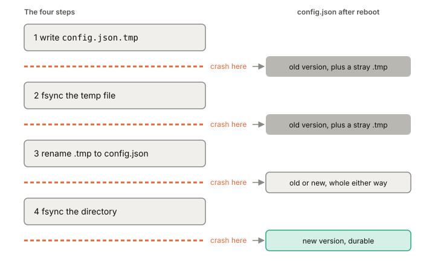

# Atomic rename

Atomic rename is the standard way to replace a whole file so that, even after a crash, you find either the complete old version or the complete new one. You write the new contents to a temporary file, make it durable, and rename it over the old name. It's four steps, and people regularly skip two of them.

## The problem with overwriting in place

Say your service keeps its settings in `config.json` and you want to save a new version. The obvious code opens the file, truncates it, and writes the new bytes.

If the power fails partway through, you've destroyed the old version and only written part of the new one. The same thing happens on other failures mid-write, like running out of space or an I/O error. There's no moment where the file on disk is safe. This is the [[crash-consistency]] problem at its smallest.

## The four steps

The fix is to never touch the only good copy:

1. **Write the new contents to a temporary file** in the same directory, say `config.json.tmp`. It has to be on the same file system, because rename can't move a file across mounts; it fails with `EXDEV`.
2. **fsync the temporary file.** Now its data is on stable storage, not just in the [[page-cache]].
3. **rename `config.json.tmp` to `config.json`.** If `config.json` exists, it's replaced.
4. **fsync the directory** that holds both names. The rename changed the directory, not the file, so the directory is what needs syncing.

After step 4, the new file is durable under the right name. If the power fails before step 3, the old file is untouched and there's a stray temp file to clean up. If it fails between 3 and 4, you'll find one version or the other, depending on whether the directory change made it to disk.

*Wherever the crash lands, config.json is a whole file, old or new.*

## What "atomic" actually promises

rename's atomicity is about other processes on a running system. If `config.json` already exists, it's replaced so that no other process ever looks for it and finds it missing. There may be a short window where both names point to the same file, but never one where the target is gone.

That promise says nothing about crashes. The man page doesn't mention power loss at all. Steps 2 and 4 are what turn "atomic for other processes" into "safe after a crash".

## Why skipping the fsync burned people in 2009

For years, many Linux programs did steps 1 and 3 only: write the temp file, rename, no fsync. On ext3 it mostly worked. In its default mode, ext3 wrote file data to disk before committing the matching metadata to its journal, and it committed every five seconds. So the data and the rename landed together. Nobody had promised that behavior; it fell out of the design.

ext4 added delayed allocation: it waits to choose disk blocks for new data, which helps performance. Unallocated data wasn't written at the journal commit, and with default settings it could sit for a minute or so. The rename, a metadata change, could be committed long before the data. Users who crashed found that many files written in the previous boot had become zero bytes long.

The response came from both sides. The message to applications was to call fsync or fdatasync when data must be on disk. And ext4 got heuristics for Linux 2.6.30 to limit the damage, including one that forces block allocation when a file is renamed on top of another. That heuristic protects the common pattern on ext4 only. It isn't a promise other file systems make.

## Where it gets tricky

Whether a new or renamed file survives a crash without syncing its directory depends on the file system and its mount options. You can write code for each combination, or fsync the directory every time and be portable. The second is the sane choice.

The temp file has to be cleaned up. After a crash, a leftover `config.json.tmp` is harmless but will pile up if the name isn't fixed or cleaned at startup.

This pattern replaces a whole file. It doesn't help when you add to a large file bit by bit. For that you want an [[append-only-log]].

## What this means when you build

- For any file you replace as a whole (config, a snapshot, a manifest), use all four steps.
- Put the temp file in the same directory as the target.
- fsync the file before the rename and the directory after it.
- Check the return value of every fsync; write errors often only show up there. Check the rename too.
- The phase 1 [[crash-testing]] harness will need to catch a missing directory fsync, which not every crash tool can do.

## Further reading

- [Ensuring data reaches disk](https://lwn.net/Articles/457667/), Jeff Moyer, 2011. Lists the five-step safe-overwrite recipe and explains when a directory fsync is needed.
- [rename(2)](https://man7.org/linux/man-pages/man2/rename.2.html), Linux man-pages 6.19, 2026. Exactly what "atomically replaced" means, and the `EXDEV` rule.
- [ext4 and data loss](https://lwn.net/Articles/322823/), Jonathan Corbet, 2009. The zero-length-files episode and the rename heuristic ext4 added.
