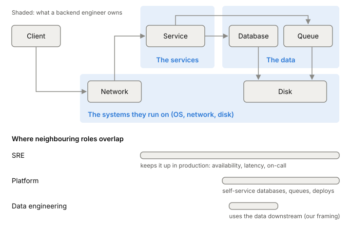

# What a backend engineer owns

A backend engineer builds and runs the parts of a product users never see:
the services that answer requests, the data those services keep, and the
machines, networks and disks underneath. There's no single official
definition of the job. This graph uses one on purpose, because it decides
what the rest of the graph teaches.

## The working definition this graph uses

Think of one request. A user taps "pay". The request crosses the network,
lands on a service, the service reads and writes a database, maybe drops a
message on a queue for later work, and answers. A backend engineer owns
that whole path:

- **The data.** What's stored, in what shape, how it's kept correct when
  two requests change it at once, and how it survives a crash.
- **The services.** The code that handles the request, its API, how it
  fails, and how it behaves under load.
- **The systems they run on.** Enough of the operating system, network and
  storage to know why the service is slow or why data went missing, and
  to fix it.

The last one is why this graph starts with the machine. You can't reason
about a database's durability without knowing what the disk promises, or
about latency without knowing what a round trip costs. The first stop is
[[latency-numbers]]: how long the basic operations take.

*One request's path, and what a backend engineer owns along it. The data engineering overlap is our own framing.*

## Where the neighbouring roles overlap

**Site Reliability Engineering (SRE).** In Google's definition, SRE is software engineers doing operations work: running production and
automating what system administrators used to do by hand. An SRE team is
responsible for a service's availability, latency, performance,
efficiency, change management, monitoring, emergency response and capacity
planning. Google caps the operational work of its SREs, taken together, at 50% of their time. When
it runs over, the extra work goes back to the product developers, including
putting them on call. So the line between backend engineer and SRE is
deliberately blurry. The backend engineer builds the service to be
operable; the SRE makes sure it stays up, and hands work back when it
doesn't.

**Platform engineering.** A platform, in one widely used definition, is a
set of self-service APIs, tools, services, knowledge and support, run as
an internal product, that delivery teams build on. The platform team's
goal is that you can get a database, a queue or a deploy pipeline without
filing a ticket and waiting on another team. The backend engineer is
usually the platform's customer. When there's no platform team, the
backend engineer does that work too.

**Data engineering.** The overlap is the data itself. The backend
engineer's database is often where analytics data comes from, so how data
is shaped, changed and streamed out affects the people downstream. This
graph doesn't have a good source on the data engineering role yet, so
this part is our framing only.

## Where it gets tricky

**Titles don't match work.** DevOps, SRE, platform and backend overlap,
and companies draw the lines differently. DevOps as a term dates from late
2008 and shares many of SRE's principles, and the same work gets
different names at different companies. Ask what someone owns, not what
they're called.

**Reliability isn't someone else's job.** Even where there's an SRE team,
a service built without thought for failure pushes its operational load
back onto its developers. That feedback loop is by design.

## What this means when you build

- Own the path your requests take, end to end, including the parts that
  run on someone else's platform.
- Learn the machine underneath early. Many hard backend bugs live at the
  boundary between your code and the OS, network or disk.
- Build services that other people can run: clear failure modes,
  signals handled, numbers you can measure.

## Further reading

- [Introduction (Site Reliability Engineering, ch. 1)](https://sre.google/sre-book/introduction/), Benjamin Treynor Sloss, 2016. What SRE is, what an SRE team owns, and how operational work flows back to developers.
- [What I Talk About When I Talk About Platforms](https://martinfowler.com/articles/talk-about-platforms.html), Evan Bottcher, 2018. The common definition of an internal platform and why self-service matters.
