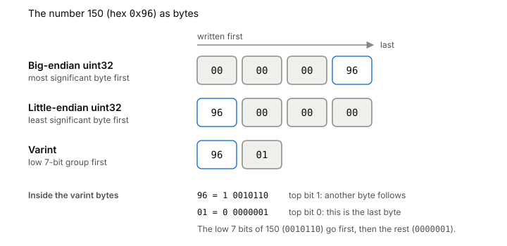

# Binary encoding

A file on disk is only bytes. Before you can store a record, you have to decide exactly which bytes stand for the number 150 or the string "testing", and the reader has to make the same decisions in reverse. Binary encoding is that set of decisions: byte order, fixed or variable width, and how the reader knows where a piece of data ends.

## One number, several ways to write it

Take the number 150 and a program that wants to save it.

The simplest choice is a fixed width. You say "this field is always a 32-bit unsigned integer" and write 4 bytes. 150 is `0x00000096`, so the 4 bytes are `00 00 00 96` or `96 00 00 00`, depending on which end you write first. Both are fine, as long as the writer and the reader agree.

That choice is the byte order, or endianness. Little-endian writes the least significant byte first (`96 00 00 00`). Big-endian is the other way round, most significant byte first (`00 00 00 96`). In Go, `encoding/binary` gives you `BigEndian` and `LittleEndian`, and each has `PutUint32` to write a number into a byte slice and `Uint32` to read it back. It also has `NativeEndian`, which uses whatever the current CPU uses. That's handy for memory, and a trap for files, because a file written on one machine may be read on another.

Fixed width is fast and simple. The reader always knows the next field starts 4 bytes later. The cost is space: a length that's usually under 100 still takes 4 bytes, or 8 if you picked 64 bits to be safe.

*One number, three encodings. Varint layout adapted from Google, "Encoding" (Protocol Buffers documentation, protobuf.dev).*

## Varints: small numbers take fewer bytes

A varint spends a byte only when it needs one. The version used by Protocol Buffers, and by Go's `encoding/binary`, works like this:

1. Split the number into 7-bit groups, starting from the low end.
2. Put each group in its own byte, least significant group first.
3. Set the top bit of every byte except the last. That bit means "another byte follows".

For 150, the low 7 bits are `0010110` and the next group is `0000001`. The first byte gets the continuation bit set: `10010110`, which is `0x96`. The second byte has it clear: `00000001`. So 150 is the two bytes `96 01`. The number 1 fits in one byte, `01`.

A 64-bit value takes one to ten bytes this way. Go names the worst cases: `MaxVarintLen16` is 3, `MaxVarintLen32` is 5 and `MaxVarintLen64` is 10. Use them to size buffers.

Negative numbers need care. Stored as plain two's complement, a small negative number has its high bits set, so it always uses all ten bytes. ZigZag encoding fixes that by interleaving signs: 0 becomes 0, -1 becomes 1, 1 becomes 2, -2 becomes 3. In general a positive p becomes 2p and a negative n becomes 2|n| - 1. In Go, `PutVarint` and `Varint` are the signed versions that take and return an `int64`.

## Length prefixes: telling the reader where data ends

A number knows its own size. A string or a blob of bytes doesn't. The reader needs to know where it stops.

The usual answer is a length prefix: write the length first, then the bytes. Protobuf writes the string "testing" in field 2 as `12 07 74 65 73 74 69 6e 67`. `12` is the field tag, `07` is the length as a varint, and the seven bytes after it are the text. The reader takes the length, reads exactly that many bytes, and knows the next field starts right after.

The other option is a terminator, a special byte value that marks the end. That breaks as soon as the data itself can contain that value. A length prefix doesn't care what's inside.

## Where it gets tricky

A reader has to distrust the bytes it's decoding. A length prefix read from a damaged file can say "the next record is 4 GiB". If the reader allocates that much or trusts it blindly, one bad byte takes the program down. Check the length against what's left in the file and against a sane maximum before using it.

Varint decoders can fail in two ways. Go's `Uvarint` returns the value and a byte count, and the count tells you what went wrong: 0 means the buffer ended in the middle of the varint, and a negative count means the value overflowed 64 bits. Code that ignores the count will quietly read garbage. A buffer that ends mid-number is exactly what you find at the end of a file after a crash.

The standard library isn't built for speed. `encoding/binary` favors simplicity over efficiency, and for serializing large structures the Go docs point you to protobuf or `encoding/gob`. For a record header of a few fixed fields, calling `PutUint32` and `Uint32` directly is plenty.

## What this means when you build

- Write the format down before writing code: every field, its width, its byte order.
- Pick one byte order for the file and never use `NativeEndian` for data on disk.
- Use fixed width for headers you want to read without parsing, and varints where many small numbers add up.
- Prefix every variable-length field with its length, and check that length before trusting it.
- The [[append-only-log]] builds its records from exactly these pieces: a fixed header with a length, then the payload.

## Further reading

- [Encoding (Protocol Buffers)](https://protobuf.dev/programming-guides/encoding/), Google. The clearest walk-through of varints, ZigZag and length-delimited fields, with byte-by-byte examples.
- [encoding/binary](https://pkg.go.dev/encoding/binary), The Go Authors, go1.27.1. The Go API the lab will use: byte orders, `PutUvarint`, `Uvarint` and its error convention.
