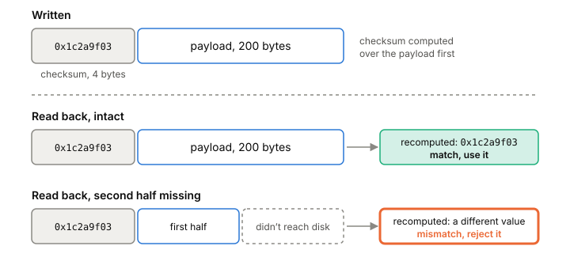

# Checksums

A checksum is a small number computed from a block of bytes and stored next to it. When you read the bytes back, you compute the number again and compare. If they differ, the data changed since it was written, and you know not to trust it. For storage code, this is how you tell a good record from one that was cut short by a crash or damaged on the way.

## How a checksum catches a bad record

Say your program writes a 200-byte record to a file. Before writing, it runs the 200 bytes through a checksum function and gets a 32-bit value, say `0x1c2a9f03`. It writes those 4 bytes into the record's header, then the 200 bytes.

Later, maybe after a restart, the program reads the record. It computes the checksum of the 200 bytes it found and compares it with the 4 stored bytes.

- They match: almost certainly the bytes are what was written.
- They don't match: something changed. Maybe only part of the record reached the disk before the power went out (a [[torn-writes|torn write]]), maybe the disk returned damaged data, maybe a bug wrote over it.

The checksum doesn't say what went wrong or how to fix it. It only says "don't trust this". What you do next is up to the code around it. An [[append-only-log]] usually treats a bad record at the very end of the file as a write that never finished, and throws it away.

*A checksum written with the record, checked on the way back in.*

## Picking a checksum: strength against cost

Checksum functions sit on a line from cheap and weak to expensive and strong.

- The Internet checksum, used in IPv4, TCP and UDP headers, is 16 bits. It's very fast and misses a lot of errors.
- Adler-32 is 32 bits and cheap to compute in software, but weak on short messages, and short messages are exactly what small log records are. Fletcher's checksum is a little stronger and a little slower.
- CRCs (cyclic redundancy checks) are the middle ground. They're well studied and easy to build into hardware.
- Cryptographic hashes sit at the strong end. They're 16 bytes or more and cost far more CPU.

For storage, the usual answer is CRC32C, the 32-bit CRC with Castagnoli's polynomial. It catches more errors than the older IEEE CRC-32 polynomial, which is the one ethernet, gzip, zip and PNG use.

The reason CRC32C won is hardware. Intel added a CRC32 instruction for the Castagnoli polynomial in SSE 4.2, and many ARM64 CPUs have CRC32 instructions too. With the instruction, CRC32C costs less than Adler-32 does in software, so there's no speed reason to settle for a weaker checksum.

## CRC32C in Go

Go's standard library has it in `hash/crc32`. You build a table once with `crc32.MakeTable(crc32.Castagnoli)` and then call `crc32.Checksum(data, table)`, or `crc32.Update` to feed data in pieces.

As of the Go source on 2026-09-28, the package checks the CPU at run time. On amd64 with SSE 4.2, and on arm64 with the CRC32 feature, Castagnoli uses the hardware instruction. Otherwise it falls back to a software method called slicing-by-8, which uses lookup tables. The same binary gets the fast path wherever the CPU supports it.

Watch the default: `crc32.ChecksumIEEE` and `crc32.NewIEEE` use the IEEE polynomial. If a file format says CRC32C and you call the IEEE function, every checksum will fail.

## Where it gets tricky

A checksum detects accidental damage. It isn't a defense against someone changing the data on purpose, who can simply recompute it. That job needs a cryptographic hash or a signature.

A matching 32-bit checksum is strong evidence, not proof. Across billions of records, a damaged one could match by chance. For crash recovery that's accepted, since the alternative, a cryptographic hash per record, costs far more.

Decide exactly which bytes the checksum covers. If it covers the payload but not the length field, a damaged length can send the reader to the wrong place before the checksum is ever checked. So check the length against what's left in the file before using it (see [[binary-encoding]]), and consider covering header fields with the checksum too.

Older advice on CPU support goes stale. Articles from around 2010 warn that many CPUs lack the instruction; check your own CPU instead of trusting that.

## What this means when you build

- Put a CRC32C in every record header, and write down which bytes it covers.
- In Go, use `crc32.MakeTable(crc32.Castagnoli)`, not the IEEE helpers.
- On read, compute it before you trust anything else in the record.
- A mismatch means "stop and decide", not "retry". Decide in advance what your recovery does with a bad record at the end of the file and one in the middle.

## Further reading

- [hash/crc32](https://pkg.go.dev/hash/crc32), The Go Authors, go1.27.1. The API, the three predefined polynomials, and (in the package source) how the hardware path is chosen.
- [More Than You Wanted to Know About Checksums](https://www.evanjones.ca/crc32c.html), Evan Jones, 2010. A short tour from the Internet checksum to CRC32C and why hardware support settled the choice. The CPU-support details are dated.
