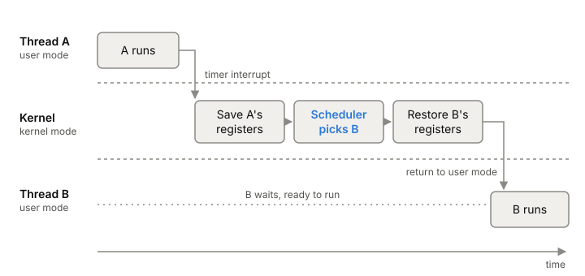

# Context switches

A context switch is the kernel taking one thread off a CPU core and
putting another one on. It's how one core runs many threads, and it's
cheap enough that you rarely notice one. You notice thousands per second,
because each switch costs a little directly and can cost much more in
cache misses afterwards.

## What happens in one switch

The kernel can only switch when it's running. It gets the CPU back from a
thread in one of two ways. Either the thread makes a [[system-call]], for
example a `read` that has to wait for data, or a timer interrupt fires and
takes the CPU back from a thread that would otherwise keep it. Once the
kernel has control, the [[cpu-scheduler]] decides whether to keep running
the same thread or pick another.

If it picks another, the switch itself is short:

1. Save the current thread's registers, including its program counter and
   stack pointer, onto its kernel stack.
2. Load the saved registers of the next thread.
3. If the next thread belongs to a different [[process]], switch to that
   process's page tables.
4. Return to user mode. The CPU now carries on in the other thread, from
   where it last stopped.

*One context switch on one core, triggered by a timer interrupt. Adapted from Remzi and Andrea Arpaci-Dusseau, "Mechanism: Limited Direct Execution" (Operating Systems: Three Easy Pieces, 2023).*

A system call on its own isn't a context switch. Entering the kernel and
coming back to the same thread is only a change of mode. A switch happens
when the kernel runs a different thread on the way out.

## What it costs, directly

On the lab machine (i5-13500H, Linux 7.1.9), two processes pinned to the
same core passed one byte back and forth over two pipes. One round trip,
which forces two context switches plus two `write` and two `read` calls,
took **1.7 µs** (median of 11 runs of a million round trips each). So one switch plus
its pipe work is under 1 µs. For comparison, an empty system call took
64 ns in the same run. The test doesn't separate the switch from the pipe
work. See
[experiment 0001](../../experiments/0001-latency-numbers-on-my-laptop.md).

Older numbers fit the same range. In 1996, on Linux 1.3.37 and a 200 MHz
P6, a switch took about 6 µs. In 2010, measured with futexes on Intel
server CPUs, a switch pinned to one core cost 1.1 to 1.9 µs, and 3 to
4.5 µs when the two sides could run on different cores.

## What it costs, indirectly

The direct cost is the small part. The next thread arrives on a core whose
caches are full of the last thread's data. Its own data has to come back
from further down the [[memory-hierarchy]]. If the switch crossed into
another process, the page tables changed too. On the x86 machines tested in
2010, loading new page tables flushed the TLB, so address translations had
to be looked up again.

In the 2010 tests, the time per switch climbed as each process's working
set grew past the L1 cache, and pinning both processes to one core, so they
shared the same caches, made it an order of magnitude faster. The author's
worst-case rule of thumb was about 30 µs of CPU per switch once cache
effects are counted. That's a judgement, not a measurement, but it shows
the gap between a microbenchmark and a real server.

Switching between two threads of the same process is a little cheaper,
because the page tables stay the same. In the 2010 tests the gap was 5 to
20%. Threads with different working sets still evict each other's data
from the caches.

## Where it gets tricky

**The numbers disagree because they measure different things.** Textbooks
call modern switches sub-microsecond. Our pipe round trip says under 1 µs
per switch with the pipe work included. The 2010 futex tests say 1 to
4.5 µs. The 30 µs rule adds cache damage. Pinned or not, empty or with a
working set, direct or total: always say which.

**Waiting is its own cost.** A thread that's switched out and becomes
runnable again still has to wait for a free core. With more busy threads
than cores, that wait adds straight to your request latency.

## What this means when you build

- Many more busy threads than cores means lots of switches and lots of
  waiting. A pool sized near the number of cores switches far less than
  one thread per request.
- Blocking calls cause switches. Every `read` that waits gives up the core.
- When you benchmark, pin to one core and say so, or your numbers include
  core migrations.

## Further reading

- [Mechanism: Limited Direct Execution (Operating Systems: Three Easy Pieces, ch. 6)](https://pages.cs.wisc.edu/~remzi/OSTEP/cpu-mechanisms.pdf), Remzi and Andrea Arpaci-Dusseau, 2023. How the kernel gets control back and what a switch saves and restores.
- [How long does it take to make a context switch?](https://blog.tsunanet.net/2010/11/how-long-does-it-take-to-make-context.html), Benoit Sigoure, 2010. Measured direct costs, and how cache pollution makes switches expensive.
