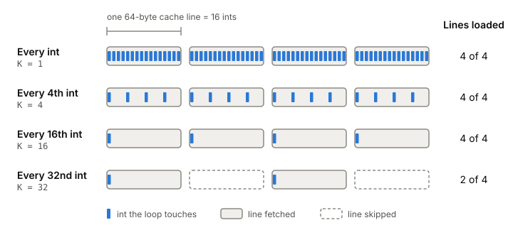
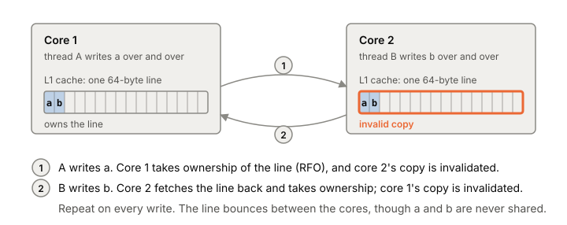

# CPU caches

A CPU cache is a small, fast copy of recently used parts of RAM that sits
next to the cores. It moves data in fixed blocks called cache lines, and
that one detail explains most of what caches do to your code, including a
nasty slowdown called false sharing that only shows up with several
threads.

## The cache works in lines, not bytes

When your code reads one byte that isn't in the cache, the CPU doesn't
fetch one byte. It fetches the whole cache line that contains it, usually
64 bytes (early caches used 32). The line's address is the byte's
address with the low 6 bits cleared, and those 6 bits say where in the
line the byte is.

That's a hit or a miss at line granularity. The first read of a line is a
miss and pays the trip down the [[memory-hierarchy]], which on the lab
laptop means about 1 ns if the line is in L1 and over 100 ns if it has to
come from RAM ([experiment 0001](../../experiments/0001-latency-numbers-on-my-laptop.md)).
Reads of the other 63 bytes of that line are hits and cost almost nothing.

A simple test makes this visible. Take a big array of 4-byte ints and loop
over it, touching every Kth element. For K from 1 to 16 the running time
barely changes, because 16 ints fill one 64-byte line and every one of
those loops touches every line. From K = 16 onward, doubling K halves the
time, because now each doubling skips half the lines. You pay per line,
not per element.

*You pay per line, not per int: strides 1 to 16 touch every line, and stride 32 skips half of them. Adapted from Igor Ostrovsky, "Gallery of Processor Cache Effects" (igoro.com, 2010).*

## Several cores, one line

Each core has its own small caches. So the same line can be copied into
several cores' caches at once. That's fine while everyone only reads. When
one core writes, the others' copies are now stale, and the hardware has to
fix that.

The best-known protocol for keeping caches consistent is MESI, named for the
four states a line can be in: Modified, Exclusive, Shared, Invalid. The
part that matters for you: before a core can write to a line, it needs the
line in its own cache in an exclusive state. It gets that by asking the
other cores to drop their copies, which is a request-for-ownership (RFO)
message. After the write, every other core that wants the line must fetch
it again.

## False sharing

Now put two [[thread|threads]] on two cores. Thread A increments counter
`a`, thread B increments counter `b`. They never touch each other's
variable, so there's no race and no lock. But if `a` and `b` sit in the
same 64-byte line, every write by A takes the line away from B, and every
write by B takes it back. The line bounces between the cores, and each
write can cost a round of ownership messages.

This is false sharing. The threads share nothing in the program's logic,
only a cache line, and the hardware can't tell the difference.

The slowdown is large. In one published test, four threads each updating
their own int in a shared array took 4.3 seconds when the ints were
adjacent, and 0.28 seconds when they were 16 ints (one line) apart. That's
about 15 times slower for code that is identical except for where four
numbers live. A 2007 test that had threads increment their own memory
location 500 million times measured overheads of 390%, 734% and 1,147%
as more threads shared one line. Every extra core adds more waiting.

*False sharing: thread A only writes `a` and thread B only writes `b`, but because they share one line, every write takes the line away from the other core.*

## Where it gets tricky

Nothing in the code looks wrong. It's correct, there's no lock, and it
just runs slow, slower with every core you add. You find it by suspecting per-thread or
per-core counters, stats and slots that sit next to each other in one
array or struct.

The fix works against the usual cache advice. Normally you pack data tight
so more of it fits in cache. For data that different threads write, you do
the opposite: give each writer's data its own line, by padding or by
spacing, and keep read-mostly data away from frequently written data so
the reads don't get invalidated too.

## What this means when you build

- Think in 64-byte lines. Fields used together should sit together; a
  struct that spans two lines costs two misses.
- Per-thread or per-goroutine counters in one array are a false-sharing
  trap. Space them a line apart, or give each its own struct with padding.
- Separate fields that are written often from fields that are only read,
  when many cores read them.
- Measure with more than one thread before you trust a concurrent data
  structure's speed.

## Further reading

- [What Every Programmer Should Know About Memory](https://www.akkadia.org/drepper/cpumemory.pdf), Ulrich Drepper, 2007. Section 3 explains cache lines and MESI; section 6.4.1 measures false sharing and shows how to avoid it.
- [Gallery of Processor Cache Effects](http://igoro.com/archive/gallery-of-processor-cache-effects/), Igor Ostrovsky, 2010. Examples 2 and 6 are the stride test and the false-sharing test above, small enough to rerun.
