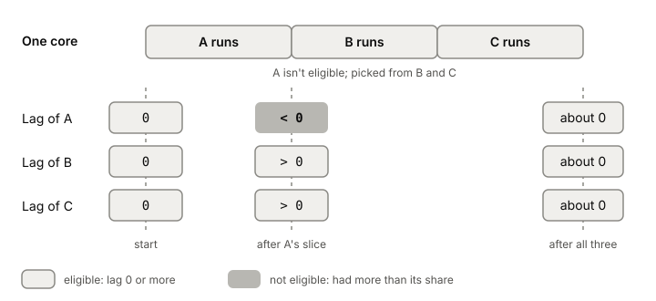

# The CPU scheduler

A machine has a handful of cores and usually far more [[thread|threads]]
that want to run. The CPU scheduler is the part of the kernel that decides
which thread runs next on each core, and for how long. When your service's
latency jumps under load, part of the reason is often who the scheduler
picked and who it made wait.

## When the scheduler gets to choose

Whenever the kernel has the CPU back from a running thread, the scheduler
decides: keep running this thread, or switch to another one. How the kernel
gets the CPU back, and what the switch costs, is the
[[context-switch]] article.

The scheduler only chooses among runnable threads. A thread blocked on disk
or network isn't in the running.

## Fair shares: what Linux aims for

For normal threads, Linux tries to share CPU time evenly among runnable
threads of the same priority. If four equal threads want one core, each
should get about a quarter of it over time.

From Linux 2.6.23 until 6.6, the algorithm doing this was CFS, the
Completely Fair Scheduler. CFS used heuristics and a set of tunable knobs
to guess which threads needed attention. Linux 6.6, released on
2023-10-29, replaced it with **EEVDF**, Earliest Eligible Virtual Deadline
First, an algorithm first published in 1995. Many of the old CFS knobs
went away with it. The kernel on the lab machine is 7.1.9, so EEVDF is what
runs there.

## How EEVDF picks

EEVDF keeps two ideas per thread.

**Lag.** The scheduler tracks how much CPU time each thread has had against
its fair share. The difference is its lag. Positive lag means the thread is
owed time. Negative lag means it has had more than its share. Only threads
with lag of zero or more are **eligible** to run.

**Virtual deadline.** For each eligible thread, EEVDF works out a virtual
deadline and runs the eligible thread with the **earliest** one.

A worked example with three equal threads, A, B and C, on one core:

1. All three start with lag 0, so all are eligible. One of them, say A,
   runs for its slice.
2. A now has negative lag (it got ahead). B and C have positive lag (they're
   owed). A isn't eligible, so the choice is between B and C.
3. B runs, then C. After each has had its turn, the lags come back to about
   zero and all three are eligible again.

Nobody gets starved, and a thread that got too much waits until the others
catch up.

*Our own example of EEVDF lag with three equal threads. Signs only, no real values; lags after B's slice aren't shown.*

**Short slices go first.** A thread with a shorter time slice gets an
earlier virtual deadline, so it's picked sooner. That favours
latency-sensitive work. A thread can
ask for a particular slice length with the `sched_setattr()` system call.
And a thread with an earlier deadline can preempt the one running.

**Sleeping doesn't reset your debt.** If a thread with negative lag could
sleep for a moment and come back with a clean slate, it could game the
scheduler. So on current kernels, when a thread sleeps, it stays on the run queue marked for
"deferred dequeue" and its lag decays over time. A thread that sleeps a
long while comes back with its lag reset; one that naps briefly doesn't.

## Where it gets tricky

**Descriptions of 6.6 don't match.** The 6.6 release notes describe CFS as
replaced outright. The kernel's own EEVDF page describes 6.6 as the start
of a transition and calls it a new option in 2024, though 6.6 came out in
October 2023. Either way, from 6.6 on you're running EEVDF. Many CFS
tunables were removed, so if you read an older article about tuning CFS,
check whether those knobs still exist on your kernel.

**Fair isn't the same as fast.** Equal shares mean a busy batch job and your
request handler split the core evenly if they have the same priority. When
latency matters, the answer is fewer runnable threads per core, or a
shorter slice for the latency-sensitive ones.

## What this means when you build

- More runnable threads than cores means every thread waits its turn.
  That wait shows up as latency, not as CPU usage in your own code.
- Each time the scheduler switches threads, you pay for a
  [[context-switch]].
- On kernels from 6.6 on, EEVDF favours threads with short slices. On
  older kernels, CFS behaves differently; say which one you measured on.

## Further reading

- [EEVDF Scheduler](https://docs.kernel.org/scheduler/sched-eevdf.html), Linux kernel documentation. The kernel's own description of lag, eligibility, deadlines and sleeping tasks.
- [Linux 6.6](https://kernelnewbies.org/Linux_6.6), Kernel Newbies, 2023. What changed when EEVDF replaced CFS, and why.
