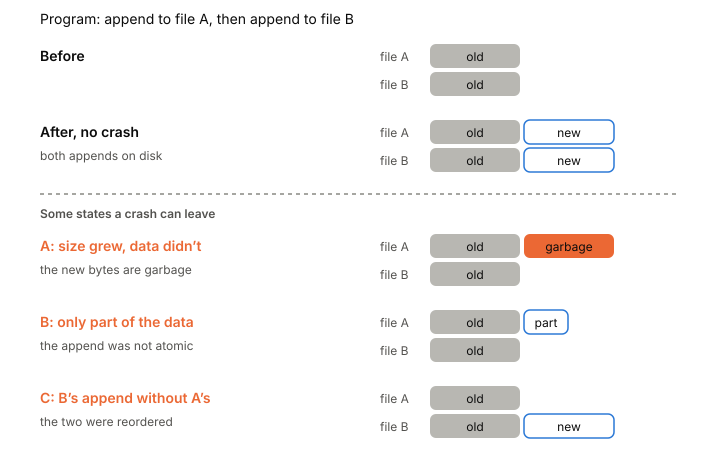

# Crash consistency

When the power goes out, your program stops in the middle of whatever it was doing. Some of its writes are on disk, some are lost, and some are half there. Crash consistency is the property that whatever mix survives, your program can start up again and get back to a correct state. It doesn't happen by default. You have to design for it, and the rules are less clear than most people expect.

## One small update is really several writes

Start with the smallest possible case: appending one block to a file.

To the program it's one `write`. To the [[filesystem]] it's at least three separate writes to three different places on disk:

1. the new data block,
2. the file's inode, updated to point at the new block and with a bigger size,
3. the bitmap that records which blocks are in use.

The disk can finish these in any order, and the power can fail between any two of them. Each partial result is broken in its own way:

- Only the data block landed. The data is on disk, but nothing points to it. The append is lost, but nothing is corrupt.
- Only the inode landed. The file now points at a block that holds whatever was there before: garbage. And the bitmap says that block is free, so something else may be written there later.
- Only the bitmap landed. A block is marked as used, but no file owns it. Space leaks.
- The inode and bitmap landed, but not the data. Everything looks consistent, and the file silently contains garbage.

That last case is the nasty one. No checker can spot it by looking at the file system's own structures, because they all agree with each other.

What you want is to move from one consistent state (before the append) to the next (after it) atomically, as if all three writes happened at once or not at all. Disks don't offer that for a group of writes, so the file system has to build it.

*One append is three writes, and each partial result breaks in its own way. Adapted from Remzi and Andrea Arpaci-Dusseau, "Crash Consistency: FSCK and Journaling" (OSTEP chapter 42, 2023).*

## How file systems solved it for themselves

The first answer was to repair after the fact. After a crash, a tool called fsck scans every inode, bitmap and directory, rebuilds what it can and fixes disagreements. It works, but it has to read the whole disk, so recovery time grows with disk size. And it can't catch the "consistent but garbage" case.

The answer most file systems use now is journaling, which is the file system name for write-ahead logging. Before touching the real structures, the file system writes a description of the whole update to a separate area, the journal:

1. Write a begin record and the new blocks to the journal. Wait until they're on disk.
2. Write a small commit record. Wait again. The update is now committed.
3. Copy the new blocks to their real places. This is called checkpointing.

After a crash, recovery reads the journal. An update with no commit record is skipped, as if it never started. An update with a commit record is replayed from the journal. If the crash hit during checkpointing, some blocks get written twice, which is harmless because it's the same data.

The wait between steps 1 and 2 matters. If the file system sent all the blocks at once, the disk could write the commit record before the data, and recovery would replay a "committed" update full of garbage. One fix is to put a [[checksums|checksum]] of the whole transaction in the commit record. Then the file system can send everything at once, and on recovery a checksum mismatch means the crash hit mid-write, so the update is thrown away.

Most journaling file systems don't journal file data at all, only metadata. In this ordered mode, the file system writes your data to its final place first, then journals the inode and bitmap changes. That avoids writing every byte twice.

Journaling cuts recovery time from "scan the whole disk" to "read the journal". Other designs exist. Soft updates carefully order every write so the disk is never inconsistent. Copy-on-write never overwrites anything in place: it writes new versions elsewhere and then switches one root pointer.

Keep these three ideas. They come back at the application level: a log with a commit marker, a checksum to spot unfinished writes, and "write the new version elsewhere, then switch".

## Your program has the same problem one level up

The file system keeps its own structures consistent. It does not keep your files consistent. That's your job, and it's harder, because you don't control the order in which the disk sees your writes.

Take two appends, one to file A and then one to file B. After a crash you might find:

- both appends, or neither,
- A's append but not B's, which is fine if your code expects it,
- B's append without A's, if the file system reordered them,
- a file whose size grew but whose new bytes are garbage, if the size update reached disk before the data,
- a file with only part of the new data (see [[torn-writes]]).

A program that updates its files in several steps, like "append to the log, then rename a file", relies on some of these outcomes being impossible. A 2014 study called those assumptions persistence properties. They come in two kinds:

- Atomicity. Does an operation happen all at once? Is a single-sector overwrite atomic? A multi-block append? A rename?
- Ordering. Can a later operation reach disk before an earlier one? Can a rename land before the data written just before it?

The study tested six Linux file systems (ext2, ext3, ext4, btrfs, xfs and reiserfs) and found the answers vary widely, even between modes of the same file system. Single-sector overwrites looked atomic everywhere they tested. Appends that span several blocks were never atomic. Successive appends to the same file stayed in order. Directory operations were freely reordered on ext2 and btrfs. And appends to one file reached disk before a later rename of another on ext3 in ordered mode, but not on ext4 in the same mode unless a special option was set.

Then they looked at eleven real systems, including LevelDB, SQLite, PostgreSQL, Git, HDFS and ZooKeeper. They found 60 crash vulnerabilities: places where correctness depended on a property some file system doesn't provide. Roughly half showed up on file systems in use at the time: ext3, ext4 and btrfs. Seven of the eleven had trouble recovering if system calls weren't persisted in order. Ten expected some update to be atomic. Git, for example, needed its appends to reach disk before a rename; if the rename landed first, every later commit to the repository failed.

*Two appends and some of the states a crash can leave. Adapted from Pillai et al., "All File Systems Are Not Created Equal: On the Complexity of Crafting Crash-Consistent Applications" (OSDI, 2014).*

## Nobody wrote down the rules

The root problem is that POSIX, the standard these calls come from, describes what each call does to the running system. It says almost nothing about what's on disk after a crash. The one call with a clear crash promise is [[fsync]]: once it returns, the file's data up to that point is supposed to be on stable storage. Everything else is up to each file system.

That gap has caused real damage. In 2009, ext4 users reported that after a crash, many files written in the previous boot were empty. Applications had been replacing files by writing a new copy and renaming it over the old one, without fsync. On ext3 this happened to work: in its default mode ext3 flushed file data before committing metadata to its journal every five seconds, so data rarely lagged behind the rename. Nobody had promised that. ext4 delays choosing disk blocks for new data, which is good for speed, so the rename could reach disk long before the data did. The [[atomic-rename]] node tells the rest of that story.

One proposed fix is to treat this like a CPU's memory model. A memory model lists which reorderings of loads and stores other cores can see, often as small "litmus tests". A crash-consistency model would list which on-disk outcomes a sequence of file operations can leave. Researchers wrote such a model for ext4 in 2016 and used it to show unexpected crash behaviors. The 2014 study put the wider problem plainly: there was no standard for these properties at all, and defining them was the first step.

## Designing so a crash is always recoverable

Since the file system won't do it for you, build your update protocol from a few pieces that work regardless of which file system you run on.

Use fsync as the ordering tool. If B must not reach disk before A, write A, fsync A, then write B. Without that fsync, assume the two can land in either order. fsync is also the only point where you know data is durable. Tell a caller "saved" only after it returns.

Sync directories too. Creating, renaming or deleting a file changes the directory, not the file. On some file systems a new file can vanish after a crash unless you also fsync its parent directory.

Write new data elsewhere, then switch. Never overwrite the only copy of something in place. Write the new version to a new file or a new region, make it durable, then flip a pointer to it in one small step. The [[atomic-rename]] pattern does this for whole files.

Keep a log with a clear commit point. Append a description of the change, make it durable, and treat the change as done only then. On recovery, replay what committed and ignore what didn't. This is the [[append-only-log]].

Check what you read back. Put a checksum on every record so recovery can tell a complete record from one that was cut off or damaged, and refuse to use the damaged one.

Make recovery safe to repeat. A crash can happen during recovery too. Replaying the same committed change twice must give the same result.

## Where it gets tricky

Application and file system developers disagree about whose job this is. File system developers point out that POSIX allows the reorderings and that they're needed for speed. When the 2014 study's authors reported the bugs they found, the replies often said POSIX doesn't let file systems do that, without pointing to any text that says so. The 2009 ext4 episode ended with both sides moving: applications were told to fsync, and ext4 added heuristics to handle the common rename pattern anyway.

Most bugs are about ordering. The most common mistake in the 2014 study was assuming two system calls reach disk in the order they were made. The next was assuming a call is atomic. Both look correct in testing, because without a crash, everything happens in order.

fsync is not always the end of the story. Some systems have had an fsync that doesn't flush the drive's cache: as of 2015, macOS needed `fcntl(F_FULLFSYNC)` for that. Some drives have ignored flush commands. And fsync can fail, in ways that make retrying useless; see [[fsync-errors]].

Atomicity assumptions depend on hardware. Single-sector overwrites looked atomic in the 2014 tests partly because the disks provided it. Storage that's atomic only at a smaller size breaks code that relies on that. [[torn-writes]] covers what drives actually promise.

Research tools test the idea; your code needs its own tests. The only way to know your protocol works is to crash it and look. [[crash-testing]] covers how.

## What this means when you build

- Write your update protocol down as a list of system calls, and for each step ask what's on disk if the power fails right after it.
- Assume nothing reaches disk in order unless an fsync separates it.
- fsync the file, and fsync the directory after creating or renaming files.
- Never overwrite the only copy. Write new, sync, then switch.
- Checksum records and design recovery to drop what's incomplete and to be safe to run twice.
- Don't trust a file system's behavior you can't find written down. Code for the weakest one you might run on.

## Further reading

- [All File Systems Are Not Created Equal: On the Complexity of Crafting Crash-Consistent Applications](https://www.usenix.org/conference/osdi14/technical-sessions/presentation/pillai), Pillai et al., 2014. The study of persistence properties across six file systems and 60 vulnerabilities in eleven applications.
- [Crash Consistency: FSCK and Journaling](https://pages.cs.wisc.edu/~remzi/OSTEP/file-journaling.pdf), Remzi and Andrea Arpaci-Dusseau, OSTEP chapter 42, 2023. The clearest walk-through of the three-write example, fsck and journaling.
- [Specifying and Checking File System Crash-Consistency Models](https://jamesbornholt.com/papers/ferrite-asplos16.pdf), Bornholt et al., 2016. Crash behavior as a memory-model-style spec, with litmus tests and the rename example.
- [Files are hard](https://danluu.com/file-consistency/), Dan Luu, 2015. A readable tour of the research, with an undo-log example that picks up one fix at a time.
- [ext4 and data loss](https://lwn.net/Articles/322823/), Jonathan Corbet, 2009. The 2009 zero-length-files episode and why ext3 had hidden the problem.
