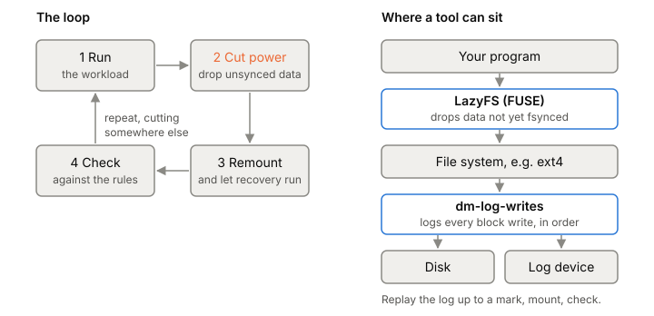

# Crash testing

Crash testing means pulling the plug on storage code on purpose, then checking what's left. Code that saves data can look perfect in every normal test and still lose data on a power cut, because without a crash everything reaches disk in the order you wrote it. The only way to find those bugs is to make crashes happen, many times, at chosen points.

## What a crash test does

Every crash test has the same loop:

1. Run a workload: your program writes records and fsyncs, and notes which writes it told a caller were saved.
2. Cut the power at some point: throw away everything that hadn't reached stable storage.
3. Remount and restart the program, letting its recovery run.
4. Check the result against rules, for example "every record acknowledged as durable is present, and no corrupted record is accepted".

Then repeat with the cut somewhere else. The bugs from [[crash-consistency]] live in specific windows, like between a write and its fsync, so the cut has to land in the right place.

Cutting power to a real machine is slow and hard to repeat, so you simulate it at the file system or at the block device. The two tools below do one each.

*The crash-test loop, and where each tool sits.*

## LazyFS: losing unsynced data at the file system

LazyFS is a FUSE file system you mount on top of a real one, such as ext4. Your program writes through it. LazyFS keeps the written data in its own cache and never flushes it in the background. Data moves to the real file system only when your program calls fsync or fdatasync.

That makes "power loss" easy to fake: tell LazyFS to drop its cache, and everything not synced is gone. You control it by writing commands to a FIFO, or by setting faults in a config file before it starts. It can:

- clear the cache at a chosen point, such as right after the sixth fsync of a given file,
- tear a single write, keeping only some of its parts,
- tear a run of writes with no fsync between them, keeping only some,
- crash itself before or after a given system call on paths matching a pattern, including rename and link.

Its 2024 paper used it to reproduce known data-loss bugs and find eight new ones in systems including PostgreSQL, etcd, ZooKeeper, Redis and LevelDB. When this was written, its latest release was 0.3.1 (2026) and its README marked it a research prototype. It needs FUSE 3, a C++17 compiler and CMake.

LazyFS has two limits that matter here. It only models data that goes through the page cache, so programs using `O_DIRECT` are out of scope. And it can't test whether metadata is durable. It uses file names to decide where to inject faults, but it doesn't model whether a new file, a rename, or other inode changes actually reached disk. So a program that forgets to fsync a directory after a rename, the classic [[atomic-rename]] mistake, can't be caught with LazyFS alone.

## dm-log-writes: recording every block write

dm-log-writes is a device-mapper target in the Linux kernel. You give it two block devices. All I/O goes to the first one as normal, and every write is also copied, in order, to a log on the second one. You put a real file system on top and run your workload on it.

Because it sits below the file system, the log holds every block the file system wrote, so metadata writes are in it along with data. It was built for file system developers checking exactly that.

The logging follows what a drive would really have on disk. An ordinary write isn't logged when it completes, but only when the next flush shows it has left the drive's cache. That models the worst case for a power failure. You can also drop named marks into the log from userspace with `dmsetup message`.

Afterwards, a userspace tool called `replay-log` writes the log back onto a device, up to any mark or one FUA write at a time, and can run a checker such as fsck at each point. Replay to a point, mount, check: that's "what if the power had failed here?"

The cost is setup. You need two block devices, `dmsetup`, and the separate replay tool. The kernel target is in mainline Linux. The replay tool's last commit was in 2024.

## Where it gets tricky

Neither tool finds bugs on its own. They cut power where you tell them, and your checker decides what counts as wrong. A weak checker passes broken code.

Choosing where to cut matters as much as cutting. Random points catch common bugs. The rare windows, like the gap between a rename and a directory fsync, need cuts placed right there.

The two tools test different things. LazyFS is easy to aim and can tear writes, but doesn't model metadata. dm-log-writes captures metadata, but crashes only where the file system flushed. Code that creates or renames files may need both.

## What this means when you build

- Write the checker's rules before the test: what must survive, what must never appear.
- Plant a bug on purpose, such as a missing fsync, and confirm the harness catches it before trusting a pass.
- Log what the program acknowledged, so the checker knows what was promised.
- Test a missing directory fsync with a tool that models metadata.
- The phase 1 harness will use LazyFS or dm-log-writes, and a decision record will say which and why.

## Further reading

- [When Amnesia Strikes: Understanding and Reproducing Data Loss Bugs with Fault Injection](https://www.vldb.org/pvldb/vol17/p3017-ramos.pdf), Ramos et al., 2024. The LazyFS paper: design, the bugs it reproduced, and an honest limitations section.
- [LazyFS](https://github.com/dsrhaslab/lazyfs), INESC TEC. Install steps, fault types and FIFO commands.
- [dm-log-writes](https://docs.kernel.org/admin-guide/device-mapper/log-writes.html), Linux kernel docs. How writes are logged at flush points, marks, and a worked fsync test with `replay-log`.
