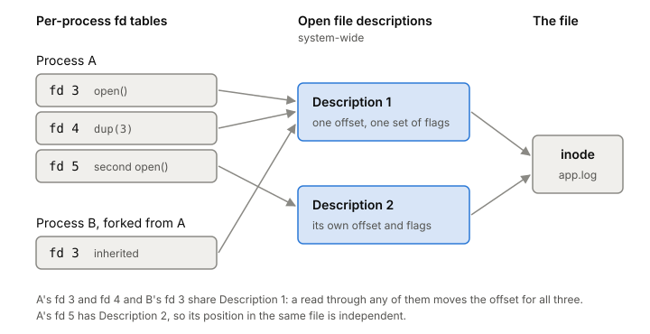

# File descriptors

A file descriptor is a small, non-negative integer that your program uses
to name something it has open: a file, a socket, a pipe. Every read and
write your server does goes through one, and a busy server holds thousands
of them, so knowing what the number points at, and how many you're allowed,
saves you from a class of confusing bugs.

## The number is an index into your own table

When your program calls `open("/var/log/app.log", O_WRONLY)`, it makes a
[[system-call]], and the kernel hands back a number, say 5. That number is
an index into a table that belongs to your [[process]]. You then pass 5 to
`write`, `read`, `lseek` and `close`, and the kernel looks up entry 5 to
find out what you mean.

The kernel always gives you the lowest number not already open in your
process. Close 5, open something else, and you get 5 again.

## Behind the number: the open file description

Entry 5 doesn't hold the file itself. It points to an *open file
description*, an entry in a table the kernel keeps for the whole system.
Kernel developers call this a `struct file`. The open file description
holds two things you care about: the current offset (where the next read
or write happens) and the file status flags you passed to `open`.

The open file description, in turn, points at the file itself, which the
[[filesystem]] article covers.

So there are three levels:

1. Your process's descriptor table: the small numbers.
2. The system-wide open file descriptions: offset and flags.
3. The file itself.

*Three levels: per-process fd tables, system-wide open file descriptions, and the file. Adapted from Michael Kerrisk, "open(2)" (Linux man-pages, 2026).*

The middle level is where the surprises live:

- **Each `open()` makes a new description.** Open the same file twice and
  you get two descriptions with two separate offsets. Writes through one
  don't move the other's position.
- **`dup()` shares a description.** The new fd points at the same
  description as the old one, so the two share one offset. A read through
  one moves the offset for both.
- **`fork()` shares too.** A child process gets copies of the parent's
  descriptors, and those copies point at the parent's descriptions. Parent
  and child writing to the same inherited fd share one offset.
- **The path doesn't matter after open.** If someone deletes or renames
  the file, your fd still points at the file you opened.

## Not just files

The same numbers name sockets, pipes, FIFOs and terminals. `pipe()` hands
back descriptors, and every network connection your server holds open is a
socket with its own descriptor. A server with 10,000 open connections holds
at least 10,000 of them.

## How many you can have

Each process has a limit, `RLIMIT_NOFILE`. It's one more than the highest
fd number the process may open. Try to go past it with `open`, `pipe` or
`dup` and the call fails with `EMFILE`. There's also a system-wide limit
on open files, and hitting that gives `ENFILE`.

The limit comes in two parts. The kernel enforces the soft limit. The hard
limit is a ceiling: an ordinary process can raise its soft limit up to the
hard limit, but not past it. A shell sets these with its `ulimit` builtin,
and every command it starts inherits them, because a child from `fork()`
inherits its parent's limits and keeps them across `exec`. You can see
any process's limits in `/proc/<pid>/limits` (Linux 2.6.24 and later).

## Where it gets tricky

**Descriptors leak into programs you start.** By default an fd stays open
across `exec`. If your server starts a helper program, the helper inherits
your sockets and files unless you ask otherwise. The `O_CLOEXEC` flag
(Linux 2.6.23 and later) closes the fd on `exec`. Setting it at `open`
time matters in threaded programs: setting it afterwards with `fcntl`
leaves a gap where another thread's `fork` plus `exec` can grab the fd.

**Reused numbers hide bugs.** Because the lowest free number is reused, a
thread that closes fd 7 and a second thread that still holds "7" can end
up writing into whatever was opened next.

**Shared offsets after `fork`.** Parent and child writing to one inherited
fd move one shared offset. That's often what you want for a log, and
rarely what you expect otherwise.

## What this means when you build

- Open with `O_CLOEXEC` unless you really want the child to have the fd.
- Count sockets, not only files, against `RLIMIT_NOFILE`. A server that
  holds many connections needs its soft limit raised; `EMFILE` means you
  hit it.
- Close what you open. A leaked fd is a leaked slot in a finite table.
- If two parts of your code need independent positions in one file, give
  each its own `open()`, not a `dup()`.

## Further reading

- [open(2)](https://man7.org/linux/man-pages/man2/open.2.html), Linux man-pages, 2026. The descriptor, the open file description, and how `dup` and `fork` share them (see NOTES).
- [getrlimit(2)](https://man7.org/linux/man-pages/man2/getrlimit.2.html), Linux man-pages, 2026. `RLIMIT_NOFILE`, soft and hard limits, and how `ulimit` sets them.
