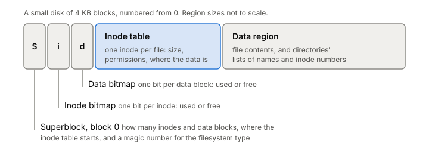
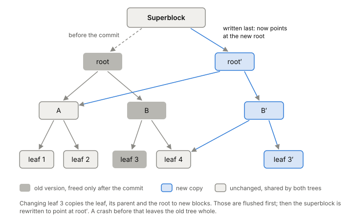

# Filesystems

A filesystem turns a disk's numbered blocks into named files and folders.
It decides which blocks hold your data, where the file's size and owner
live, and how to keep all of that consistent when the power goes out
halfway through an update. Every database and log you build sits on one,
and its design shows up in your latency, in what a crash can leave behind,
and in what "I wrote it" actually means.

## Files are a story told on top of blocks

Say your service appends a line to `/var/log/app.log`. Underneath, the
[[block-device]] knows nothing about files. It has a row of fixed-size
blocks numbered from 0, and it can read or write a block by number. The
filesystem has to answer four questions with nothing but those blocks:

1. Which blocks hold the bytes of `app.log`?
2. How does the name `app.log` lead to those blocks?
3. Which blocks are free for the next write?
4. Where do the file's size and permissions live?

The simplest way to see the answer is a toy filesystem, vsfs, laid out on
a small disk of 4 KB blocks. The first block is the **superblock**: it
describes the filesystem itself, like how many inodes and data blocks
there are and where the inode table starts, plus a magic number that says
what kind of filesystem this is. Next come two **bitmaps**, one bit per
inode and one bit per data block, marking which are in use. Then the
**inode table**, and finally the **data region** where file contents go.

*The toy filesystem vsfs laid out on a small disk. Adapted from Remzi and Andrea Arpaci-Dusseau, "File System Implementation" (OSTEP ch. 40, 2026).*

Real filesystems like ext4, XFS and btrfs are far more elaborate, but the
same pieces show up in some form in all of them.

## The inode holds everything about a file except its name

Each file has an **inode** (short for "index node"). It holds the file's
metadata, like its size and permissions, and where its data is.
Inodes are small, commonly 128 or 256 bytes, so a 4 KB block holds 16 of
256 bytes each. Every inode has a number, and in a simple layout the
filesystem can compute where inode N sits on disk from N alone.

When you `open` a file, the [[file-descriptor]] you get back points at an
open file description, which in turn points at this inode.

The inode has to say which blocks hold the data. There are two main ways:

- **Block pointers.** The inode holds a few direct pointers, one per data
  block. For bigger files, one pointer leads to an indirect block full of
  more pointers, and a double indirect block adds another level. With 12
  direct pointers, one single and one double indirect block, 4 KB blocks
  and 4-byte pointers, a file can reach just over 4 GB. ext2 and ext3 work
  this way.
- **Extents.** An extent is a starting block plus a length: "blocks 9000
  to 9255". One extent can describe a huge run of contiguous blocks, so
  extents take far less metadata when files are laid out in long runs.
  They are less flexible when free space is scattered. ext4 and XFS use
  extents.

## A directory is a file full of names

A directory is a special kind of file with its own inode. Its data blocks
hold a list of pairs: a name and an inode number. The name `app.log` lives
there, not in the file's inode.

So opening `/var/log/app.log` is a walk. The root directory's inode number
is fixed and known at mount time (2 in most Unix filesystems). The
filesystem reads the root inode, reads the root directory's blocks to find
`var`, reads that inode, reads its blocks to find `log`, and so on. The
work grows with the number of path components.

## One small write touches several blocks

Back to the append. If the new line needs a fresh data block, the
filesystem has to:

1. read the data bitmap and find a free block,
2. write the bitmap to mark it used,
3. read the inode,
4. write the inode with the new block pointer and size,
5. write the data block itself.

That's five I/Os for one allocating write in vsfs. Creating a new file is
worse: walking the path, allocating an inode and adding an entry to the
directory came to 10 I/Os in the textbook example, before any data.

Two things follow. First, no real filesystem does all this I/O on every
`write` call. Most buffer writes in memory for somewhere between 5 and 30
seconds and write them out later in batches, which is the job of the
[[page-cache]]. Second, one logical change (append a line) became several
block writes to different places. If the power goes out after some of
them and not others, the on-disk structures disagree: an inode that points
at a block the bitmap says is free, or a bitmap that marks a block used
that no inode owns. Keeping those structures consistent through a crash is
the filesystem's version of [[crash-consistency]], and there are two main
answers.

## Journaling: write the plan down first (ext4, XFS)

A journal is a reserved area where the filesystem writes what it's about
to do before doing it. For the append, it goes like this:

1. **Journal write.** Write a transaction to the journal: a begin block,
   then copies of the new inode, bitmap and (maybe) data. Wait.
2. **Commit.** Write a small commit block. Once that's on disk, the
   transaction counts. Wait.
3. **Checkpoint.** Write the same blocks to their real locations.
4. **Free.** Later, mark the transaction's journal space as reusable. The
   journal is used over and over as a circular log.

After a crash, recovery reads the journal. A transaction without a commit
block is skipped. A committed one is replayed, writing its blocks to
their real places again. Replaying a block that was already written is
harmless.

*Ordered (metadata) journaling for one append, and what a crash at each point leaves. Adapted from Remzi and Andrea Arpaci-Dusseau, "Crash Consistency: FSCK and Journaling" (OSTEP ch. 42, 2023).*

Copying everything into the journal first (**data journaling**) means
every data block is written twice. For sequential writes, that halves the
drive's usable write bandwidth. So most filesystems journal only metadata
and handle data with an ordering rule instead: write the data block to its
final place first, then journal the inode and bitmap that point to it.
The rule is "write the thing being pointed at before the pointer", so a
crash can never leave an inode pointing at garbage.

ext4 lets you pick with a mount option:

- `data=ordered` (the default): ext4 journals only metadata, but groups
  each file's metadata with its data into one transaction and forces the
  data out to its final place before that metadata commits.
- `data=writeback`: metadata is journaled but data isn't ordered against
  it. That's about the same protection XFS gives by default. After a crash, recently written files can contain wrong or
  stale data, which can be a security problem.
- `data=journal`: everything, data included, goes through the journal.
  This turns off delayed allocation and `O_DIRECT`.

Speed goes the other way: writeback is usually fastest, ordered is
slightly slower, and full journaling is the slowest except when a workload
reads and writes heavily at the same time.

ext4 commits its running transaction every 5 seconds by default. A power
cut can lose up to that much metadata work without damaging the
filesystem. Because of delayed allocation (ext4 picks blocks only when it
writes the data out), data older than 5 seconds can still be lost.

XFS also uses write-ahead logging for its metadata. It logs some objects
(inodes) as logical changes and others (raw buffers) as physical block
images, and chains long operations together so recovery can finish
something that was halfway done. Its "delayed logging" collects committed
changes in memory and writes them to the log as one checkpoint, which
keeps the log from filling up with repeated copies of hot objects.

## Copy-on-write: never overwrite anything (btrfs)

My laptop runs btrfs, which takes the other road. btrfs never overwrites a
block in place. Apart from the superblock, everything on disk is a B-tree:
a root tree that leads to the other trees, an extent tree for space
allocation, a chunk tree that maps logical addresses to physical ones, and
trees holding the files and directories themselves.

When the append changes a leaf of the file tree, btrfs writes the new leaf
to a newly allocated block. The parent node pointed at the old leaf, so
the parent has to change too, which means a new copy of the parent, and
so on up to the root. A commit then goes:

1. Flush all the new tree blocks to disk.
2. Write the superblock so it points at the new root tree.

The transaction is complete once the superblock is on disk. Until then,
the old superblock still points at the old, untouched trees, so a crash
at any earlier point leaves the previous version intact. Blocks that the
transaction freed aren't reused until it commits, so the old version
stays whole in the meantime.

*A copy-on-write update: new copies up the path to the root, then the superblock flips. Adapted from btrfs developers, "Btrfs design" (btrfs docs).*

A few details worth knowing:

- **The superblock** is at 64 KiB into the device, with mirror copies at
  64 MiB and 256 GiB. At mount, the kernel reads only the first.
- **Checksums everywhere.** Every tree block's header carries a checksum,
  and file data checksums live in a tree of their own. My laptop mounts
  btrfs with zstd compression
  ([experiment 0001](../../experiments/0001-latency-numbers-on-my-laptop.md));
  the data checksum covers the compressed bytes
  actually sent to the disk. See [[checksums]] for why that matters.
- **Snapshots are cheap.** Tree blocks are reference-counted, so a
  snapshot is a second root that shares every block with the original
  until one of them changes.
- **Overwrites split extents.** Writing 1 MB into the middle of a 128 MB
  extent doesn't rewrite 128 MB. It leaves up to three extent records:
  the old front, the new 1 MB, and the old back.

## Where it gets tricky

**The journal protects the filesystem, not your data.** All of ext4's
modes keep the filesystem's own metadata consistent. They differ in what
happens to the contents of your files. In the default ordered mode, data
isn't journaled at all. A crash can still leave your file with its old
contents, new contents, or (in writeback mode) something else. Making
your own data survive a crash takes [[fsync]] and patterns like
[[atomic-rename]], not the filesystem's journal.

**Ordering only works if it reaches the drive.** Journaling and
copy-on-write both depend on "this block is on disk before that one". The
drive in my laptop has a volatile write-back cache
([experiment 0003](../../experiments/0003-what-my-ssd-reports-to-the-kernel.md)).
ext4 turns on write barriers by default, which enforce the order of
journal commits even with a volatile cache, at some cost in speed. How
the kernel asks a drive to flush is in [[fsync]].

**Copy-on-write costs something too.** Every small change copies a path of
tree blocks up to the root, and in-place overwrites aren't in place
anymore. I haven't measured what this costs on my machine. My one
storage measurement so far, a random 4 KiB `O_DIRECT` read with a median
of 49.8 µs, went through btrfs checksums and LUKS decryption, not the bare
drive ([experiment 0001](../../experiments/0001-latency-numbers-on-my-laptop.md)).
Rerunning it on ext4 would show how much of that is the filesystem.

## What this means when you build

- Know which filesystem and mode you're on. ext4 in ordered mode, ext4 in
  writeback mode and btrfs make different promises after a crash.
- A small append can cost several block writes. Batch small writes.
- Every component of a path is a lookup. Keep hot paths short.
- Don't lean on the filesystem's journal for your own data. Use
  [[fsync]], and write your own log if order and atomicity matter; the
  phase 1 build does exactly that.

## Further reading

- [File System Implementation (OSTEP ch. 40)](https://pages.cs.wisc.edu/~remzi/OSTEP/file-implementation.pdf), Remzi and Andrea Arpaci-Dusseau, 2026. Builds a toy filesystem block by block and counts the I/Os of each operation. Start here.
- [Crash Consistency: FSCK and Journaling (OSTEP ch. 42)](https://pages.cs.wisc.edu/~remzi/OSTEP/file-journaling.pdf), Remzi and Andrea Arpaci-Dusseau, 2023. The journaling protocol step by step, data vs metadata journaling, and a short look at copy-on-write.
- [ext4 General Information](https://docs.kernel.org/admin-guide/ext4.html), Linux kernel docs. The three data modes, the 5-second commit, delayed allocation and barriers, from the people who maintain ext4.
- [XFS Logging Design](https://docs.kernel.org/filesystems/xfs/xfs-delayed-logging-design.html), Linux kernel docs. How XFS journals metadata; read the introduction first, the rest is deep detail.
- [Btrfs design](https://btrfs.readthedocs.io/en/latest/dev/dev-btrfs-design.html), btrfs developers. B-trees, copy-on-write, commits through the superblock, snapshots.
- [Btrfs on-disk format](https://btrfs.readthedocs.io/en/latest/dev/On-disk-format.html), btrfs developers. Where the superblock and its copies live and which trees exist.
