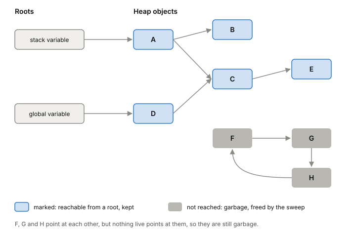
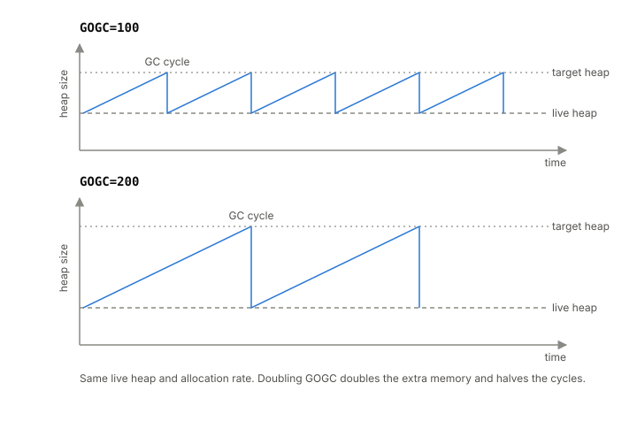

# Garbage collection

A garbage collector is the part of a language runtime that finds heap
memory your program can no longer reach and makes it available again, so
you never call `free`. It isn't free itself. It costs memory (the heap
has to be bigger than what's live) and CPU (something has to find the
garbage), and on a server those costs show up as request latency. This
article is about Go's collector first, because the lab is written in Go,
and then the JVM's low-pause collector for comparison.

## Finding garbage by following pointers

Only heap memory needs collecting. A value that stays on a goroutine's
stack is freed when its function returns, as covered in
[[heap-and-stack]]. The collector's job is everything that escaped.

Go's collector is a tracing collector. It starts from the roots, the
pointers the program is definitely using right now: local variables and
global variables. From each root it follows every pointer to the object it
points at, then every pointer inside that object, and so on. Anything it
can reach this way is live. Anything it can't reach is garbage, and once
something is unreachable it stays that way (with one narrow exception for
finalizers and weak pointers). Strings, slices, maps,
channels and interface values all contain pointers, so the object graph
in a real Go program is dense.

Go uses the mark-sweep method. In the mark phase it walks the graph and
marks every live object. In the sweep phase it walks the heap and makes
every unmarked piece of memory available for new allocations. It never
moves objects, so pointers never have to be updated. The collector cycles
through sweeping, then idle, then marking, over and over.

Two facts from this shape everything else:

- Marking only touches **live** memory. The cost of a cycle grows with how
  much is live, not with how much garbage there is.
- Most of the cost is in marking. [[profiling|Profiling]] of Go programs puts it at
  about 90% marking and 10% sweeping.

*Marking follows pointers from the roots. Whatever it can't reach is garbage, even objects that point at each other.*

## When a cycle runs: GOGC and the memory limit

The collector trades memory for CPU, and GOGC is the dial. After each
cycle, Go sets a target heap size:

> target heap = live heap + (live heap + GC roots) × GOGC / 100

Take a program with 8 MiB of live heap, 1 MiB of goroutine stacks and
1 MiB of pointers in globals. At GOGC=100 it can allocate 10 MiB of new
heap before the next cycle starts. At GOGC=50 that drops to 5 MiB and
cycles run twice as often. At GOGC=200 it's 20 MiB and cycles run half as
often. Doubling GOGC doubles the extra memory and roughly halves the GC's
CPU cost. `GOGC=off` turns the collector off. The heap target never goes
below 4 MiB.

Since Go 1.19 there's a second dial, the memory limit, set with the
`GOMEMLIMIT` environment variable or `debug.SetMemoryLimit`. It's a soft
cap on the Go runtime's total memory. As the heap nears it, the collector
runs more often to stay under. That creates a risk: if the live heap
itself grows close to the limit, the program can end up collecting almost
constantly, which is called thrashing. To stop that from freezing the
program, Go caps the GC at roughly 50% of CPU time over a short window and
lets memory go past the limit instead.

The memory limit fits best when the program has its memory to itself, like
a web service in a [[containers|container]] with a fixed amount of RAM, set 5 to 10%
below that amount. Don't set one just to avoid running out of memory when
you're already near the container's limit. You'd swap an out-of-memory
crash for a server that crawls.

*The shape only, no measured values: the heap grows until it hits the target, a cycle brings it back to the live heap, and GOGC sets how far above the live heap the target sits. Adapted from the Go team, "A Guide to the Go Garbage Collector" (go.dev).*

## What it costs a server's latency

The simplest collector stops the whole program, collects, and restarts it.
For a web server that means every in-flight request freezes for the full
mark and sweep. Go's collector instead does most of its work while the
program keeps running, and only stops everything for short moments at the
switch between phases. The length of those stops is not tied to the size
of the heap.

Getting there took years. In 2015 Go's pauses were around 300 to 400 ms.
A series of releases cut that to 30 to 40 ms, then to 4 or 5 ms, well
under the team's 10 ms goal. By 2016 that held on an 18 GB heap,
and by 2017 pauses were under 1 ms. The team's 2018 goal was 500 µs
of stop-the-world time per GC cycle.

Sub-millisecond pauses matter because users feel the slowest request,
not the average one. In the Go team's worked example, a session of 100
server requests leaves only 37% of users with every request under 10 ms.
To give 99% of users that experience, you have to target the 99.99th
percentile.

But short pauses don't make the collector free for latency. A concurrent
collector still takes work away from your requests, in other ways:

- during the mark phase the GC takes about 25% of the CPU, so requests get
  scheduled later;
- goroutines that allocate fast are made to help with marking ("assists"),
  which adds GC work right into request handling;
- pointer writes cost extra while marking is on;
- each running goroutine has to be paused briefly so its stack can be
  scanned.

Concurrent collection usually has lower throughput than a stop-the-world
collector, too. Since most of the cost is during marking, the main lever
for both throughput and latency is the same: run fewer cycles, by raising
GOGC or the memory limit, or by allocating less.

## Discord: when the problem wasn't the pause

In 2020 Discord wrote up a Go service that tracked which messages each
user had read. Each server kept an LRU cache of tens of millions of these
entries in memory. The code allocated very little. Still, latency and CPU
spiked roughly every two minutes.

The cause was the collector, but not a long pause. Go forced a GC cycle at
least every two minutes even when the heap wasn't growing. Each forced
cycle had to mark the entire live cache, tens of millions of objects, to
learn that almost none of it was garbage. Changing GOGC did nothing,
because the service didn't allocate fast enough for GOGC to trigger cycles
sooner. Shrinking the cache made the spikes smaller, but more requests
missed the cache and went to the database, so the 99th percentile got
worse. They rewrote the service in Rust, which frees memory when it's no
longer owned, and the spikes went away.

The lesson for us is the cost model from earlier: marking scales with the
live heap. A service that keeps a big pointer-heavy structure in memory
pays to scan all of it every cycle, however little garbage it makes. Their
graphs came from Go 1.9.2, and they tried 1.8 through 1.10. The memory
limit (1.19) and the Green Tea collector (1.26) came later, and the post
predates both.

## Green Tea: marking that respects the cache

Walking an object graph is hard on a modern CPU. Objects that point to each
other can be anywhere in the heap, so marking jumps around memory doing a
tiny bit of work at each stop. Each jump is likely a cache miss, and main
memory can be up to 100 times slower than cache (see
[[memory-hierarchy]] and [[cpu-cache]]). Go's profiling found that at
least 35% of marking time was spent just waiting on heap memory.

Green Tea changes the unit of work from objects to pages. Go's runtime
manages its heap in 8 KiB pages (its own unit, separate from the 4 KiB
hardware page). Instead of queuing individual objects to scan, Green Tea
queues pages, lets marks pile up on each page, and then scans a page's
objects together. Work done close together in memory has a much better
chance of hitting the cache.

It shipped as an experiment in Go 1.25 and became the default collector in
Go 1.26, released in 2026. The expected saving is 10 to 40% of GC
overhead for programs that lean on the GC, with about 10% more on newer
x86 CPUs (Intel Ice Lake, AMD Zen 4 and later) that it can use vector
instructions on. A program that spends 10% of its time in the GC would
save 1 to 4% of its total CPU. You can turn it off at build time with
`GOEXPERIMENT=nogreenteagc`, an option expected to go away in Go 1.27.

One thing to keep in mind: the Go GC guide is still written for the
collector as of Go 1.19. Its cost model and its advice on GOGC and the
memory limit still apply, but its picture of how marking walks the heap
is older than Green Tea.

## The JVM's answer: a concurrent, compacting collector

The JVM has several collectors. ZGC is the one built for low latency. It
does all expensive work while the application runs and aims never to
stop application threads for more than a millisecond. Like Go's, its
pauses don't grow with the heap, and it handles heaps from a few hundred
megabytes to 16 TB.

Unlike Go's, ZGC moves objects to compact the heap, and it's generational,
keeping young and old objects in separate generations. ZGC shipped as
experimental in JDK 11 and production-ready in JDK 15. JDK 21 added the
generational mode, JDK 23 made it the default, and JDK 24 removed the old
non-generational mode.

Its tuning model is familiar: the main knob is the maximum heap size, and
the heap needs enough headroom for allocations to keep being served while
a cycle runs. For latency-sensitive services, the recommendation is to
keep the machine's CPU use under about 70%.

## Where it gets tricky

**Generational or not.** The JVM moved to generational collection. Go
tried a generational design and dropped it. The Go team's reasoning: a
generational collector needs a write barrier that runs on every pointer
write all the time, and it wasn't fast enough. And in Go, many short-lived
objects never reach the heap at all, because escape analysis keeps them
on the stack. Young objects still die young in Go; they just die on the
stack. The two runtimes are answering the same question for languages
that allocate differently.

**Pauses aren't the whole cost.** "Sub-millisecond pauses" is true for Go
and for ZGC, and a service can still see GC-shaped latency spikes, as
Discord did. The concurrent work, the assists and the CPU share during
marking all land on requests.

**Docs lag the runtime.** Between the GC guide (Go 1.19), Green Tea (1.26),
and the Discord post (1.9.2), you're reading about three different
collectors. Check the Go version behind any GC advice.

## What this means when you build

- Allocation rate drives GC frequency. Reducing heap allocations on hot
  paths is usually the best GC tuning there is. See [[heap-and-stack]].
- The live heap drives the cost of each cycle. A big in-memory cache of
  pointer-heavy objects is scanned in full every cycle; prefer fewer,
  larger, pointer-free structures for bulk data.
- In a container with fixed memory, set `GOMEMLIMIT` a little below the
  container's limit so the runtime knows the real ceiling. Don't use it to paper over a heap
  that's too big for the box.
- Watch GC in profiles: `runtime.gcBgMarkWorker` for marking, and
  `runtime.gcAssistAlloc` above about 5% means allocation is outrunning
  the collector.
- Build and test on Go 1.26 or later if you want the numbers in this
  article to match what you see.

## Further reading

- [A Guide to the Go Garbage Collector](https://go.dev/doc/gc-guide), the Go team. The cost model, GOGC, the memory limit, latency sources and how to profile; written for Go 1.19.
- [Getting to Go: The Journey of Go's Garbage Collector](https://go.dev/blog/ismmkeynote), Rick Hudson, 2018. Why Go's GC is concurrent and non-generational, and how pauses went from hundreds of milliseconds to under one.
- [The Green Tea Garbage Collector](https://go.dev/blog/greenteagc), Michael Knyszek and Austin Clements, 2025. Why marking stalls on memory, and the page-based redesign.
- [Go 1.26 Release Notes](https://go.dev/doc/go1.26), the Go team, 2026. Green Tea becomes the default, with expected gains and the opt-out.
- [ZGC: The Z Garbage Collector (OpenJDK wiki)](https://wiki.openjdk.org/display/zgc/Main), OpenJDK ZGC project, 2026. The JVM's low-latency collector, its tuning, and its per-JDK change log.
- [Why Discord is switching from Go to Rust](https://discord.com/blog/why-discord-is-switching-from-go-to-rust), Jesse Howarth, 2020. A real service where the GC's cost came from scanning a large live heap, not from pause length.
