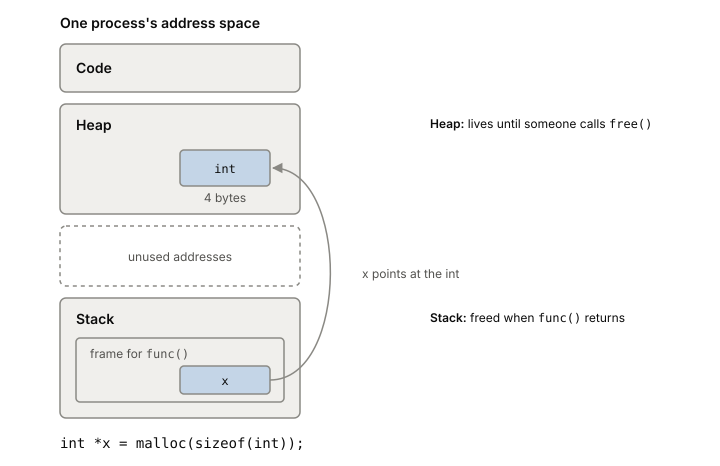

# The heap and the stack

A program keeps its data in two places. The stack holds the local
variables of functions that are running right now and is cleaned up
automatically when they return. The heap holds everything that has to
outlive the function that made it, and someone has to clean it up later.
Where a value lands decides what it costs, and in Go it decides how much
work you hand to the garbage collector.

## Two regions of one address space

Both live in the process's [[virtual-memory|virtual address space]],
alongside the program's code. They differ in who manages them.

**The stack** is managed by the compiler. When a function is called, the
compiler makes room on the stack for its local variables. When the
function returns, that room is released. You never free it yourself,
which is why stack memory is also called automatic memory. The catch: anything left on the
stack is gone once the function returns.

**The heap** is for data that must live longer, or whose size isn't known
until the program runs. In C you ask for it with `malloc()` and give it
back with `free()`. Those are library calls, not system calls. The
library carves pieces out of a region it got from the kernel, growing
that region with the `brk` system call or getting fresh anonymous memory
with `mmap()`. What happens when those new pages are first touched is
covered in [[page-faults]].

One line of C shows both at once:

```c
int *x = malloc(sizeof(int));
```

The pointer `x` is a local variable, so it's on the stack. The int it
points to is on the heap. When the function returns, `x` disappears. The
int stays until someone calls `free`.



*After `int *x = malloc(sizeof(int));` the pointer is on the stack and the int is on the heap. When `func()` returns, `x` is gone but the int stays until someone frees it.*

## In Go, the compiler decides

Go has no `malloc` and no `free`. You write `&T{}` or `make([]byte, n)`
and the compiler decides where it goes, using escape analysis. If the
compiler can prove a value doesn't outlive its function, the value goes
on the goroutine's stack. If it can't determine the value's lifetime, the
value "escapes to the heap".

Common reasons a value escapes:

- a pointer to it may still be used after the function returns;
- its size is only known at run time, like a slice whose length comes from
  a variable;
- a pointer to it is written into another value that already escaped
  (escape is transitive).

You can ask the compiler what it decided:

```
go build -gcflags=-m=3 ./yourpackage
```

## What an allocation costs

A stack allocation costs almost nothing. The compiler knows in advance
when the memory is freed and emits the cleanup itself.

A heap allocation in Go costs more, twice over. First the runtime's
allocator (`runtime.mallocgc`) has to find space. Then the value becomes
work for the [[garbage-collection|garbage collector]]. How often the Go GC
runs depends mainly on how fast you allocate: with GOGC=100, a new cycle
starts roughly when you've allocated as much new heap as
was live after the last one. More heap allocation means more GC cycles,
and each cycle costs CPU in proportion to how much live heap it has to
scan.

In a CPU profile of a Go service, more than about 15% of cumulative time
in `runtime.mallocgc` is a sign of a lot of allocation. That's usually
the first place to look before tuning the GC itself.

## Where it gets tricky

Escape analysis isn't a fixed rule you can memorize. It depends on how a
value is used, and the algorithm changes between Go releases. A value
that stayed on the stack in one version can escape in another, or the
other way round. Check with `-gcflags=-m=3` instead of guessing.

## What this means when you build

- In Go, values that don't escape are the cheapest memory you have. Hot
  paths that allocate less run faster and make the GC run less often.
- Returning pointers, storing into long-lived maps and slices, and sizing
  things at run time are the usual reasons values escape.
- Measure allocations with a heap profile (`alloc_space`) before
  rewriting code, then check escape decisions with `-gcflags=-m=3`.

## Further reading

- [Operating Systems: Three Easy Pieces, ch. 14: Interlude: Memory API](https://pages.cs.wisc.edu/~remzi/OSTEP/vm-api.pdf), Remzi and Andrea Arpaci-Dusseau, 2025. Stack vs heap in C, malloc and free, and the system calls under them.
- [A Guide to the Go Garbage Collector](https://go.dev/doc/gc-guide), the Go team. "Where Go values live" explains escape analysis; the optimization guide covers heap profiles and `-gcflags=-m=3`.
