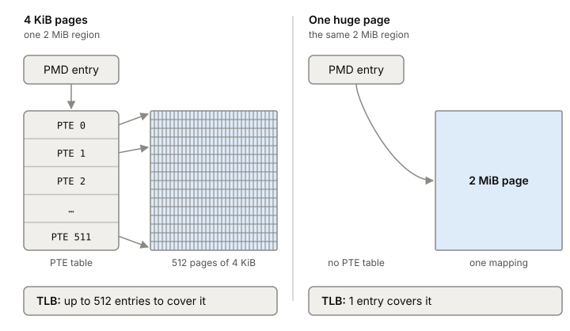

# Huge pages

A huge page is a page of memory much bigger than the normal 4 KiB, most
often 2 MiB on x86. One translation then covers 512 times as much memory,
so a program with a big working set misses the TLB far less. Linux can
hand them out automatically (transparent huge pages, or THP), and that
automatic part is where the trouble starts for some servers.

## One TLB entry, 512 times the memory

In [[virtual-memory]], the CPU translates every address through the page
tables and caches recent translations in the TLB. The TLB is small. A
program that touches more pages than it has entries for keeps missing,
and each miss is a walk through the page tables.

A 2 MiB page covers what 512 pages of 4 KiB would, with one mapping.
That gives two lasting wins for every access for
the life of the program:

- one TLB entry covers 512 times more memory, so there are fewer misses;
- each miss that does happen is handled faster.

There's also a one-time effect. The first touch of a fresh 2 MiB region
takes one [[page-faults|page fault]] instead of 512. But the kernel then
has to clear a whole 2 MiB page in that one fault, so the fault itself is
slower. This first effect matters far less than the TLB one.

*With a huge page, the PMD entry maps the whole 2 MiB region itself, and one TLB entry covers what 512 did before.*

## Two ways to get them

**hugetlbfs** is the older way. An administrator reserves a pool of huge
pages up front, and programs that ask for them explicitly get memory from
that pool. While it sits in the pool, the reserved memory can't be used
as cache or for anything else.

**Transparent huge pages** need no reservation and no code change. The
kernel tries to back anonymous memory (heap, stack, anonymous `mmap`) and
tmpfs/shmem with huge pages on its own, and a background thread,
`khugepaged`, scans memory and merges runs of small pages into huge ones.
Newer kernels also support multi-size THP (mTHP): blocks like 16K, 32K or
64K that sit between a base page and a 2 MiB page.

THP is controlled by `/sys/kernel/mm/transparent_hugepage/enabled`:

- `always`: use huge pages wherever possible.
- `madvise`: only in regions a program marked with
  `madvise(MADV_HUGEPAGE)`.
- `never`: don't use them automatically.

A second file, `defrag`, decides how hard the kernel tries when no 2 MiB
block is free. Its default is `madvise`: only regions that asked for huge
pages make the allocating thread stop and reclaim or compact memory to get
one. With `defrag` set to `always`, any program can stall like that.

## Where it gets tricky

**Memory bloat.** With THP set to `always`, a program that maps a large
region and touches one byte of it can get a whole 2 MiB page instead of
4 KiB. Memory use grows for no gain. That's why the kernel docs suggest
`madvise` mode when wasted memory matters.

**Fork plus copy-on-write.** Redis saves snapshots by forking. After a
fork, parent and child share their pages until one of them writes, and
then that page is copied. With 4 KiB pages, a write copies 4 KiB. With
huge pages, it copies 2 MiB. In a busy Redis instance, the first few
event-loop runs after a fork write to a few thousand pages, and with THP
on that copies almost all of the process's memory: a big latency hit and
a big jump in memory use. Redis's recommended setting is THP off
(`never`).

So huge pages are good advice for one kind of program and bad advice for
another. They help a program that keeps a
large working set and reads it randomly. They hurt a program that forks
a large heap and then writes to it.

**`never` isn't quite never.** A program can still ask the kernel to
collapse a range into huge pages with `MADV_COLLAPSE`, and that ignores the
sysfs settings.

## What this means when you build

- Check what your machines run: `cat
  /sys/kernel/mm/transparent_hugepage/enabled`. The setting changes how
  memory-heavy servers behave.
- Follow your database's docs on THP. Redis wants it off because of fork
  and copy-on-write, not because of the TLB.
- For your own service with a large, long-lived heap or cache, huge pages
  can cut TLB misses. `madvise` mode lets you opt in for just those
  regions.
- To see whether huge pages are in use, read `AnonHugePages` in
  `/proc/meminfo`, or in `/proc/PID/smaps` for one process.

## Further reading

- [Transparent Hugepage Support](https://docs.kernel.org/admin-guide/mm/transhuge.html), Linux kernel developers. Why huge pages speed things up, the THP modes and knobs, mTHP, and how to monitor them.
- [Diagnosing latency issues](https://redis.io/docs/latest/operate/oss_and_stack/management/optimization/latency/), Redis. The fork, copy-on-write and THP section shows how a kernel memory setting becomes request latency.
