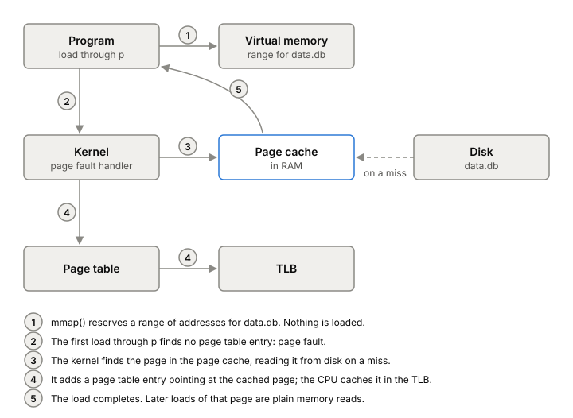

# mmap

`mmap` maps a file into your process's address space, so you read and
write the file through a pointer instead of calling `read` and `write`.
It's simple to use and skips a copy, which has tempted database builders
for decades. Whether a database should rely on it is one of the
livelier arguments in storage.

## What happens when you touch a mapped page

Say you map a 10 GiB file `data.db` and read the byte at offset 5 GiB
through the pointer `mmap` gave you:

1. `mmap` itself loads nothing. It only reserves a range of
   [[virtual-memory]] and records that it's backed by `data.db`.
2. Your first access to that address has no page table entry behind it,
   so the CPU raises a [[page-faults|page fault]].
3. The kernel finds the page in the [[page-cache]], reading it from disk
   first if it isn't there.
4. It adds a page table entry pointing your address at that cached page,
   and the CPU caches the mapping in its TLB.
5. Your load finishes. Later accesses to the same page are plain memory
   reads, with no system call.

Two things make this attractive. There's no `read` system call per
access, and there's no copy: your pointer points into the page cache
itself instead of a buffer of your own. The kernel also decides what
stays in memory and evicts pages when memory fills, so you don't write
a cache.

*What happens the first time a program touches a mapped page. Adapted from Andrew Crotty, Viktor Leis and Andrew Pavlo, "Are You Sure You Want to Use MMAP in Your Database Management System?" (CIDR, 2022).*

## The case against it in databases

A CIDR 2022 paper by Crotty, Leis and Pavlo argues that a database
shouldn't use mmap in place of its own buffer pool, for four reasons:

- **Transactional safety.** The kernel can write a dirty mapped page to
  disk at any moment, including before the transaction that changed it
  commits. The database can't stop it and isn't told. Working around
  this takes copy-on-write schemes or shadow paging; LMDB, for example,
  allows only one writer at a time.
- **I/O stalls.** Any pointer access can become a blocking disk read if
  the page was evicted, and the database can't know in advance. mmap has
  no asynchronous reads.
- **Error handling.** A disk error shows up as a `SIGBUS` signal at
  whatever line of code touched the page, not as an error return in one
  I/O module. And a stray pointer write corrupts the page and gets
  written to the file.
- **Performance.** Evicting a mapped page means removing it from other
  CPU cores' TLBs too, which needs an inter-processor interrupt (a "TLB
  shootdown"). Add a single-threaded eviction path and contention on the
  page table, and eviction stops scaling.

They measured it on Linux 5.11 with a 100 GB page cache and fast NVMe
SSDs, reading randomly over 2 TB with 100 threads. The baseline, fio
using [[direct-io]], held close to 900,000 reads per second. mmap
matched it for about 27 seconds, fell to nearly zero for about 5 seconds
once the page cache filled and eviction began, then settled at roughly
half. Their advice: consider mmap only when the data fits in memory and
the workload is read-only.

## The case for it

LMDB's author, Howard Chu, answered in 2024. LMDB maps its file
read-only by default and doesn't write through the map, so the paper's
worries about the kernel flushing partial updates don't apply, and a
stray pointer can't corrupt the map. Every mapped page is clean, so the kernel can drop one under
memory pressure without writing anything. A stall on a missing page
happens in any design, since the caller has to wait for data that isn't
in memory. And the paper benchmarked fio, not a database.

His broader point: on a shared machine only the kernel sees total memory
and I/O pressure, and relying on the page cache lets several processes
share one copy of the data at no extra memory cost.

## Where it gets tricky

The two sides mostly talk about different setups. The paper tests a
read-only workload much larger than memory on very fast SSDs, where
eviction dominates. LMDB is built around a read-only map and a single
writer, which avoids the write-side problems by design. Both can be
right. mmap with writable pages as a drop-in for a buffer pool is the
risky case. A read-only map carries fewer of the risks, and eviction
speed on fast drives is the open question.

## What this means when you build

- For read-mostly data that fits in RAM, mmap is simple and fast.
- If you write through a mapping, the kernel decides when those writes
  reach disk. You need your own log and ordering on top, and an
  `msync` or [[fsync]] where durability matters.
- Expect `SIGBUS` on I/O errors, not error codes.
- If the data is much bigger than memory and the drive is fast, measure
  before you commit to it.

## Further reading

- [Are You Sure You Want to Use MMAP in Your Database Management System?](https://www.cidrdb.org/cidr2022/papers/p13-crotty.pdf), Crotty, Leis and Pavlo, CIDR 2022. How mmap works step by step, four problems for databases, and measurements against O_DIRECT.
- [Are You Sure You Want to Use MMAP in Your DBMS?](https://www.symas.com/post/are-you-sure-you-want-to-use-mmap-in-your-dbms), Howard Chu, 2024. LMDB's author on why a read-only map avoids most of those problems.
