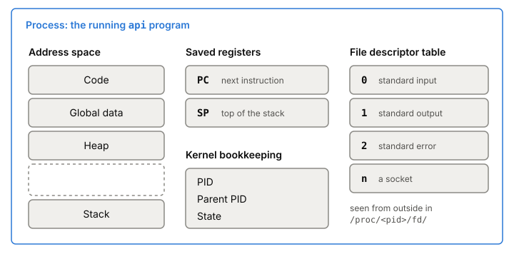
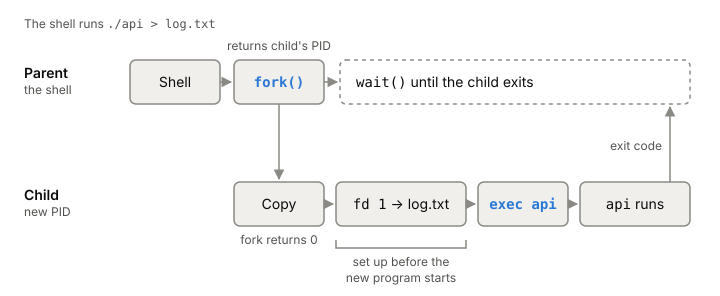
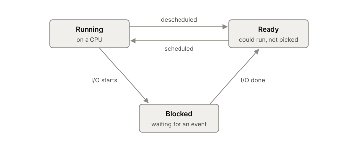

# Processes

A process is a program while it runs. The file on disk is just bytes; the
kernel turns it into a process by giving it memory, registers, open files
and an ID, then keeps track of it until it exits. Every backend service you
deploy is one or more processes, so this is the unit you start, stop,
monitor and debug.

## What a process is made of

Take a small server you wrote, compiled to a binary called `api`. While it
sits on disk it does nothing. When you start it, the kernel builds a
process around it. That process has a few parts.

**An address space.** This is all the memory the process can address:
its code, its global data, its heap and its stack. Each process gets its
own. Your `api` process can't read or write another process's memory,
because the kernel keeps each address space separate. How that mapping works is [[virtual-memory]].

**Registers.** The CPU's registers hold the process's working state. Two
matter most. The program counter says which instruction runs next. The
stack pointer says where the top of the stack is. When the process isn't
on a CPU, the kernel saves these so it can put them back later.

**Open files.** A process holds a table of the things it has open: files,
sockets, pipes. Each entry is a small number, a [[file-descriptor]]. By
convention 0 is standard input, 1 is standard output and 2 is standard
error. Sockets live in this table too.

**An ID and some bookkeeping.** Each process has a process ID (PID). The
kernel keeps an entry for every process in its process list, sometimes
called a process control block, with its state, its parent, its open files
and the saved registers.

*What the kernel keeps for one process.*

You can see most of this from outside on Linux. Every running process has a
directory under `/proc` named by its PID. Inside it, `/proc/<pid>/fd/`
lists one entry per open file descriptor, each pointing at the real file.
A socket shows up as something like `socket:[2248868]`, a type and an inode
number.

## How a program becomes a process

A program is loaded into its new address space. Early systems read the whole
program into memory before running it. Modern ones load it lazily: pieces of
code and data come in from disk only when the program first touches them.
On Unix systems, a new process is almost always made from an existing one,
in two steps.

1. **fork** copies the calling process. The new one, the child, gets its
   own PID and its own copy of the parent's memory. The call returns twice:
   in the parent it returns the child's PID, in the child it returns 0.
   That's how each side knows which one it is.
2. **exec** replaces the program running in a process with a different
   one. The code and data of the new program are loaded, the heap and stack
   start fresh, and the old program is gone. A successful exec never
   returns, because there's nothing left to return to.

A shell uses both. When you type `./api > log.txt`, the shell forks. The
child points its standard output at `log.txt`, then execs `api`. The parent
waits for the child to finish. The gap between fork and exec is the useful
part: it's where the child sets up redirection, changes directory or drops
privileges, all before the new program starts.

*How a shell runs `./api > log.txt`: fork, set up the child, then exec.*

Copying a whole process sounds expensive. Linux avoids most of the cost with
copy-on-write: at fork time it copies only the page tables and creates a new
task structure for the child. The memory itself stays shared until one side
writes to it. Before any write, the child is looking at the parent's pages.

## What the child inherits, and what it doesn't

After fork, parent and child have separate memory. A write in one never
shows up in the other.

Open files are different. The child gets copies of the parent's file
descriptors, and each copy points at the same open file as the parent's. So
the two share things like the current file offset. If both write to the
same inherited log file without care, their output can interleave.

Some things are deliberately not inherited. The child starts with no
pending [[signals]] and doesn't get the parent's timers or memory locks.
And the child has exactly one thread: the one that called fork. That last
point matters a lot once you use [[thread|threads]], as covered below.

## A process's life: ready, running, blocked, gone

A simple model has three states.

- **Running**: on a CPU, executing instructions.
- **Ready**: could run, but the kernel has picked something else for now.
- **Blocked**: waiting for something, like a disk read or a network packet.
  It won't run until that event happens.

Your `api` process spends most of its life blocked, waiting for requests.
When a request arrives it becomes ready, and the [[cpu-scheduler]] decides
when it runs. Moving it on and off a CPU is a [[context-switch]].

*The three states of a process and the moves between them. Adapted from Remzi and Andrea Arpaci-Dusseau, "The Abstraction: The Process" (Operating Systems: Three Easy Pieces, 2023).*

When a process exits, it doesn't vanish at once. It stays as a **zombie**
until its parent reads its exit code with `wait()`. Exit code 0 usually
means success. If the parent never waits, the zombie stays in the process
list.

A process needs the kernel for anything outside its own memory: opening a
file, sending on a socket, creating a child. Each of those requests is a
[[system-call]].

## Where it gets tricky

**fork has real critics.** fork plus exec is the classic Unix model and
textbooks teach it first. A 2019 paper from Microsoft Research and others
argues it should stop being the default. Their case:

- It doesn't mix with threads. The child gets one thread, but a copy of the
  whole address space, including locks that other threads in the parent
  were holding. Those threads don't exist in the child, so nothing will
  ever release those locks. That's why, after fork in a multithreaded
  program, the child may only call async-signal-safe functions until it
  calls exec.
- It gets slower as the parent grows, because there are more page table
  entries to copy and mark. In their test on Ubuntu 16.04 (i7-6850K,
  3.6 GHz), `posix_spawn()` took about 0.5 ms regardless of the parent's
  size, while fork+exec grew with it.
- It inherits everything by default, which is the wrong default for
  security. You have to remember to close file descriptors and scrub
  secrets before exec.
- It pushes systems toward memory overcommit, since the kernel can't know
  how much of the copied memory the child will actually write. Redis, which
  forks for persistence, advises against turning overcommit off.

fork still works. In a large, multithreaded server, though, "just fork"
has costs you should know about.

**Copy-on-write isn't free.** fork looks instant for a small process. For a
process with a large heap, the page tables alone take time and memory to
copy, and every page either side writes to afterwards gets copied then.
Redis forks for [[redis-persistence|persistence]], so while the child writes out its data, each
page the parent changes gets copied.

**Shared file offsets surprise people.** Because parent and child share open
files, not just file names, one process moving the offset moves it for the
other.

## What this means when you build

- Your service is a process. Its PID, its open files and its memory are all
  visible under `/proc/<pid>/`. Look there first when something's odd.
- Count your file descriptors. Every connection is one. Leaked ones show up
  as a growing list in `/proc/<pid>/fd/`.
- If you start child processes from a multithreaded server, prefer a
  spawn-style call that does fork and exec together over a bare fork.
- Make sure something waits for your children, or you'll collect zombies.
- Use the exit code. 0 for success, non-zero for failure; whatever started
  your process reads it.

## Further reading

- [The Abstraction: The Process (Operating Systems: Three Easy Pieces, ch. 4)](https://pages.cs.wisc.edu/~remzi/OSTEP/cpu-intro.pdf), Remzi and Andrea Arpaci-Dusseau, 2023. The clearest from-scratch explanation of what a process is and its states.
- [Interlude: Process API (Operating Systems: Three Easy Pieces, ch. 5)](https://pages.cs.wisc.edu/~remzi/OSTEP/cpu-api.pdf), Remzi and Andrea Arpaci-Dusseau, 2023. fork, exec and wait with small programs, and why the shell needs the split.
- [fork(2)](https://man7.org/linux/man-pages/man2/fork.2.html), Linux man-pages, 2026. Exactly what a child inherits on Linux, and the copy-on-write note.
- [proc_pid_fd(5)](https://man7.org/linux/man-pages/man5/proc_pid_fd.5.html), Linux man-pages, 2026. How to see a process's open files from outside.
- [A fork() in the road](https://www.microsoft.com/en-us/research/wp-content/uploads/2019/04/fork-hotos19.pdf), Andrew Baumann, Jonathan Appavoo, Orran Krieger, Timothy Roscoe, 2019. The case against fork, with a measurement of its cost.
