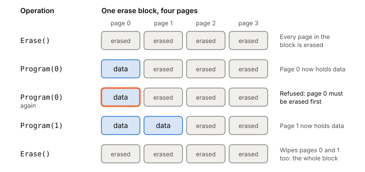

# Inside an SSD

An SSD looks like a simple [[block-device]]: numbered sectors you read and
write. Inside, it's flash memory that can't overwrite anything in place,
run by firmware that hides this by moving your data around. That firmware
decides how fast your writes are, how long the drive lives, and what's
left after a power cut, so it shapes how you should write data.

## Flash can't overwrite in place

Picture a service that keeps a 4 KB record and rewrites it in place every
time it changes. On a disk that sounds harmless. On flash it's the worst
case.

Flash is organized in two sizes. A **page** is a few KB (4 KB is a common
example) and is the unit you read and write. An **erase block** groups many
pages and is much bigger, 128 KB up to about 2 MB. Three operations work
on them:

- **Read** a page: tens of microseconds.
- **Program** (write) a page: hundreds of microseconds. You can only
  program a page that has been erased.
- **Erase** a whole block: a few milliseconds. This wipes every page in
  the block.

Once a page is programmed, the only way to change it is to erase its whole
block. So a naive in-place update of one 4 KB page means: read every live
page in the block, erase the block, program all of it back.

These timings are rough textbook figures for older chips. The textbook
table puts TLC flash (3 bits per cell, which is what my laptop's WD SN740
uses) at about 75 µs to read a page, 900–1,350 µs to program one and
4,500 µs to erase a block. Chips storing fewer bits per cell are faster.

Flash also wears out. Every erase and program cycle leaves a little charge
behind, and eventually a block can't tell 0 from 1. Manufacturers have
rated MLC blocks at around 10,000 program/erase cycles and SLC at around
100,000, though research suggests real lifetimes are longer.

*Flash pages can be programmed once, then only erased as a whole block. Adapted from Remzi and Andrea Arpaci-Dusseau, "Flash-based SSDs" (OSTEP ch. 44, 2023).*

## The flash translation layer hides all this

An SSD is a set of flash chips, a controller, and some volatile memory for
caching and bookkeeping. The firmware on the controller runs the **flash
translation layer** (FTL). Its job is to take block reads and writes from
the host and turn them into page reads, programs and erases, while keeping
up the illusion of a plain block device. It spreads work across many chips
in parallel, which is a big part of an SSD's speed.

Most FTLs today are **log-structured**. When you write logical block
100, the drive doesn't go to a fixed place for block 100. It writes the
data to the next free page in the block it's currently filling, and
records "logical 100 is now at physical page 57" in a **mapping table**.
The table lives in the drive's memory and is saved in some form to flash.

So each rewrite of your 4 KB record lands on a fresh page. The page with
the previous version is still there, still programmed, but nothing points
to it. It's garbage.

## Garbage collection and write amplification

Sooner or later the drive runs out of erased pages and has to clean up.
**Garbage collection** picks a block that holds some garbage pages, copies
the still-live pages out to the log, and erases the block so it can be
written again.

That copying is extra writing you never asked for. The ratio is **write
amplification**: bytes the FTL writes to flash divided by bytes you wrote
to the drive. A block that holds only garbage is the cheap case: erase it,
no copying. A block that's mostly live data is expensive: copy almost all
of it to free a little space. High write amplification means slower writes
and faster wear, so the FTL also does **wear leveling**, spreading writes
so blocks wear out at about the same rate.

*How a log-structured FTL turns overwrites into garbage, and what cleaning it up costs. Adapted from Remzi and Andrea Arpaci-Dusseau, "Flash-based SSDs" (OSTEP ch. 44, 2023).*

Two things help the drive:

- **Overprovisioning.** Many drives hold more flash than they expose.
  The spare space lets cleaning wait and run in the background when the
  drive is less busy.
- **TRIM.** When you delete a file, the drive has no idea: those logical
  blocks still look live, and GC keeps copying them. TRIM is a command
  that tells the drive a range is no longer needed, so the FTL can drop
  it from the map and reclaim the space.

On my laptop, TRIM never reaches the drive. The drive accepts discards,
but the LUKS encryption layer that btrfs sits on reports no discard
support ([experiment 0003](../../experiments/0003-what-my-ssd-reports-to-the-kernel.md)).
So from the drive's point of view, deleted data stays live until the same
logical blocks are overwritten.

## The map itself needs memory

A page-level map is big. At 4 bytes per 4 KB page, a 1 TB drive needs
1 GB of memory just for the table. One answer is to keep only the
active part of the map in memory. When a read needs a mapping that isn't
cached, the drive first does an extra flash read to fetch it. Workloads
with locality stay fast; scattered access over a huge range pays for it.

WD's product brief for my drive doesn't say how much memory it has for
this, or whether it has any DRAM at all.

## What the FTL wants from your software

Because the FTL is firmware you can't see, the useful question is what
access patterns it handles well. A 2017 study that traced real
applications on ext4, XFS and F2FS through a detailed SSD simulator
boiled it down to five rules:

1. **Request scale.** Send large requests or many at once, so the drive
   can use all its chips in parallel.
2. **Locality.** Access data with locality, so the FTL's cached map
   keeps hitting.
3. **Aligned sequentiality.** Start writes at a block boundary and write
   sequentially. This matters for FTLs that map some areas by whole
   block.
4. **Grouping by death time.** Write together the data that will be
   deleted together. Then whole blocks turn to garbage at once and GC
   has nothing to copy.
5. **Uniform data lifetime.** Data with similar lifetimes makes wear
   leveling cheaper.

The fourth rule is the one people miss. It's often mistaken for separating
hot data from cold data. And "random writes are bad" is the wrong frame
for SSDs: random versus sequential says little about how much garbage
collection a workload causes, while death time says a lot. In those
traces, locality depended most on the [[filesystem]], the older
filesystems (ext4, XFS) often did better on SSDs than the flash-specific
F2FS, and F2FS's habit of delaying TRIM raised garbage collection costs.

## The write cache and power loss

Most SSDs buffer recent writes in RAM on the drive, and FTLs keep parts of
their mapping tables in volatile memory too. That's fast, and it's a risk:
if the power goes, whatever was only in that memory is gone.

NVMe makes this explicit. A drive reports in its identify data whether it
has a **volatile write cache**. If it does, the host can turn the cache on
or off, and sends a **Flush** command to make everything the drive has
completed so far non-volatile. My SN740 reports a "write back" cache and
supports FUA writes, which skip it
([experiment 0003](../../experiments/0003-what-my-ssd-reports-to-the-kernel.md)).
Getting from `write()` to that Flush is the job of [[fsync]].

**Power-loss protection** (PLP) is extra hardware, usually capacitors,
that keeps the drive alive long enough to save its volatile state when
power drops. Enterprise drives often have it; consumer drives mostly
don't, and some only promise a best effort. It also changes what a
flush costs. In one engineer's fio tests (2026,
16 KB `O_DIRECT` writes, one fsync per write, ext4 on Ubuntu 24.04), an
fsync took 2,974 µs on a Samsung 990 Pro and 891 µs on a Crucial T500,
both consumer drives, against 12.4 µs on a pair of Intel D7-P5520s in
RAID 1 and 1.6 µs on a Samsung PM-9a3, enterprise drives with PLP. The gap fits the
mechanism: when the cache is protected, a flush has little left to do.

What drives actually do when they lose power was tested directly in
2013: 15 SSDs from 5 vendors, more than 3,000 power cuts
during writes. 13 of the 15 lost data they should have kept. Failures
included flipped bits, **shorn writes** (a write only partly done, below
the sector size), writes that landed out of order, corrupted FTL metadata,
and dead drives. One drive lost a third of its blocks after 8 power cuts.
The authors' advice was blunt: don't update the only copy of important
data in place. Partial writes are the subject of [[torn-writes]].

## Where it gets tricky

**The spec sheet doesn't answer your questions.** The SN740 brief gives
peak speeds (5,000 MB/s sequential read and 460K random-read IOPS for my
512 GB model), measured with CrystalDiskMark over a 1,000 MB range. It
gives no latency, no queue depth for the IOPS figure, and nothing about
PLP, DRAM, the write cache or atomic write sizes. My own measurement, a
random 4 KiB `O_DIRECT` read, came to a median of 49.8 µs and a p99.9 of
249 µs, through btrfs and LUKS rather than the bare drive
([experiment 0001](../../experiments/0001-latency-numbers-on-my-laptop.md)).
See [[latency-numbers]] for how that compares with RAM and the network.

**Endurance ratings assume a workload.** The brief rates my model at
300 TB written (the warranty ends at 5 years or 300 TBW, whichever comes
first), computed with a standard JEDEC client workload. Your write amplification may be higher or lower than that
workload's, so the real figure for your use can differ.

**Nobody outside the vendor sees the FTL.** FTL designs are trade secrets.
The research here worked around that with a simulator (2017) or by
physically cutting power (2013). The power-cut study used 2013 SATA and
SAS drives on Linux 2.6.32. I haven't found a current study of how today's
consumer NVMe drives behave on power loss.

**Claimed PLP doesn't always match measured behaviour.** The Crucial T500
is described online as having capacitor-backed PLP, yet its fsync still
took almost 1 ms in the tests above, far from the enterprise drives.
Measure your own drive rather than trusting a feature list.

**The spec moves.** NVMe Base Specification 2.4 was ratified in 2026.
My drive implements NVMe 1.4b, an older revision.

## What this means when you build

- Write in big batches or keep several requests in flight. One small
  synchronous write at a time uses a fraction of the drive.
- Keep data that dies together in the same place: append to a log, and
  delete whole files rather than holes in the middle. That's the design
  of the [[append-only-log]] in the phase 1 build.
- Don't update the only copy of important data in place. Write a new copy
  and switch over.
- A completed write sits in the drive's volatile cache until a flush.
  Measure what [[fsync]] costs on your drive before promising latency; on
  consumer drives it can be milliseconds.
- For servers that must not lose data, use drives with power-loss
  protection, and check `write_cache` on what you actually run.
- If you encrypt the disk, check whether TRIM gets through.

## Further reading

- [Flash-based SSDs (OSTEP ch. 44)](https://pages.cs.wisc.edu/~remzi/OSTEP/file-ssd.pdf), Remzi and Andrea Arpaci-Dusseau, 2023. Builds an FTL from raw flash step by step. Start here.
- [The Unwritten Contract of Solid State Drives](https://pages.cs.wisc.edu/~jhe/eurosys17-he.pdf), Jun He, Sudarsun Kannan, Andrea and Remzi Arpaci-Dusseau, 2017. The five rules software should follow, and how real apps and filesystems break them.
- [Understanding the Robustness of SSDs under Power Fault](https://www.usenix.org/system/files/conference/fast13/fast13-final80.pdf), Mai Zheng, Joseph Tucek, Feng Qin, Mark Lillibridge, 2013. What 15 real SSDs did when the power was cut mid-write.
- [SSDs, power loss protection and fsync latency](http://smalldatum.blogspot.com/2026/01/ssds-power-loss-protection-and-fsync.html), Mark Callaghan, 2026. fsync latency on consumer vs enterprise drives, measured.
- [NVM Express Base Specification 2.4](https://nvmexpress.org/wp-content/uploads/NVM-Express-Base-Specification-Revision-2.4-Ratified-2026.07.31.pdf), NVM Express, 2026. The volatile write cache field and the Flush command, from the spec itself.
- [Western Digital PC SN740 product brief](https://documents.sandisk.com/content/dam/asset-library/en_us/assets/public/western-digital/product/internal-drives/pc-sn740-nvme-ssd/product-brief-pc-sn740-nvme-ssd.pdf), Western Digital, 2024. What the vendor states about my drive, and what it leaves out.
