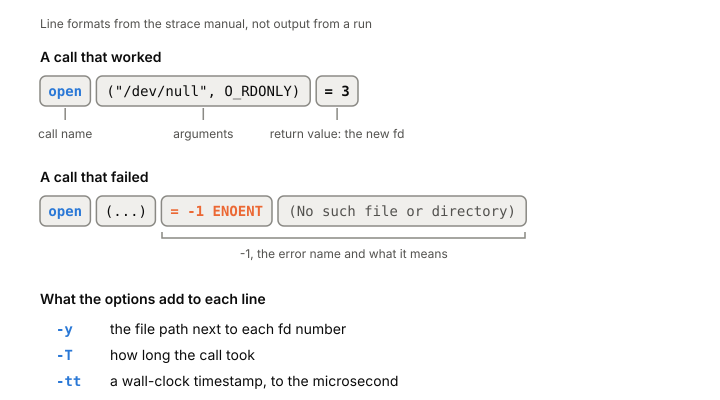

# strace

strace is a Linux tool that prints every [[system-call]] a program makes,
with its arguments and result, plus every signal it receives. When a
program hangs, fails without a useful error or runs slowly for no clear
reason, its system calls usually show what it's really doing: which files
it opens, which sockets it waits on, which call keeps failing. It needs no
source code and no recompiling.

## What the output tells you

Each line is one system call: its name, its arguments in parentheses, and
what it returned. A successful open looks like this:

```
open("/dev/null", O_RDONLY) = 3
```

The 3 is the new [[file-descriptor]]. A failed call shows -1 and the error
name with its meaning, like `-1 ENOENT (No such file or directory)`. That
alone answers a lot of "why won't it start?" questions: the program is
looking for a config file somewhere you didn't expect.

[[signals|Signals]] show up on their own lines, marked with `---`, so you
can see a SIGTERM or SIGPIPE arrive in the middle of the calls around it.

When several threads are traced, one thread's call can be cut off in the
output by another's. strace marks the first as `<unfinished ...>` and picks
it up later as `<... resumed>`, so the order of events stays readable.

## The options you'll use most

- `-p PID` attaches to a process that's already running. Stop tracing with
  Ctrl-C.
- `-f` follows child processes and threads. With `-p` on a multithreaded
  program, `-f` is what gets you all its threads, not just the first.
- `-T` shows how long each call took. A `read` that takes seconds is where
  the program is waiting.
- `-tt` adds wall-clock timestamps with microseconds.
- `-y` prints the file path next to each file descriptor number, so you
  see which file or socket a bare number refers to.
- `-e trace=...` limits which calls are shown. Classes like `%file` (every
  call that takes a file name) and `%network` save you listing them.
- `-c` prints no trace at all, just a table at the end: how many times each
  call was made, how many failed, and how much time went into each.
- `-o FILE` writes the trace to a file instead of stderr.

A typical first look at a stuck server: attach with `-p` and `-f`, add
`-T` and `-y`, and see which call it's sitting in and on what.



*How to read one line of strace output. The line formats come from the strace manual; this isn't output from a run.*

## Where it gets tricky

**strace can slow a program down a lot.** Classic strace uses the kernel's
ptrace interface, which stops the traced program twice for every system
call, at entry and at exit, and switches to strace each time. That's two
[[context-switch|context switches]] per call. In a 2014 worst case, a `dd`
copying one byte at a time went from 0.10 s to 46 s under strace, 442
times slower, even though strace was only asked to show a call `dd` never
made. For programs that make system calls as fast as they can, anything
over 100x is possible. Timings measured under strace can be wrong for the
same reason.

**The fix has conditions.** Newer strace has a `--seccomp-bpf` option that
asks the kernel to stop the program only for the calls you're tracing. It
only works with `-f`, it doesn't apply when attaching with `-p`, and if it
can't be set up, strace quietly goes back to stopping on every call. The
2014 slowdown was measured before this option existed, and we haven't
measured how much it helps.

**strace has frozen processes before.** Past bugs left the traced process
stopped after strace went away. If that happens, the fix is to kill strace
and send the process SIGCONT.

**Not every library call crosses the kernel.** Some, like reading the
clock, are answered in user space by the vDSO (see [[system-call]]), so
there's no system call for strace to show.

## What this means when you build

- Reach for strace when you need to know what a program is doing at the
  boundary with the kernel: files, sockets, waits, errors.
- Start with `-c` to see which calls dominate, then trace just those.
- On a production service, think before attaching. It can push latency
  past your timeouts. Lower-cost buffered tracers exist, such as `perf
  trace` (in perf since Linux 3.7).
- Treat timings from under strace as rough.

## Further reading

- [strace(1)](https://man7.org/linux/man-pages/man1/strace.1.html), strace project, 2026. Every option, the output format, and the overhead note with `--seccomp-bpf`.
- [strace Wow Much Syscall](https://www.brendangregg.com/blog/2014-05-11/strace-wow-much-syscall.html), Brendan Gregg, 2014. Why ptrace-based tracing is slow, with a measured worst case and alternatives.
