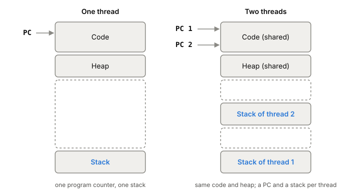
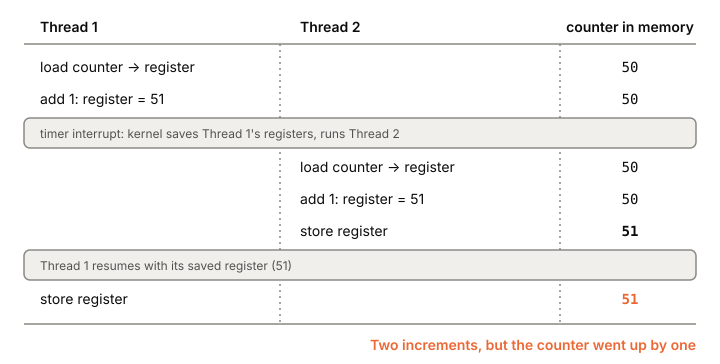

# Threads

A thread is one line of execution inside a [[process]]. A process can have
many, all running the same program and sharing the same memory, each with
its own place in the code. That sharing is why threads are useful for
servers, and also why they cause the hardest bugs you'll write.

## One process, several places in the code at once

Start with a process running a web server with a single thread. It has one
program counter, one set of registers, one stack. It handles a request,
then the next. If a request has to wait for the database, the whole server
waits with it.

Now give the same process a second thread. The process still has one
address space: one copy of the code, one heap, one set of globals. What's
new is a second program counter, a second set of registers, and a second
stack. Each thread can be at a different point in the code, calling
different functions, with its own local variables on its own stack.

*One thread versus two in the same address space. Adapted from Remzi and Andrea Arpaci-Dusseau, "Concurrency: An Introduction" (Operating Systems: Three Easy Pieces, 2023).*

So a thread is very much like a separate process, with one difference: all
the threads of a process see the same memory. A pointer from one thread
works in another. A global that one thread changes, the others see.

## What threads share and what each one owns

Threads in a process share almost everything a process has:

- the heap and global data
- the open [[file-descriptor|file descriptors]], so a socket opened by one
  thread can be read by another
- the process ID
- how the process handles each [[signals|signal]]
- the current directory, user and group IDs, and resource limits

Each thread owns only a few things:

- its stack, for local variables and function calls
- its registers, including the program counter
- its thread ID
- its signal mask, and its `errno`
- on Linux, its CPU affinity (which cores it may run on)

## Why a server uses threads

There are two reasons.

The first is parallelism. A machine with several cores can run several
threads of one process at the same moment, one per core. Work that splits
into pieces finishes sooner.

The second is not getting stuck on I/O. When one thread waits for a disk
read or a network reply, it's blocked. The [[cpu-scheduler]] can run
another thread of the same process that has work to do. This is why web
servers and databases have been built on threads: one slow request doesn't
freeze the rest.

You could get both effects from several processes instead. Threads are
simpler when the work needs to share data, because they already share
memory. Processes are the better choice when the tasks are separate and
share little.

## How Linux builds a thread

On Linux, threads and processes come from the same place. The kernel
creates both with the `clone` system call, and flags decide how much the new
task shares with the one that made it:

- `CLONE_VM`: share the same memory
- `CLONE_FILES`: share the same file descriptor table
- `CLONE_THREAD`: join the same thread group, so the new task counts as a
  thread of the same process

A fork is roughly a clone with little shared. A thread is a clone with
nearly everything shared. Thread groups arrived in Linux 2.4 so that all
threads in a process could share one PID. Inside, each thread still has its
own system-wide thread ID. `getpid()` returns the group's ID, which is the
same for every thread.

The thread library in glibc is NPTL (Native POSIX Thread Library). It's
**1:1**: every thread your program creates is a real kernel task that the
kernel schedules on its own. The older LinuxThreads library was also 1:1
and has been unsupported since glibc 2.4.

The alternative was M:N, where a library runs many user threads on a
smaller number of kernel threads. That means two schedulers, one in the
library and one in the kernel, and if they don't cooperate they make bad
choices. When NPTL was designed (the paper is from 2005), the kernel
developers agreed M:N didn't fit Linux and that a thin library was worth
more. The same work also made exit much faster: starting and stopping
100,000 threads went from 15 minutes to 2 seconds.

## The price of sharing: races

Shared memory means two threads can touch the same data at the same time.
Here's the standard example. Two threads each add 1 to a shared counter
10 million times. You'd expect 20,000,000. Run it and you sometimes get
something like 19,345,221.

The reason is that `counter = counter + 1` isn't one step. On x86 it
can compile to three instructions: load the value into a register, add 1,
store it back. Say the counter is 50.

1. Thread 1 loads 50 and adds 1. Its register holds 51.
2. A timer interrupt fires. The kernel saves Thread 1's registers and runs
   Thread 2.
3. Thread 2 loads 50 (memory still says 50), adds 1, stores 51.
4. Thread 1 resumes and stores its 51.

Two increments, and the counter went up by one. This is a **race
condition**: the result depends on the timing of who runs when. The code
that touches the shared counter is a **critical section**, and what you
need there is mutual exclusion, so only one thread is inside at a time.
Locks and atomic operations provide that; they're a later phase.

*Two increments, one lost: how the shared counter goes wrong. Adapted from Remzi and Andrea Arpaci-Dusseau, "Concurrency: An Introduction" (Operating Systems: Three Easy Pieces, 2023).*

## What a thread costs

A thread costs memory and switching time.

**Memory.** Each thread gets a stack. On Linux the default is usually
8 MiB, but that's virtual memory; RAM is only used for the part of the
stack the thread actually touches. In a 2018 test, a process with 10,000
threads showed about 80 GiB of virtual memory and only about 80 MiB
resident. You can set a smaller stack with `pthread_attr_setstacksize`.
How virtual and resident memory differ is [[virtual-memory]].

**Switching.** When a core moves from one thread to another, the kernel
saves one thread's registers and loads the other's. Between two threads of
the same process, the address space stays the same, so the page tables
don't change. That's less work than a switch between processes. The same 2018 test measured 1.2 to 1.5 µs per switch, pinned to
one core on a Haswell i7-4771; unpinned, about 2.2 µs. Two goroutines in Go
passing a message through a channel did it in about 170 ns, because Go
switches between them in user space without a kernel switch. The full story
is in [[context-switch]].

## Where it gets tricky

**Threads share signal handling, but not signal masks.** How the process
responds to each signal is process-wide, so a handler one thread installs
applies to all of them. Which signals are blocked is set per thread. Which
thread ends up handling a signal is covered in [[signals]].

**fork in a threaded program copies one thread.** The child gets only the
thread that called fork, plus the whole memory, including locks that other
threads were holding. Nobody in the child will ever unlock them. Details in
[[process]].

**"Thread" means different things.** A Go goroutine isn't a kernel
thread. Go switches between goroutines in user space, without a kernel
context switch, which is close to the M:N idea Linux rejected for its own
thread library. When someone says "we run 100,000 threads," check which
kind they mean.

**Old limits don't apply.** A lot of folklore about thread limits dates
from the early 2000s. On a 2018 machine, 10,000 threads in one process was
practical. The NPTL paper itself warns that its
description of limitations is out of date.

## What this means when you build

- Every piece of shared data in a threaded server needs a rule: owned by
  one thread, read-only, or guarded. A counter without one will lose
  updates.
- Stack size is virtual until used. Thread count limits usually come from
  how much stack each thread really touches, and from switching, not from
  the 8 MiB default.
- On Linux each thread has its own thread ID, because to the kernel each
  one is a task. Expect to see thread IDs, not just the PID, in tools.
- The lab is in Go, so much of your concurrency will be goroutines. Know
  which switch you're paying for: a goroutine switch (about 170 ns in that
  2018 test) or a kernel thread switch (1.2 to 1.5 µs).

## Further reading

- [Concurrency: An Introduction (Operating Systems: Three Easy Pieces, ch. 26)](https://pages.cs.wisc.edu/~remzi/OSTEP/threads-intro.pdf), Remzi and Andrea Arpaci-Dusseau, 2023. Why threads exist, and the shared-counter race step by step.
- [pthreads(7)](https://man7.org/linux/man-pages/man7/pthreads.7.html), Linux man-pages, 2026. The full list of what threads share and what each owns, and the 1:1 model.
- [clone(2)](https://man7.org/linux/man-pages/man2/clone.2.html), Linux man-pages, 2026. The flags that turn a new task into a thread or a process.
- [The Native POSIX Thread Library for Linux](https://akkadia.org/drepper/nptl-design.pdf), Ulrich Drepper and Ingo Molnar, 2005. Why Linux chose 1:1 threads, from the people who built it.
- [Measuring context switching and memory overheads for Linux threads](https://eli.thegreenplace.net/2018/measuring-context-switching-and-memory-overheads-for-linux-threads/), Eli Bendersky, 2018. Real measurements of thread memory and switch cost, with code.
