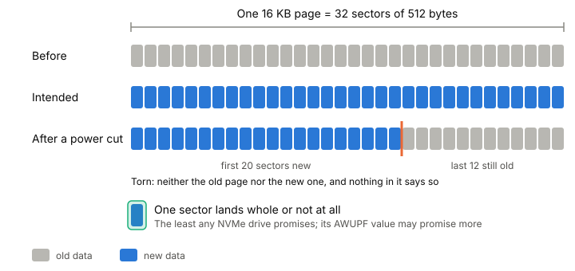

# Torn writes

A torn write is a write that's only partly on disk after a power cut: some
of its sectors hold the new data, the rest still hold the old. The drive
reports no error, because it never got the chance. Any file format you
design, a log, a page file, a config, has to either avoid tears or notice
them on the next start.

## One 16 KB write is many sectors

Say you write a 16 KB page to the SSD in my laptop. The drive's sectors
are 512 bytes
([experiment 0003](../../experiments/0003-what-my-ssd-reports-to-the-kernel.md)),
so to the [[block-device]] that one write is 32 sectors. If the power goes
while they're landing, you can come back to a page whose first 20 sectors
are new and last 12 are old. It's neither the old page nor the new one,
and nothing in it says so.

*A torn 16 KB write: the drive promises one sector at a time, not the page.*

## What an NVMe drive promises

The NVMe spec has an exact answer, per drive. Each drive reports a value
called **AWUPF** (Atomic Write Unit Power Fail): the size, in logical
blocks, of a write guaranteed to be atomic during a power failure or
error.

- If your write is no bigger than AWUPF and it fails, later reads return
  the data from the previous successful write. Old or new, never a mix.
- If your write is bigger, there's no guarantee at all about what reads
  return afterwards.

AWUPF is counted from zero, so a value of 0 means one block. That makes
**one logical block** the least any NVMe drive promises. A drive may
promise more, and may also define atomic boundaries that a write must not
cross to get the promise. There's no special "atomic write" command: the
size and position of an ordinary write decide it.

A second value, AWUN, sounds similar but is about something else: whether
concurrent commands can interleave their data. It says nothing about power
failure, and AWUPF is never larger than it.

On my drive I don't know AWUPF, because `nvme-cli` isn't installed. The
kernel reports its atomic write sizes as 0, which I read as "nothing
larger than a sector is promised". So for my machine, the safe assumption
is 512 bytes. [[ssd-internals]] covers a power-cut study where some drives
tore writes even inside a sector.

## Asking Linux for an untorn write

Linux 6.11 added a flag for this: `RWF_ATOMIC` on `pwritev2()`.
With it, a write is stored all or nothing across a power or hardware
failure. The rules are strict:

- Only with [[direct-io]] (`O_DIRECT`). Buffered writes aren't supported.
- The length must be a power of two, between the minimum and maximum
  atomic sizes that `statx()` reports for the file.
- The offset must be naturally aligned: a 32 KiB write at offset 32 KiB is
  fine, at offset 48 KiB it isn't.
- Untorn isn't durable. You still need `O_SYNC` or `O_DSYNC` (or
  [[fsync]]) for the write to survive at all.

Databases are the main reason this exists. They write pages of up to
16 KB, and without an untorn-write promise they [[full-page-writes|write each page twice]] to
protect against tears.

## Where it gets tricky

**"NVMe tears at 16 KB boundaries" isn't in the spec.** The claim came
up in a 2024 kernel developers' discussion, but the spec makes the atomic
size a per-drive value, so check the drive.

**The kernel's 0 is undocumented.** The sysfs docs define the atomic write
files but not what 0 means. Mine is a reading, not a fact from the docs.

**Filesystem support varies.** `RWF_ATOMIC` is defined for regular files
in block-based filesystems. I haven't found a source saying whether
btrfs, which my laptop runs, supports it.

## What this means when you build

- Unless you've read AWUPF off your drive, assume one sector lands whole
  and anything bigger can tear.
- Don't overwrite the only copy of a record in place.
- Make tears detectable: put a [[checksums|checksum]] on every record, and
  on recovery treat a record that fails it as never written. That's how
  the phase 1 [[append-only-log]] drops a torn tail, and
  [[crash-testing]] is how you check it works.
- Tears are one of the failure modes that [[crash-consistency]] has to
  design around.

## Further reading

- [NVM Express NVM Command Set Specification 1.3](https://nvmexpress.org/wp-content/uploads/NVM-Express-NVM-Command-Set-Specification-Revision-1.3-Ratified-2026.07.31.pdf), NVM Express, 2026. Section 2.1.4 and the AWUN/AWUPF fields: what an NVMe drive promises about atomic writes.
- [pwritev2(2)](https://man7.org/linux/man-pages/man2/pwritev2.2.html), Linux man-pages, 2026. The `RWF_ATOMIC` flag and its rules.
- [Atomic writes without tears](https://lwn.net/Articles/974578/), Jake Edge, LWN, 2024. Why databases want untorn writes and how the kernel API came about.
