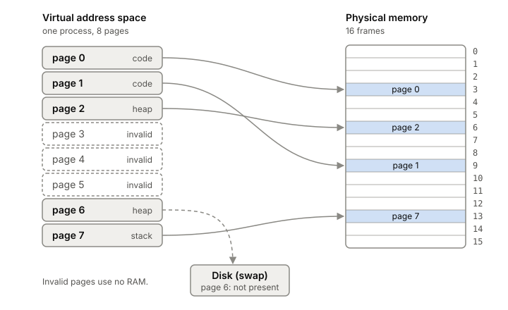
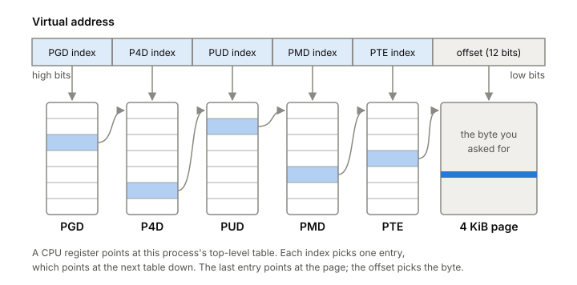

# Virtual memory

Every address your program uses is made up. The operating system gives
each [[process]] its own private address space, and the CPU translates
each address in it to a real location in RAM, one page at a time, on
every single memory access. This is what keeps processes from reading each
other's memory, lets the kernel hand out RAM only when it's really used,
and explains a lot of numbers you'll see in `top` that seem wrong.

## Every address you can print is virtual

Print a pointer in any program, in C or Go, and you get a big hex number.
That number is a virtual address, a position in the process's own
address space, with no fixed link to a spot in the RAM chips. Only the kernel and the
hardware know where the bytes really are.

The address space is the process's whole view of memory. It holds the
program's code, a stack for function calls and local variables, and a heap
for memory allocated at run time (see [[heap-and-stack]]). It looks like
one large, private, mostly empty range of addresses.

The system gives you three things with this illusion:

- **Transparency.** The program behaves as if it had its own physical
  memory and never has to know otherwise.
- **Protection.** A load or store in one process can't reach another
  process's memory, or the kernel's. One process can crash without taking
  the others down.
- **Efficiency.** All of this has to cost very little time and memory,
  which it only manages with help from the hardware.

Two processes can use the very same virtual address and mean completely
different bytes. Virtual page 10 in one process might sit in physical
frame 100 while virtual page 10 in another sits in frame 170. Neither
process can tell, and neither needs to.

## Memory is mapped in pages

Translating every byte on its own would need a table as big as memory. So
memory is cut into fixed-size blocks. Physical RAM is split into page
frames, and each address space is split into pages of the same size. The
kernel docs use 4 KiB pages in their examples, and that's the page size
on the lab laptop.

A virtual address then has two parts. The low bits are the offset inside
the page, and the high bits are the virtual page number. With 4 KiB pages
the offset is the bottom 12 bits, since 2^12 is 4096. Translation only has
to swap the page number for a frame number and keep the offset as it is.

The per-process table that does this is the page table, with one entry
(a PTE) per page. Besides the frame number, an entry carries a few bits
that matter later:

- **present:** is this page in RAM right now, or not?
- **protection:** may the process read, write, or execute it?
- **user/supervisor:** can user code touch it, or only the kernel?
- **accessed** and **dirty:** has it been used since it was loaded, and
  has it been written?

Pages that the process never uses are simply marked invalid. They take no
RAM at all. That's why a process can have a huge, sparse address space
and still use only a few megabytes of real memory.

*Pages map to frames in any order, unused pages take no memory, and a page can be out on disk. Adapted from Remzi and Andrea Arpaci-Dusseau, "Operating Systems: Three Easy Pieces, ch. 18: Paging: Introduction" (2025).*

## Why the page table is a tree

A flat table has a size problem. Take a 32-bit address space with 4 KiB
pages. That's a 20-bit page number, so about a million entries. At 4 bytes
each, that's 4 MB of table per process, and 400 MB for 100 processes,
almost all of it describing empty space.

So real page tables are trees. The top-level table covers the whole
address space in big chunks. Each entry points to a smaller table for its
chunk, and so on down to the last level, whose entries point at actual
frames. A big empty hole in the address space costs one "not mapped" entry
high up, not thousands of entries at the bottom.

Linux defines this tree as five levels today, named PGD, P4D, PUD, PMD
and PTE from top to bottom. Each CPU architecture maps them onto what its
hardware supports, and folds away levels it doesn't have. Each process has
its own top-level table, and a register in the CPU points to the current
one. To translate, the hardware uses the high bits of the address to pick
an entry at the top, the next bits to pick one in the next level down, and
so on, and the lowest bits as the offset in the final page.

*One translation walks five tables, top to bottom. Adapted from the Linux kernel developers, "Page Tables" (kernel.org documentation).*

The same trick lets an upper-level entry map a large block directly,
skipping the levels below. That's how Linux maps 2 MiB and 1 GiB pages,
covered in [[huge-pages]].

## The TLB is what makes it fast

A tree solves the size problem and makes the speed problem worse. If the
hardware had to walk the page table for every load, each memory access
would turn into several. Even a single-level table would roughly double
the cost of every access.

The fix is a cache. The TLB (translation lookaside buffer) sits in the
CPU's memory management unit and keeps recently used translations. On a
TLB hit, translation is almost free. On a miss, the hardware walks the
page table, which costs extra memory accesses, and then stores the result
in the TLB.

A TLB works for the same reason every cache in the [[memory-hierarchy]]
works: locality. Walk through an array and only the first access to each
page misses. The rest of the accesses on that page hit. Come back to the same
array soon and they all hit.

The TLB is small, though. If a program touches more pages in a short time
than the TLB has entries for, it misses over and over and slows down, even
when all its data is already in RAM. This is called exceeding the TLB
coverage. It shows up at the big end of our own
[pointer-chasing measurement](../../experiments/0001-latency-numbers-on-my-laptop.md),
where loads over a 1 GiB block most likely pay for TLB misses on top of
RAM misses (the test didn't measure them separately). Bigger pages are the
standard fix, because one entry then covers far more memory.

Translations belong to one process, so a [[context-switch]] between
processes has to deal with the TLB. Either the entries are flushed and
the next process starts cold, or the hardware tags each entry with an
address space ID so entries from several processes can live side by side.

## RAM is handed out lazily

Asking for memory and getting RAM are two different events. When a
program grows its heap or maps a region with [[mmap]], the kernel mostly
just records that this range of addresses is now allowed. It doesn't
touch RAM yet. This is called demand paging: keep in RAM only what's
actually needed.

For memory that isn't backed by a file (the stack, the heap, anonymous
mmap regions), the first read maps a shared page full of zeros. The first
write gets a real physical page of its own. Each of these first touches
is a trap into the kernel, a [[page-faults|page fault]], and it's the
normal, expected way memory gets filled in, not an error.

The mapping can also point several virtual pages at the same physical
page. The kernel uses that for controlled sharing between processes, and
for copy-on-write, the other common, expected reason for a page fault. The
[[page-cache]] article shows how file data gets into memory in the first
place.

## Where it gets tricky

**Virtual size is not memory use.** Because reserving address space costs
almost nothing, runtimes reserve a lot of it. Go's runtime, on 64-bit
platforms, typically has a virtual footprint of about 700 MiB for its
internal data structures alone. The column in `top` that shows virtual
size will look alarming for almost any Go server. What costs RAM is the
pages that have been touched and are resident.

**"Page" means several things.** The base page on the lab laptop is 4 KiB.
A huge page on x86 is 2 MiB or 1 GiB. Software built on top often has its
own unit it also calls a page. When someone says page, ask which one.

**Out of RAM is not the same as out of address space.** A 64-bit process
has vastly more address space than the machine has RAM. When RAM runs
short, the kernel reclaims memory: it frees page cache whose data is
also on disk, and swaps out anonymous pages, which it only does under
heavy pressure. If it still can't make room, the out-of-memory killer
ends processes to free memory.

**Translation isn't free even when it's cached.** The layers of tables,
the TLB and its misses, and the flushes on context switches all add cost
that a "RAM access" number in a table doesn't show.

## What this means when you build

- When a process looks big, check resident memory, not virtual size.
- Allocating memory is cheap. Touching it for the first time costs a page
  fault per page. Pre-touching memory at startup moves that cost out of
  request handling.
- Random access over a large area pays in TLB misses on top of cache
  misses. Keep hot data compact, and look at [[huge-pages]] for
  large heaps and caches.
- Processes are isolated by their address spaces. If two need to share
  data, it has to be set up on purpose (a shared mapping, a file, a
  socket).

## Further reading

- [Operating Systems: Three Easy Pieces, ch. 13: The Abstraction: Address Spaces](https://pages.cs.wisc.edu/~remzi/OSTEP/vm-intro.pdf), Remzi and Andrea Arpaci-Dusseau, 2023. What an address space is and the three goals of virtual memory.
- [Operating Systems: Three Easy Pieces, ch. 18: Paging: Introduction](https://pages.cs.wisc.edu/~remzi/OSTEP/vm-paging.pdf), Remzi and Andrea Arpaci-Dusseau, 2025. Pages, frames, page table entries, and why a flat page table is too big and too slow.
- [Operating Systems: Three Easy Pieces, ch. 19: Paging: Faster Translations (TLBs)](https://pages.cs.wisc.edu/~remzi/OSTEP/vm-tlbs.pdf), Remzi and Andrea Arpaci-Dusseau, 2023. The TLB, locality, context switches and ASIDs, and TLB coverage.
- [Page Tables](https://docs.kernel.org/mm/page_tables.html), Linux kernel developers. How Linux really builds its five-level tables, and the path of a page fault through the kernel.
- [Concepts overview (memory management)](https://docs.kernel.org/admin-guide/mm/concepts.html), Linux kernel developers. Short official tour of virtual memory, huge pages, anonymous memory and reclaim.
- [A Guide to the Go Garbage Collector](https://go.dev/doc/gc-guide), the Go team. Its note on virtual memory explains why a Go process's virtual size looks so large.
