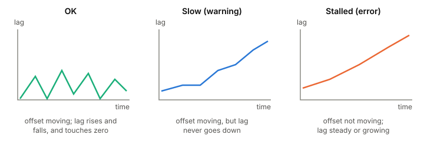

# Consumer lag

Consumer lag is how far a consumer group is behind the newest message
in a partition, counted in messages. It's the main health signal for
anything that reads a log: when lag grows, your consumers are slower
than your producers, stuck, or dead. The number alone doesn't tell you
which, so how you read it matters more than what threshold you pick.

## Log end minus committed offset

Each group has a committed offset per partition (see
[[offsets-and-commits]]). Lag is the distance from there to the end of
the partition's log, the log end offset.

Kafka's `kafka-consumer-groups.sh --describe` prints this for every
partition: `CURRENT-OFFSET` (the committed one), `LOG-END-OFFSET` and
`LAG`. In the docs' small example, partition 0 has a committed offset
of 2 and a log end of 4, so its lag is 2.

Lag is per partition. A group with a total lag of zero on eleven
partitions and a big one on the twelfth has one stuck consumer or one
hot partition, and a sum hides it.

## Two places to measure it

**From outside,** with committed offsets, as the tool above does. It
works even when the consumer is down, which is when you most need it.
It also counts records the consumer has already processed but not yet
committed, so between commits it overstates how far behind the
consumer really is.

**From inside the consumer,** with the client metric `records-lag-max`
(and per-partition `records-lag`). The consumer publishes these itself,
not the broker, and they use its current position, not the committed
offset. They're fresher, and they stop when the consumer stops.

Use both. The outside view catches dead consumers; the inside view
shows the real position of live ones.

## Reading the shape, not the number

Kafka's own docs suggest keeping the maximum lag under a threshold and
the minimum fetch rate above zero. The trouble is picking the
threshold. A busy topic can be far behind for a moment and be
perfectly healthy; a quiet one can be a few messages behind and stuck.

LinkedIn's Burrow takes another approach: no threshold at all. It keeps
a sliding window of each partition's last committed offsets (10 by
default) with the lag at each, and applies a few rules:

*Three kinds of lag, told apart by how it moves rather than how big it is. Adapted from the Burrow wiki, "Consumer Lag Evaluation Rules".*

- **Lag hit zero at some point in the window:** fine.
- **Offset moving, lag never shrinking:** the consumer is working but
  too slow. A warning.
- **Offset not moving, lag level or growing:** the consumer is
  connected and committing the same offset, but not getting through
  that partition. An error. A [[poison-messages|poison message]] looks
  like this.
- **No commits for longer than the window spans:** the consumer has
  stopped. Also an error, unless it's fully caught up.

The pattern that matters most on a busy topic is whether lag ever goes
down. A sawtooth that keeps falling back is a consumer keeping up.

## Messages behind vs time behind

Users care about time: how old is the data the consumer is working on
now? Lag in messages converts to that only through rates. Divide the lag
by how much faster the consumer reads than producers write, and you get
the time to catch up. The same lag can mean seconds for a fast consumer
and hours for a slow one, and if producers are faster, it never
catches up. This is
[[littles-law]] in another form: a queue's length, divided by the rate
it's served at, is how long an item waits.

## What this means when you build

- Alert per partition, on the trend (stalled or never decreasing), not
  on one fixed number.
- Watch lag from outside the consumer too, so a dead consumer shows up.
- When lag grows everywhere, you need more throughput: more consumers,
  up to the partition count (see [[consumer-groups]]), or faster
  processing. When it grows on one partition, look for a [[hot-spots|hot key]] or
  a bad message.
- If lag can outlast [[log-segments|retention]], messages get deleted before they're
  read. Where the consumer resumes then is covered in
  [[offsets-and-commits]].

## Further reading

- [Basic Kafka Operations](https://kafka.apache.org/43/operations/basic-kafka-operations/), Apache Kafka 4.3 docs. `kafka-consumer-groups.sh` and its per-partition offsets and lag.
- [Monitoring](https://kafka.apache.org/43/operations/monitoring/), Apache Kafka 4.3 docs. The consumer's `records-lag` metrics and what they're measured from.
- [Consumer Lag Evaluation Rules](https://github.com/linkedin/Burrow/wiki/Consumer-Lag-Evaluation-Rules), LinkedIn Burrow wiki. Judging lag by its shape over a window instead of by a threshold.
