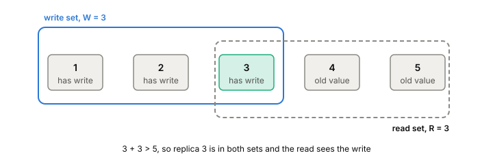

# Quorums

A quorum is the number of replicas that must answer before a read or a
write counts. In [[leaderless-replication]] you store N copies, wait for
W of them on a write and R of them on a read, and if R + W > N, every
read overlaps every successful write in at least one replica. That rule
is often read as "reads always see the latest write". It promises less
than that.

## Why the overlap works

Take N = 5, with W = 3 and R = 3. A write is confirmed once any three of
the five replicas have it. A read asks any three. Three plus three is
six, and there are only five replicas, so the two sets must share at
least one. That replica has the write, and the read can return it by
picking the newest version among the answers.

*With N = 5, W = 3 and R = 3, any read set shares a replica with any write set.*

The same arithmetic with N = 3 gives Dynamo's most common setting,
R = W = 2. You can also lean one way: R = 1 and W = N makes reads cheap
and writes wait for everyone, which some read-heavy Dynamo services
used.

When R + W ≤ N, the sets don't have to overlap, and a read can miss a
confirmed write entirely. This is a partial quorum. It's faster, since
you wait for fewer replicas, and a 2012 study by Bailis and others found
it usually returns fresh data within tens of milliseconds, with no hard
bound. Their paper also notes that Cassandra's default at the time was
N = 3, R = W = 1.

## Sloppy quorums bend the rule

Dynamo wanted writes to succeed even when some of a key's replicas were
down. So it doesn't insist that the W replicas be the key's own N. If
one owner is unreachable, the next healthy node on the ring takes the
write with a hint naming the owner it's meant for, and passes it on
later. That's a sloppy quorum, with hinted handoff.

It keeps writes available, but it breaks the overlap argument. The W
nodes that confirmed a write might not be among the N that a later read
asks, so R + W > N no longer means the read sees it. In a network
partition, both sides can gather enough nodes this way and keep
accepting writes to the same key.

Riak does the same with what it calls fallback nodes. Setting PR and
PW (primary read and write) makes it count only a key's real owners,
which gives a strict quorum.

## Why it's less of a guarantee than it looks

Kyle Kingsbury's 2013 Jepsen tests on Riak show the gaps clearly.

**A failed write can still land.** A write that doesn't reach W
replicas returns an error, but the replicas that did take it keep it,
and repair can spread it to the others. With strict quorums on both reads
and writes, writes rejected on the minority side of a partition still
spread after it healed, and overwrote writes that had succeeded on the
majority side. That run lost 92% of acknowledged writes.

**Overlap tells you a newer write exists, not what to do with two.**
If two clients write the same key at once, a quorum read may see both
versions. Something still has to choose between them or merge them, and
a timestamp that picks the larger one throws the other away. With last
write wins and no partition at all, Riak lost 71% of acknowledged
writes in that test. That's a [[conflict-resolution]] problem, not a
quorum problem, but quorums don't protect you from it.

**Reads can go back in time.** A write that failed, or hasn't finished
yet, may sit on only some replicas. A read whose set happens to include
one of them sees the new value, and the next read, asking a different
set, might not. So quorums alone don't give you [[linearizability]].
Repairing the stale replicas before answering is what stops this, and
that's covered in [[anti-entropy]].

**Waiting for a quorum can stall.** Even in a design aimed at
availability, requests timed out during a partition until the cluster
decided the far-side nodes were gone and set up fallbacks.

Kafka answers the same question, how many copies to wait for, in a
different way: [[in-sync-replicas]].

## What this means when you build

- Use R + W > N with strict quorums when a read has to see the last
  confirmed write, and know that concurrent writes still need a
  resolution rule.
- Treat a quorum write error as "maybe written". Make writes safe to
  retry.
- If you use sloppy quorums for availability, don't count on reading
  your own writes during failures.
- For anything that needs one order, a counter, a lock, a unique name,
  use a [[consensus]] protocol instead.

## Further reading

- [Dynamo: Amazon's Highly Available Key-value Store](https://www.allthingsdistributed.com/files/amazon-dynamo-sosp2007.pdf), DeCandia et al., SOSP 2007. R, W, N, sloppy quorums and hinted handoff, where the terms come from.
- [Probabilistically Bounded Staleness for Practical Partial Quorums](http://www.bailis.org/papers/pbs-vldb2012.pdf), Bailis et al., VLDB 2012. What partial quorums cost in staleness and save in latency.
- [Jepsen: Riak](https://aphyr.com/posts/285-jepsen-riak), Kyle Kingsbury, 2013. Sloppy and strict quorums under partitions, and how acknowledged writes still get lost.
