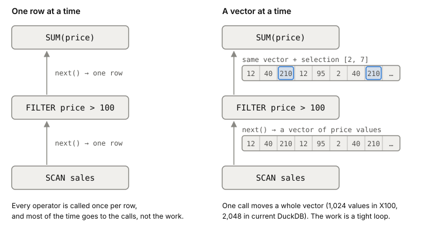

# Vectorized execution

Vectorized execution means every operator in a [[query-planner|query plan]] works on a
batch of values per call, typically a thousand or two, instead of one
row per call. It removes the per-row overhead that dominates big
analytical queries, and turns the real work into tight loops over
arrays, which CPUs run very fast. DuckDB and ClickHouse both run
queries this way.

## Where the time goes, one row at a time

The classic way to run a query plan is the iterator model, also called
Volcano. Each operator has a `next()` method that returns one row, and
gets its input by calling `next()` on the operator below it. A scan
feeds a filter, the filter feeds a sum, one row per call. It's simple,
and nothing big piles up in memory between operators.

The problem is what each call costs next to the work it does. In 2005,
Peter Boncz, Marcin Zukowski and Niels Nes profiled MySQL 4.1 running
TPC-H Query 1, a scan-and-aggregate query from a decision-support
benchmark. The functions
doing the actual arithmetic took about 10% of the time. About 28% went
to the hash table for the aggregate, and most of the rest to walking
MySQL's row format and copying values in and out of it. A single
addition cost 38 instructions. Worse, the compiler couldn't overlap
work across rows, because each row was its own trip through calls it
couldn't see past.

## Pass a vector instead

Their engine, X100, kept the iterator model
but changed what `next()` returns: a vector, a small array holding one
column's values for about a thousand rows. The actual work happens in
primitives, tiny functions that loop over those arrays, such as "add
these two arrays" or "compare every value with 100".

*The same plan run one row at a time and one vector at a time. The filter doesn't copy the matching values; it passes the positions that matched.*

Three things improve at once:

- The overhead of a call is paid once per vector instead of once per
  row.
- A loop where each element doesn't depend on the one before is
  exactly what compilers optimize best. They pipeline it, and often
  turn it into SIMD instructions that handle several values at once.
- The vector is small enough to stay in the [[cpu-cache]] while the
  next operator uses it.

Filters don't copy data. A filter passes on the same vector plus a
selection vector, the list of positions that passed, and the next
primitive only looks at those positions. DuckDB goes further and lets
a vector take different physical forms: a plain array, one constant
value standing for every row, or a dictionary plus a list of codes
straight from compressed storage. Data that was compressed on disk can
stay compressed while the query runs.

Vectorized execution fits [[column-storage]] naturally, because a
column read from disk is already an array of one type.

## How big a vector

It's a balance. A vector of one value is row-at-a-time again, with all
its overhead. Make vectors too big and they no longer fit in the CPU
cache, so every operator waits on main memory. At the extreme a
vector is a whole column, which is how MonetDB's earlier
column-at-a-time engine worked, and it ended up limited by memory
bandwidth.

X100 used 1,024 values by default. On its 2005 test machines anything
from 128 to 8K worked well, and it slowed down once intermediate
results spilled out of cache. DuckDB used 1,024 in its 2019 paper; its
current docs give 2,048.

## Where it gets tricky

**Vectorized doesn't mean SIMD.** The idea is batches, not special
instructions. SIMD is a bonus that tight loops make possible.
ClickHouse compiles its hot loops several ways (plain, AVX2, AVX-512)
and picks the fastest one the CPU supports at runtime.

**Compiling each query is the other school.** Some engines generate
machine code for each query instead of interpreting a plan made of
batch primitives. DuckDB chose vectorized interpretation because a
compiler like LLVM would drag large dependencies into a library meant
to be embedded. ClickHouse does both: it's vectorized, and it uses
LLVM to compile expressions that many queries repeat, fusing
`a * b + c + 1` into one operator. The catch with generating code is
that such engines are harder to build and debug than vectorized
interpreters.

## What this means when you build

- For analytics, how an engine executes matters as much as how it
  stores data.
- If you write your own data processing, like the [[stream-processing|stream processor]] in
  this phase's lab, handle records in batches and keep the inner loop
  over plain arrays, not one call per record.
- Size batches to fit in cache: thousands of values, not millions.

## Further reading

- [MonetDB/X100: Hyper-Pipelining Query Execution](https://www.cidrdb.org/cidr2005/papers/P19.pdf), Peter Boncz, Marcin Zukowski and Niels Nes, 2005. The paper that introduced vectorized execution, with the MySQL profile and the vector-size experiment.
- [Execution Format](https://duckdb.org/docs/current/internals/vector.html), DuckDB docs. Current vector size and the flat, constant and dictionary vector forms.
- [DuckDB: an Embeddable Analytical Database](https://mytherin.github.io/papers/2019-duckdbdemo.pdf), Mark Raasveldt and Hannes Mühleisen, 2019. Why DuckDB chose vectorized interpretation over compiling queries.
- [ClickHouse - Lightning Fast Analytics for Everyone](https://www.vldb.org/pvldb/vol17/p3731-schulze.pdf), Robert Schulze et al., 2024. Vectorized execution with SIMD kernels chosen at runtime, plus LLVM compilation for hot expressions.
