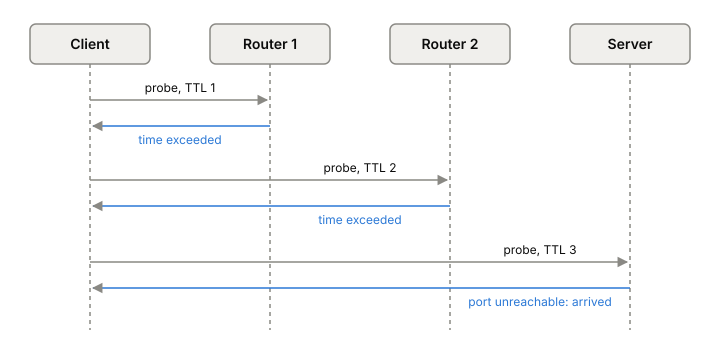

# ICMP

ICMP (Internet Control Message Protocol) is how routers and hosts tell a
sender that something went wrong with its packet: no route, nobody
listening on that port, time to live ran out, packet too big. `ping` and
`traceroute` are built on it, and so is path MTU discovery. When you
debug a network problem, ICMP messages are often the only evidence
you get.

## Small messages about other packets

ICMP rides inside IP, with protocol number 1 in IPv4. IPv6 has its own
version, ICMPv6 (RFC 4443, 2006), with next header 58. Every ICMP
message starts with a **type** and a **code**. The ones you'll see most:

| Message | IPv4 type / code | IPv6 type | Used by |
|---|---|---|---|
| Echo request / echo reply | 8 and 0 | 128 and 129 | ping |
| Destination unreachable | 3 | 1 | connection errors |
| … port unreachable | 3 / code 3 | 1 | UDP to a closed port |
| … fragmentation needed | 3 / code 4 | 2 (Packet Too Big) | path MTU discovery |
| Time exceeded (TTL hit 0) | 11 / code 0 | 3 | traceroute |

An error message carries a copy of the IP header of the packet that
caused it, plus the first 8 bytes of that packet's data. That's enough
to hold the TCP or UDP ports, so the sender's kernel can work out which
socket the error belongs to.

Two rules keep ICMP from making things worse. No ICMP error is sent
about an ICMP error, so errors can't cascade. And ICMP is only feedback:
it doesn't make IP reliable, and there's no promise a message will be
sent or arrive.

## Ping: echo and reply

`ping` sends an echo request. The target swaps the source and
destination, changes the type to echo reply, and sends back the same
data, identifier and sequence number. The sender matches replies to
requests by those two numbers and times the round trip. It measures
reachability and latency, and it's the tool behind the router row in
the phase 1 [[latency-numbers]] table.

## Traceroute: counting hops with TTL

Every IP packet has a TTL (time to live) field that each router
decrements as it forwards (see [[ip-routing]]). When a router brings it
to zero, it drops the packet and may send back an ICMP time exceeded
message, which shows the router's address.

Traceroute turns that into a map of the path:

1. Send a probe with TTL 1. The first router drops it and replies. Now
   you know hop 1 and its round-trip time.
2. Send one with TTL 2. The second router replies.
3. Keep going until the destination itself answers. With classic UDP
   probes, sent to an unlikely port, it answers "port unreachable",
   which means you've arrived.

The Linux traceroute sends three probes per TTL by default, stops at 30
hops, and prints `*` for a probe that got no answer.

*Traceroute: each probe dies one hop further along, and the router that drops it reports back.*

## Path MTU discovery

The third job is telling a sender its packets are too big. A sender
marks its packets "don't fragment" and starts at the MTU of its own
link. A router that can't fit one onto its next link drops it and
returns "fragmentation needed" (IPv4) or "Packet Too Big" (IPv6). Since
RFC 1191 (1990), the IPv4 message includes the MTU of the link that was
too small, so the sender knows how far to shrink. The sender tries a
bigger size again only rarely: no sooner than 5 minutes after being
told to shrink. Why packets are too big in the first place, and what
happens when this message gets lost, is [[mtu-and-fragmentation]].

## Where it gets tricky

**Blocking all ICMP breaks things.** It's common advice to drop ICMP at
the firewall. Drop "fragmentation needed" or "Packet Too Big" and path
MTU discovery stops working, and large packets vanish without a trace.

**Rate limits make hops look missing.** Every IPv6 node must limit how
fast it sends ICMPv6 errors, and the spec warns against limits so
crude that they break traceroute. A `*` in traceroute output means no
answer came back in time. It doesn't prove the hop is down.

**Firewalls break the classic method.** Many drop UDP probes to odd
ports, or ICMP echo. That's why the Linux traceroute also offers TCP
probes, which look like the start of an ordinary connection.

**"Port unreachable" is UDP's refused connection.** There's no
handshake in [[udp]], so ICMP is how your socket learns nobody is
listening. [[tcp]] answers with a reset instead.

## What this means when you build

- Use `ping` for "is it up and how far", `traceroute` for "where does
  it stop". Read a single silent hop with suspicion.
- Allow ICMP destination unreachable and Packet Too Big through your
  firewalls and security groups.
- When a UDP service seems to swallow requests, capture the traffic and
  look for port unreachable coming back (see [[packet-capture]]).

## Further reading

- [RFC 792: Internet Control Message Protocol](https://www.rfc-editor.org/rfc/rfc792), J. Postel, 1981. The ICMPv4 messages, codes and rules.
- [RFC 4443: ICMPv6](https://www.rfc-editor.org/rfc/rfc4443), A. Conta, S. Deering and M. Gupta, 2006. The IPv6 version, Packet Too Big, and the rate-limiting rule.
- [RFC 1191: Path MTU Discovery](https://www.rfc-editor.org/rfc/rfc1191), J. Mogul and S. Deering, 1990. How a sender uses "fragmentation needed" to find the path MTU.
- [RFC 9293: Transmission Control Protocol (TCP)](https://www.rfc-editor.org/rfc/rfc9293), W. Eddy (ed.), 2022. Why a closed TCP port answers with a reset (section 3.5.2).
- [traceroute(8)](https://man7.org/linux/man-pages/man8/traceroute.8.html), Traceroute for Linux. How traceroute uses TTL and time exceeded, and what its output marks mean.
