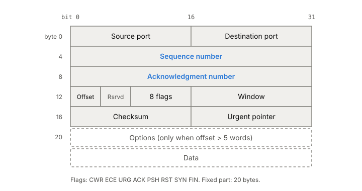

# TCP

TCP takes a network that loses, duplicates and reorders packets and
gives two programs a reliable, in-order stream of bytes between them.
It's what you get when you open a `SOCK_STREAM` socket over IP. Its
promises are strong but narrow, and the gaps between what it promises
and what people assume it promises show up as framing bugs, connections
that hang for a quarter of an hour, and data that stalls behind one lost
packet.

## What TCP promises, and what it doesn't

Once a connection is set up between two [[ports-and-sockets|sockets]],
TCP promises:

- **Every byte arrives, or you get an error.** Lost data is detected
  and sent again.
- **Bytes arrive in the order they were sent, once.** Duplicates are
  dropped and out-of-order data is held back until the gap is filled.
- **Corruption in transit is checked for.** Every segment carries a checksum.
- **Both directions are independent.** Each side can send while the
  other sends, and each side closes its own direction.

It doesn't promise:

- **Message boundaries.** TCP carries bytes, not messages. Two `write`
  calls can arrive as one `read`, or one `write` as three reads. The
  segments on the wire don't line up with your writes either.
- **Noticing a dead peer.** TCP has no built-in liveness check. An idle
  connection to a machine that lost power looks exactly like a quiet
  one.
- **Privacy or authenticity.** TCP has no encryption or authentication
  of its own. That's [[tls|TLS]]'s job (phase 3).
- **Timing.** "Reliable" means TCP keeps trying. It can keep trying for
  a very long time.

The current specification is RFC 9293, published in 2022. It
replaced RFC 793 from 1981 and gathered in decades of fixes that had
been spread over other documents.

## Every byte has a number

Take a client sending a 3,000-byte request to a server, after the
connection is open. TCP doesn't number packets. It numbers bytes. At
setup, each side picks a starting number, its initial sequence number,
and from then on every byte it sends has the next number.

The client's TCP cuts the 3,000 bytes into segments, each sent inside
one IP packet. Say it uses three segments of 1,000 bytes and its
numbering starts at 1. Each segment's header carries the sequence
number of its first byte: 1, 1001 and 2001.

The server answers with acknowledgments. An ACK carries the number of
the next byte the server expects, which means "I have everything
before this". This is a **cumulative** acknowledgment: one ACK of 3001
covers all three segments.

Now suppose the second segment is lost:

*Cumulative ACKs: the receiver keeps asking for the first missing byte, and one ACK covers everything once the gap is filled.*

The segment at 2001 arrives but the server can't hand it to the
application yet, because bytes 1001 to 2000 are missing and the stream
must stay in order. So it holds it and repeats "I still need 1001". The
client notices, sends 1001 again, and the next ACK jumps to 3001.
How the client notices, by timer or by repeated ACKs, is
[[tcp-retransmission]].

The same numbers handle duplicates. If a retransmitted segment turns
out to be a copy of one that already arrived, the receiver sees bytes it
already has and drops them.

To keep track, the sender remembers two numbers: the oldest byte not yet
acknowledged, and the next byte to send. The receiver remembers the next
byte it expects. The gap between the sender's two numbers is data in
flight.

Two control signals also take a sequence number: SYN, which opens the
connection, and FIN, which closes one direction. That way they get
acknowledged and retransmitted like data. A bare ACK takes no number,
or TCP would end up acknowledging acknowledgments.

## Sequence numbers wrap, and don't start at zero

Sequence numbers are 32 bits, so after about 4 billion bytes they wrap
around to zero, and all comparisons are done modulo 2^32. At old
network speeds that took hours. At 1 Gbit/s the space wraps in about 34
seconds, at 10 Gbit/s in about 3, and at 100 Gbit/s in about a third of
a second. A delayed old segment could then land inside the current
window and look valid. The TCP timestamps option and PAWS (protection
against wrapped sequence numbers) fix that; Linux supports both.

The starting number isn't zero, and isn't a simple counter either. It
comes from a clock that ticks about every 4 µs plus a secret keyed hash
of the connection's two addresses and two ports. The clock part keeps a
new connection from reusing numbers an old one on the same four values
might still have in flight. The secret part stops an attacker off the
path from predicting them.

## The header

Each segment starts with a header:

*The TCP header. Adapted from Wesley Eddy (editor), RFC 9293, "Transmission Control Protocol (TCP)", figure 1 (2022).*

- **Ports** pick the sockets at each end, as in UDP.
- **Sequence and acknowledgment numbers** are the byte counters above.
- **Flags** say what the segment is for: SYN opens, FIN closes a
  direction, RST aborts, ACK marks the acknowledgment field as valid
  (every segment carries it once the connection is established).
- **Window** is how many more bytes the sender of this segment is
  willing to receive. That's [[tcp-flow-control]].
- **Checksum** covers the header, the data and a pseudo-header with the
  IP addresses, like UDP's.
- **Options** carry extras such as timestamps and window scaling. With
  no options the header is 20 bytes.

## A connection's life in eleven states

A TCP connection moves through states, and on Linux you can see them
with `ss`: LISTEN, SYN-SENT, SYN-RECEIVED, ESTABLISHED, FIN-WAIT-1,
FIN-WAIT-2, CLOSE-WAIT, CLOSING, LAST-ACK, TIME-WAIT and CLOSED (which
really means "no state at all").

- **Opening.** A server socket sits in LISTEN. A client's SYN starts
  the [[tcp-handshake]], and three segments later both sides are
  ESTABLISHED.
- **Talking.** Data flows both ways in ESTABLISHED.
- **Closing.** Closing in TCP means "I have no more data to send", and
  each direction closes on its own. The side that closes first sends a
  FIN and goes through FIN-WAIT-1 and FIN-WAIT-2. The other side ACKs
  it and sits in CLOSE-WAIT until its application calls `close` too,
  then sends its own FIN from LAST-ACK. The side that closed first ends
  in [[time-wait]] for a while before the connection is really gone.
- **Aborting.** Either side can send RST instead. The connection is
  dropped at once and any unsent data is thrown away.

Because the two directions close separately, a connection can be
**half-closed**: one side has finished sending but can still receive.

## Not overrunning the receiver or the network

Reliability alone would let a fast sender bury a slow receiver or a
congested link. TCP carries three more mechanisms, each with its own
article:

- The **receive window** stops the sender from sending more than the
  receiver has room for ([[tcp-flow-control]]).
- **Congestion control** stops it from sending more than the network
  can carry. Every TCP must implement it ([[congestion-control]]).
- **Nagle's algorithm and delayed ACKs** cut down on tiny packets, and
  can add delay for request-response traffic
  ([[nagle-and-delayed-ack]]).

## Where it gets tricky

**No message boundaries, so framing is your job.** A server that calls
`read` once and assumes it got one whole request is wrong, even if it
passes a quick test: TCP is free to split and merge your bytes anywhere.
Every protocol on TCP needs its own framing: a length prefix, a
delimiter, or a header that says how much follows.

**A dead peer can go unnoticed for a long time.** An idle ESTABLISHED
connection has no timer at all on Linux; if the other machine vanishes,
nothing happens until you send something. [[tcp-keepalive|TCP keep-alives]] exist but are
off by default, and the spec says their interval must default to no
less than two hours. If you do send, and nothing ever comes back, Linux
retransmits up to `tcp_retries2` times (default 15) before giving up.
The kernel's documentation puts that at a lower bound of about 924.6
seconds, and a 2019 Cloudflare test on Linux 5.2 saw the connection die
after about 940 seconds, roughly 15 and a half minutes. The tcp(7) man
page gives a looser "13 to 30 minutes". The `TCP_USER_TIMEOUT` socket
option (Linux 2.6.37 and later) caps how long sent data may stay
unacknowledged, and replaces that retry count when set.

**Writing to a broken connection kills naive programs.** If the
connection has broken and you write to it, your process gets
`SIGPIPE`, whose default action ends the process (see [[signals]]).

**One lost segment holds up everything after it.** In-order delivery
means data that arrived fine waits behind the gap. With many requests
sharing one connection, one loss delays all of them. That's
[[head-of-line-blocking]].

**Lots of CLOSE-WAIT means a bug in your code.** CLOSE-WAIT is the
state where the other side has closed and TCP is waiting for your
application to close too. If `ss` shows these piling up, something in
your program isn't calling `close`.

**Old references are out of date.** RFC 793 was the TCP spec for four
decades and many tutorials still cite it. Since 2022 it's RFC 9293.

## What this means when you build

- Frame your messages. Never assume one `read` equals one message.
- Put your own deadlines on network calls, and on long-lived
  connections use keep-alives plus `TCP_USER_TIMEOUT`, so a dead peer is
  noticed in seconds, not a quarter of an hour.
- Close every socket you're done with, and watch for CLOSE-WAIT.
- Handle or ignore `SIGPIPE` in servers.
- Use TLS on top; TCP itself protects nothing from an attacker.

## Further reading

- [RFC 9293](https://www.rfc-editor.org/rfc/rfc9293), Wesley Eddy (editor), IETF, 2022. The TCP spec: header, states, sequence numbers, closing, failure rules.
- [tcp(7)](https://man7.org/linux/man-pages/man7/tcp.7.html), Linux man-pages, 2026. What Linux's TCP implements, and its knobs and socket options.
- [IP Sysctl](https://docs.kernel.org/networking/ip-sysctl.html), Linux kernel docs, 2026. The `tcp_retries2` default and the timeout it works out to.
- [socket(2)](https://man7.org/linux/man-pages/man2/socket.2.html), Linux man-pages, 2025. What a `SOCK_STREAM` socket promises, and `SIGPIPE`.
- [When TCP sockets refuse to die](https://blog.cloudflare.com/when-tcp-sockets-refuse-to-die/), Marek Majkowski, Cloudflare, 2019. Packet traces of how long each TCP state takes to notice a dead peer on Linux, and how keep-alives and `TCP_USER_TIMEOUT` change it.
