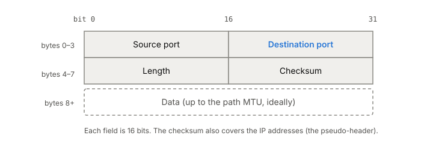

# UDP

UDP adds ports and a checksum to IP and almost nothing else. You hand
the kernel a message, it goes out as one packet, and it may arrive once,
twice, late, out of order or never, with nobody telling you which. That
makes it cheap and fast for small request-and-reply traffic like
[[dns]], and it means anything else you need, you build yourself.

## Eight bytes of header

The whole protocol is RFC 768, a short document Jon Postel wrote in
1980. The header is four 16-bit fields:

*The whole UDP header is 8 bytes. Adapted from Jon Postel, RFC 768, "User Datagram Protocol" (1980).*

- **Source port.** The port a reply should go to. It's optional; a
  sender that expects no reply can put 0.
- **Destination port.** Which socket on the receiving machine gets the
  datagram (see [[ports-and-sockets]]).
- **Length.** Header plus data, in bytes, so never less than 8.
- **Checksum.** Covers the data, the UDP header and a "pseudo-header"
  holding the source and destination IP addresses, so a datagram
  delivered to the wrong machine fails the check. Over IPv4 a sender may
  skip it by sending all zeros. Over IPv6 it's required (apart from a
  narrow exception for some tunnels), because the IPv6 header has no
  checksum of its own.

In the IP header, UDP is protocol number 17.

## What UDP leaves to you

Picture a client sending a short question to a server and waiting for
a short answer. With UDP that's one packet out and one back. There's
no connection to set up first and nothing to tear down after, so the
kernel keeps almost no state for it. Compared with [[tcp]], you save the
handshake and the per-connection bookkeeping.

What you give up:

- **Delivery.** A lost datagram is simply gone. If you need it to
  arrive, you retransmit it yourself.
- **Uniqueness.** The network can deliver the same datagram twice, and
  the copy can show up much later. Handle that for at least the
  2 minutes TCP assumes a packet can live.
- **Order.** Datagrams can arrive in a different order from the one you
  sent them in.
- **Congestion control.** UDP will let you send as fast as your network
  card goes, which can be far more than the path can carry. Backing off
  when the network is full is your job (see [[congestion-control]]).
- **Big messages.** A datagram is one IP packet, so the payload tops
  out at 65,507 bytes over IPv4 and 65,527 over IPv6. Anything bigger
  than the path's MTU gets split into IP fragments, and losing any one
  fragment loses the whole datagram (see [[mtu-and-fragmentation]]).
  Stay under the path MTU; if you don't know it, stay under 576 bytes
  for IPv4 or 1280 for IPv6.

One thing UDP keeps that TCP doesn't: message boundaries. UDP passes
messages, not a byte stream, so each datagram you send is its own
unit.

## Where it gets tricky

**Home-made reliability means home-made congestion control.** The
moment you add retransmissions, you can make a congested network worse,
so your retransmissions need congestion control too. That's why the
standing advice for anything that needs reliable, ordered delivery is
to use a standard transport that already does it, rather than rebuild
one on UDP.

**NATs and firewalls have to guess.** With TCP, a middlebox can watch
the handshake and the close. UDP has neither, so a [[nat]] or firewall
creates state when it sees a first packet go out and throws it away
after a quiet period. After that, replies are dropped. NATs are
supposed to keep that state for at least 2 minutes, but many use
shorter timeouts. Short request-and-reply protocols like DNS don't
notice. Long quiet sessions do, and they either send keep-alives (no
more often than every 15 seconds) or reconnect.

**The checksum is weak.** It's a 16-bit sum that catches some
corruption, not all of it. If the data matters, add a stronger check of
your own.

## What this means when you build

- Use UDP for small, independent messages where a lost one can be
  retried or ignored: lookups, metrics, game state.
- Keep each datagram under the path MTU.
- Expect duplicates and reordering; make handlers idempotent or number
  your messages.
- If you find yourself adding acknowledgments, retransmission and
  ordering, you are rebuilding TCP. Stop and use TCP, or a standard
  protocol built on UDP.

## Further reading

- [RFC 768](https://www.rfc-editor.org/rfc/rfc768), Jon Postel, 1980. The entire UDP spec; the header and the checksum.
- [RFC 8085](https://www.rfc-editor.org/rfc/rfc8085), Eggert, Fairhurst and Shepherd, IETF, 2017. What an application on UDP must handle itself: congestion, message size, reliability, NATs.
