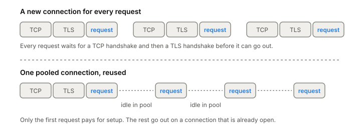

# Connection pooling

A connection pool keeps connections to a server open after a request
finishes, so the next request can reuse one instead of opening a new
one. Go's HTTP client does it by default, and database drivers sit
behind pools like HikariCP. The pool's limits and timeouts decide how
many connections you open, how long they live, and what happens when
one has quietly died.

## What a new connection costs

Before the first byte of a request can go out, a new connection needs a
[[tcp-handshake]], and for HTTPS or a database over TLS, a [[tls]]
handshake on top. Close the connection after one request and you pay
for both again on the next one (and see [[time-wait]] for what all
those closes cost).



*Only the first request on a pooled connection pays for setup.*

A pool keeps the connection after the response. The next request to
that server takes it from the pool, uses it, and puts it back.

## The knobs on a pool

Go's `net/http` client is a good example, because its `Transport`
spells the settings out. It keeps connections for reuse by default, and
it exposes:

- **Idle connections per host** (`MaxIdleConnsPerHost`). How many
  unused connections to keep for one server. The default is 2.
- **Idle connections in total** (`MaxIdleConns`). 100 in the default
  transport.
- **All connections per host** (`MaxConnsPerHost`). Counts connections
  being dialed, in use and idle. When it's reached, new requests wait
  for a connection. Zero, the default, means no limit.
- **Idle timeout** (`IdleConnTimeout`). How long an unused connection
  stays in the pool before it's closed. 90 seconds in the default
  transport.

Two Go details trip people up. A connection goes back in the pool only
after you've read the response body to the end and closed it. And the
Transport holds the pool, so create one and share it, not one per
request.

## Idle connections go stale

A connection sitting in the pool can die without anyone telling you.
The server may close it after its own idle timeout (Go's server has
one, `IdleTimeout`). A proxy or load balancer in between may drop it
because it looked idle. Often the client only finds out when it tries
to use it.

Three defenses work together:

- **Close idle connections first.** Set the pool's idle timeout below
  the idle timeout of the server and everything in between.
- **Probe them.** [[tcp-keepalive]] probes, or an application-level
  ping such as [[http2|HTTP/2]] PING, keep middleboxes from treating the
  connection as idle and detect a dead peer. Go's default transport
  dials with TCP keepalive set to 30 seconds.
- **Retry carefully.** Go's Transport retries a request that hit a
  network error only if the connection had already worked before and
  the request is idempotent (GET, HEAD, OPTIONS, TRACE, or one with an
  `Idempotency-Key` header). A POST that failed on a stale connection
  comes back to you as an error; it might already have reached the
  server.

## How big should the pool be?

For a database, smaller than you'd think. A database can only run as
many queries at once as it has cores to run them, plus a few that are
waiting on disk. Past that, more connections just add context
switches. In a demo by Oracle, shrinking the pool, with nothing else
changed, cut response times from about 100 ms to about 2 ms. A common
starting point comes from the PostgreSQL project:

```
connections = (core_count * 2) + effective_spindle_count
```

On a 4-core server with one disk that's 9, call it 10. The spindle
count is zero when the data fits in cache, and faster disks mean less
waiting, so fewer connections, not more. Treat it as a starting point
and load test around it. The goal is a small pool that's always busy,
with application [[thread|threads]] queueing for it, rather than a big pool that
lets every thread hit the database at once.

## Where it gets tricky

**For HTTP, the risk is too few.** With Go's 2 idle connections per
host, 50 requests at once to one backend can open 50 connections, and
when they finish all but 2 are closed. The next burst dials again.
Raise `MaxIdleConnsPerHost` for busy backends.

**"Keep-alive" means two things.** HTTP keep-alive is reusing a
connection for more than one request. TCP keepalive is the kernel
probing an idle connection. Go's `DisableKeepAlives` turns off the
first and has nothing to do with the second.

**Pool-locking.** If one thread holds a connection and then asks for a
second while every connection is taken, threads can wait on each other
forever. HikariCP gives the minimum pool size that rules this out:
threads × (connections each holds − 1) + 1. Better to fix the code so
it holds one at a time.

**HTTP/2 changes the picture.** With [[http2]], one connection carries
many requests at once, so a client may need only one connection per
server. Then the connection's own stream limit becomes the ceiling, and
[[grpc]] clients sometimes end up pooling connections again.

## What this means when you build

- Share one client per process; that's where the pool lives.
- Drain and close response bodies.
- Keep the pool's idle timeout below every other one on the path.
- Size database pools small, from cores, then load test.
- Raise the per-host idle limit for backends you call a lot.

## Further reading

- [net/http](https://pkg.go.dev/net/http), The Go Authors, go1.27.1. The `Transport` fields for pool limits and timeouts, the body-draining rule, and when a request is retried.
- [About Pool Sizing](https://github.com/brettwooldridge/HikariCP/wiki/About-Pool-Sizing), HikariCP wiki, 2021. Why a small database pool beats a big one, the starting formula, and the pool-locking minimum.
- [Keepalive](https://grpc.io/docs/guides/keepalive/), gRPC authors, 2025. HTTP/2 PING as an application-level keepalive, and why long-lived connections get dropped by proxies that think they're idle.
- [Performance Best Practices](https://grpc.io/docs/guides/performance/), gRPC authors, 2024. How one HTTP/2 connection's stream limit makes gRPC clients pool channels.
