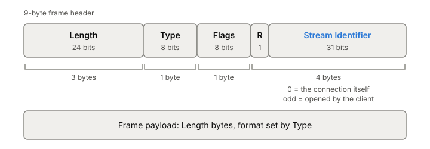

# HTTP/2

HTTP/2 keeps everything HTTP means (methods, status codes, headers) and
changes how it travels. Each request and response is cut into small
binary frames, many requests share one [[tcp|TCP]] connection at the same time,
and headers are compressed. The current spec is RFC 9113 (2022), which
replaced RFC 7540. Proxies and load balancers speak it to clients,
[[grpc]] is built on it, and its failure modes are different from
HTTP/1.1's.

## What HTTP/1.1 left on the table

On an [[http-1-1|HTTP/1.1]] connection, responses come back in the
order the requests went out, one whole message at a time. Pipelining
lets a client send several requests without waiting, but a slow
response at the front still holds up the ones behind it. That's
[[head-of-line-blocking]] at the application layer. So browsers open a
pool of connections, up to 6 per host, and spread requests over them.

Headers were the other waste. They're verbose and repeat on every
request (think `User-Agent`, `Accept`, cookies). On a new connection
those bytes fill TCP's initial [[congestion-control|congestion window]]
quickly, so a page that fires many requests at once waits longer just
to get its headers out.

HTTP/2 fixes both inside a single connection.

## Every message becomes frames

Once the connection is up, everything is a frame. Every frame starts
with the same 9-byte header:

*Every HTTP/2 frame starts with this 9-byte header. Adapted from Martin Thomson and Cory Benfield (editors), RFC 9113, "HTTP/2", figure 1 (2022).*

- **Length** is the payload size. By default a frame carries at most
  16,384 bytes; the receiver can raise that with a setting.
- **Type** says what the frame is: DATA (0x0), HEADERS (0x1), PRIORITY
  (0x2, now deprecated), RST_STREAM (0x3), SETTINGS (0x4), PUSH_PROMISE
  (0x5), PING (0x6), GOAWAY (0x7), WINDOW_UPDATE (0x8) and CONTINUATION
  (0x9). A receiver ignores types it doesn't know.
- **Flags** are per type. The one you'll see most is END_STREAM, which
  marks the last frame of a message.
- **Stream identifier** says which request this frame belongs to.
  Stream 0 means the connection as a whole: SETTINGS, PING and GOAWAY
  travel there.

A request is a HEADERS frame (plus CONTINUATION frames if the headers
don't fit), then zero or more DATA frames for the body, then optionally
another HEADERS frame for trailers. A response is the same, on the same
stream.

The request line of HTTP/1.1 is gone. Its parts travel as
*pseudo-headers* that start with a colon: `:method`, `:scheme`,
`:authority` and `:path` for a request, `:status` for a response. They
sit in the same header block as normal fields, before them.

Take a GET for a page with no body. The client sends one HEADERS frame
on stream 1 with END_STREAM set, since there's nothing more to send. The
server answers on stream 1 with a HEADERS frame (`:status: 200` and the
response headers), then DATA frames, the last one with END_STREAM.

## Many streams on one connection

A **stream** is one request and its response. The client numbers the
streams it opens with odd numbers (1, 3, 5...), the server uses even
ones, and each new stream must have a higher number than the last.
Numbers are never reused, so a very long-lived connection can run out
and has to be replaced.

Because every frame carries its stream number, frames from different
streams can be mixed freely on the wire, and responses can finish in
any order:

*Frames from different streams interleave on one connection, so a small response doesn't wait behind a large one.*

Two more things come with streams:

- **Cancelling one request is cheap.** A RST_STREAM frame ends one
  stream and leaves the others running. In HTTP/1.1 the only way to
  cancel was to close the whole connection.
- **The server caps concurrency.** The `SETTINGS_MAX_CONCURRENT_STREAMS`
  setting limits how many streams the peer may have open (open or
  half-closed) at once. It starts unlimited, and the spec recommends
  servers allow at least 100.

Each endpoint also tracks every stream through a small state machine:
idle, open, half-closed once one side has sent END_STREAM, and closed
once both have or a RST_STREAM arrives.

Since one connection now carries everything, a client should open only
one HTTP/2 connection per host and port. It can even reuse a connection
for a different hostname if that name resolves to the same server and
the [[tls|TLS]] certificate covers it. A server that doesn't want this answers
`421 Misdirected Request`.

## Getting onto HTTP/2

Over [[tls|TLS]], the client and server agree on HTTP/2 during the TLS
handshake itself, using ALPN with the token `h2`.

Without TLS, HTTP/1.1 once offered an upgrade to "h2c". It was rarely
deployed and RFC 9113 deprecates it. A cleartext client now needs to
know in advance that the server speaks HTTP/2 (inside a data center,
say).

Either way, the client opens with a fixed 24-byte preface, the string
`PRI * HTTP/2.0\r\n\r\nSM\r\n\r\n`, followed by a SETTINGS frame. The
string is chosen so that an HTTP/1.x server that receives it by mistake
stops rather than trying to parse frames. The server's first frame is
its own SETTINGS. The client doesn't have to wait for it before sending
requests, and in practice it doesn't.

## Flow control per stream and per connection

Many streams sharing one connection can crowd each other out, so HTTP/2
adds its own flow control on top of [[tcp-flow-control|TCP's]]. It's
credit based. Each receiver grants a window, 65,535 bytes to start
with, both for each stream and for the whole connection. The sender may
send that many bytes of DATA, and the receiver hands out more with
WINDOW_UPDATE frames as it consumes them.

Some details matter:

- **Only DATA frames count.** Control frames never wait on flow
  control, so a PING or RST_STREAM always gets through.
- **It's per hop.** A proxy has its own windows toward the client and
  toward the backend. That's the case it was designed for: a proxy with
  a fast client side and a slow backend can stop reading one stream
  without stalling the rest.
- **Small windows cap throughput.** If the window is smaller than the
  [[bandwidth-delay-product]] of the path, the sender runs out of credit
  every round trip and the link sits idle. Implementations that don't
  need flow control can advertise the maximum window and keep topping
  it up.

## HPACK: headers as table references

HTTP/2 compresses headers with HPACK (RFC 7541, 2015). Both ends of the
connection keep matching tables of header fields, separate for each
direction:

- A **static table** of 61 common fields, fixed by the spec. Entry 2 is
  `:method: GET`, entry 4 is `:path: /`.
- A **dynamic table** of fields seen on this connection, first in,
  first out. It starts at 4,096 bytes, and each entry costs its name,
  its value, plus 32 bytes of overhead.

A header is sent either as a one-byte-or-so index into those tables, or
as a literal, optionally Huffman coded, that may also be added to the
dynamic table for next time. In the spec's own example, the second
request on a connection sends `:method`, `:scheme`, `:path` and
`:authority` as one byte each, because all four are already in a table.
In a [[packet-capture|packet capture]] of an attack in 2023, the first HEADERS frame was 26
bytes and every one after it only 9.

Two consequences:

- **Header blocks are indivisible.** Decoding a header block changes
  the table, so a HEADERS frame and its CONTINUATION frames must go out
  back to back, with no frames from other streams between them. A huge
  header block holds up the whole connection while it's sent.
- **The table is shared by everything on the connection.** HPACK was
  designed after SPDY's DEFLATE-based header compression fell to the
  CRIME attack, which showed that an attacker who controls part of
  the input and sees the compressed size can guess secrets. HPACK only
  lets a guess match a whole header value, so it slows such attacks
  without stopping them, and values with little randomness stay at
  risk. This matters most when a proxy puts requests from many
  different clients onto one backend connection. Sensitive headers can
  be sent as "never indexed" literals so they never enter a table.

## Still one TCP stream underneath

All those streams ride a single [[tcp]] connection, and TCP delivers
bytes strictly in order. When one packet is lost, every stream waits for
its retransmission, including streams that had nothing in that packet.
HTTP/2 solved head-of-line blocking between HTTP messages and left
TCP's version of it in place. The full story
is [[head-of-line-blocking]], and the fix is [[quic]] and [[http3]].

## Keeping connections alive and closing them cleanly

**PING.** A PING frame carries 8 bytes that the peer must echo back
right away. It measures round-trip time, and it tests whether an idle
connection still works. That matters because NATs and load balancers
silently drop idle connections. It's the HTTP/2-level cousin of
[[tcp-keepalive|TCP keepalive]], one layer up.

**GOAWAY.** Before closing, an endpoint sends GOAWAY with the highest
stream number it may have processed. The other side opens no new
streams on that connection and moves to a new one. Streams above that
number were never processed and are safe to retry, even POSTs. A
RST_STREAM with the `REFUSED_STREAM` code gives the same promise for one
stream. This is how a server drains connections for maintenance without
failing requests.

## Where it gets tricky

**Rapid Reset (CVE-2023-44487).** In 2023 attackers found that
cancelling a stream frees its concurrency slot at once. A client sends
HEADERS, then RST_STREAM for that stream, then the next request, over
and over, without waiting for any reply. One captured packet held 525
requests. The server has already started work on each request before
the cancel arrives, and the stream limit never trips because no stream
stays open. Cloudflare saw a peak just above 201 million requests per
second from a botnet of about 20,000 machines, and because the attack
uses the protocol as designed, every HTTP/2 implementation was exposed.
The defence is to count resets per connection and close abusive
connections with GOAWAY. Cloudflare also briefly cut its stream limit
to 64 and broke real browsers, which assume 100 without waiting for
SETTINGS; they went back to 100.

**Server push is effectively dead.** HTTP/2 let a server send responses
the client hadn't asked for yet, like the CSS a page will need. It was
hard to get right: pushing something the client already had cached
wasted bandwidth and slowed more important responses. Chrome turned it
off by default in Chrome 106 (2022), when only 1.25% of HTTP/2 sites
used it, and fewer later. The spec still defines it. The replacement is
the `103 Early Hints` response, which suggests resources and leaves the
client to decide.

**Priorities were redone.** RFC 7540 had clients describe a tree of
dependencies and weights between streams. It was complex, unevenly
implemented and often ignored, and RFC 9113 deprecates it. This isn't
cosmetic: with no parallelism at the TCP level, a poor sending order
can make HTTP/2 slower than HTTP/1.1. The replacement, RFC 9218 (2022),
is a `Priority` header with an urgency from 0 (most urgent) to 7,
default 3, and an "incremental" flag for responses that are useful in
pieces. Servers treat it as a hint.

**More power, more attack surface.** An HTTP/2 connection holds more
state than an HTTP/1.1 one, and many legitimate features can be abused
in bulk: PINGs and SETTINGS that each demand a reply, tiny
WINDOW_UPDATE increments that make the sender emit tiny frames, floods
of small frames. Several implementations fell to these in 2019. The
spec's advice is to track how much each connection uses each feature
and set limits.

## What this means when you build

- Behind a proxy, each hop is its own HTTP/2 connection with its own
  settings, windows and HPACK tables.
- Allow at least 100 concurrent streams, because clients assume it.
  Run a server version patched for Rapid Reset, and close connections
  that reset or error far more than normal.
- Drain with GOAWAY on shutdown. On the client side, retry
  automatically only the streams the server says it never processed.
- On long-lived connections (gRPC, proxies to backends), use PING to
  catch dead connections a [[nat|NAT]] or load balancer dropped silently.
- For big transfers on high-latency links, raise the flow-control
  windows to at least the bandwidth-delay product.
- Don't use server push. Use `103 Early Hints` or preload.
- If your users are on lossy networks, one TCP connection is a single
  point of stalling. That's the case for HTTP/3.

## Further reading

- [RFC 9113](https://www.rfc-editor.org/rfc/rfc9113), Martin Thomson, Cory Benfield (editors), IETF, 2022. The HTTP/2 spec: frames, streams, flow control, GOAWAY, and a frank list of denial-of-service risks.
- [RFC 7541](https://www.rfc-editor.org/rfc/rfc7541), Roberto Peon, Herve Ruellan, IETF, 2015. HPACK: the tables, worked examples in appendix C, and why compression can leak secrets.
- [HTTP/2 Rapid Reset: deconstructing the record-breaking attack](https://blog.cloudflare.com/technical-breakdown-http2-rapid-reset-ddos-attack/), Lucas Pardue, Julien Desgats, Cloudflare, 2023. The stream state machine walked through with a real packet capture, and what went wrong in a large proxy fleet.
- [Remove HTTP/2 Server Push from Chrome](https://developer.chrome.com/blog/removing-push), Barry Pollard, Chrome team, 2022. Why push was dropped and what replaces it.
- [RFC 9114](https://www.rfc-editor.org/rfc/rfc9114), Mike Bishop (editor), IETF, 2022. Section 1.1 explains why one lost packet stalls every HTTP/2 stream.
- [RFC 9218](https://www.rfc-editor.org/rfc/rfc9218), Kazuho Oku, Lucas Pardue, IETF, 2022. The priority scheme that replaced HTTP/2's tree, shared with HTTP/3.
