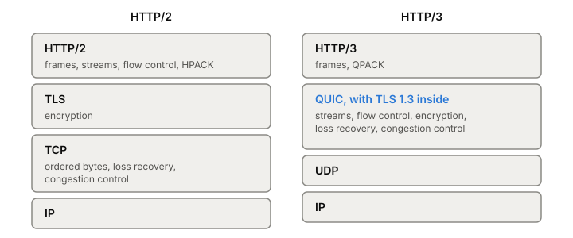

# HTTP/3

HTTP/3 is HTTP running on [[quic|QUIC]] instead of [[tcp|TCP]]. It's defined in
RFC 9114 (2022) and borrows most of its design from [[http2|HTTP/2]]:
binary frames, many requests on one connection, compressed headers. The
difference is that QUIC already provides streams, per-stream flow
control and [[tls|TLS]], so HTTP/3 hands those jobs down and keeps only what's
specific to HTTP. The payoff is that a lost packet stalls only the
requests whose data it carried.

## What moves down into QUIC



*Where each job lives in HTTP/2 and in HTTP/3.*

Each request and its response use one client-opened, two-way QUIC
stream, and only one request per stream. Because the stream already
identifies the request, HTTP/3 frames drop the stream number. Because
QUIC marks the end of a stream, the END_STREAM flag goes too, and with
it the whole flags field.

Several HTTP/2 frames simply disappear because QUIC does their job:

| HTTP/2 frame | In HTTP/3 |
|---|---|
| WINDOW_UPDATE | Gone. QUIC does flow control. |
| RST_STREAM | Gone. QUIC can reset a stream. |
| PING | Gone. QUIC has its own PING. |
| CONTINUATION | Gone. HEADERS frames may be larger instead. |
| PRIORITY | Gone. No priority signal in the base spec. |
| SETTINGS | Sent once, at the start, and never changed. |

Connection-level frames like SETTINGS can't go on "stream 0" any
more, so each side opens one one-way **control stream** at the
start and sends its SETTINGS first. Settings that were really transport
limits in HTTP/2, like the maximum number of concurrent streams or the
initial window size, become QUIC transport parameters, and sending them
as HTTP/3 settings is an error.

Two quieter changes:

- **Everything is flow controlled.** In HTTP/2 only DATA frames count
  against the window. In HTTP/3 every frame rides a QUIC stream, so
  headers count too.
- **Streams stay "open" longer.** HTTP/2 counts a stream as closed once
  the frame with END_STREAM is handed to TCP. QUIC counts it closed only
  when all its data has been acknowledged. So the same traffic keeps
  more streams active at once, and a server may need a higher stream
  limit to get the same concurrency.

## QPACK instead of HPACK

HPACK, HTTP/2's header compression, assumes header blocks arrive in the
order they were sent, so both sides' tables change in step. HTTP/2 gets
that for free from TCP. QUIC only orders data within a stream, and
running HPACK on it would bring back the very
[[head-of-line-blocking]] QUIC removed.

QPACK (RFC 9204, 2022) keeps HPACK's static and dynamic tables but
splits the work. All changes to the dynamic table go over a separate
one-way stream, in order. Header blocks on request streams only refer
to table entries; they never change the table.

That leaves one race. A request's headers may refer to an entry whose
insertion hasn't arrived yet. That request stream is then **blocked**
until it does. The decoder says how many streams it will let block
(`SETTINGS_QPACK_BLOCKED_STREAMS`), and the encoder chooses: refer only
to entries the decoder has acknowledged and never block, or refer to
fresh ones and compress better at the risk of a stall.

## Finding an HTTP/3 server

A URL says `https`, not which HTTP version to use. HTTP/3 is identified
by the ALPN token `h3` in the QUIC handshake. A client can try QUIC
straight away, or learn about HTTP/3 from a response header on an
[[http-1-1|HTTP/1.1]] or HTTP/2 connection over TCP. This one says HTTP/3 is on [[udp|UDP]]
port 50781 of the same host:

```
Alt-Svc: h3=":50781"
```

The client can then try QUIC on that port for later requests. When
UDP is blocked, QUIC fails to connect and the client should fall back to
TCP. HTTP/3 can run on any UDP port.

## Where it gets tricky

**HTTP/2 extensions don't carry over as they are.** HTTP/2 guarantees
an order across all frames on a connection. QUIC doesn't, so any
HTTP/2 extension that assumed frames on different streams arrive in
the order sent has to be redesigned.

**Priority moved out of the protocol.** HTTP/3 has no priority frames
of its own. The `Priority` header and priority update frames from RFC
9218 (2022) fill the gap, and servers treat them as hints.

**Head-of-line blocking is a setting now.** QPACK's blocked streams are
a small, deliberate version of the problem, sized by the encoder and
decoder.

## What this means when you build

- Serve HTTP/2 or HTTP/1.1 over TCP alongside HTTP/3, and advertise
  HTTP/3 with `Alt-Svc`. Some clients will never reach you over UDP.
- Don't copy HTTP/2 stream limits across unchanged; HTTP/3 streams
  count as active for longer.
- Everything about running [[quic]] applies: let UDP through, route
  by connection ID, budget CPU.

## Further reading

- [RFC 9114](https://www.rfc-editor.org/rfc/rfc9114), Mike Bishop (editor), IETF, 2022. The HTTP/3 spec; appendix A is a compact list of what changed from HTTP/2.
- [RFC 9204](https://www.rfc-editor.org/rfc/rfc9204), Charles Krasic, Mike Bishop, Alan Frindell (editors), IETF, 2022. QPACK, and the trade-off between compression and blocked streams.
- [RFC 9218](https://www.rfc-editor.org/rfc/rfc9218), Kazuho Oku, Lucas Pardue, IETF, 2022. The version-independent priority scheme HTTP/3 uses.
