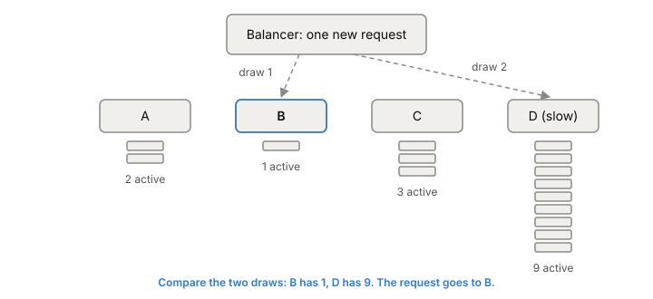
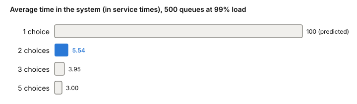

# Load balancing algorithms

Once a [[load-balancing|load balancer]] knows which backends are
healthy, it still has to pick one for each request. The rule it uses
looks like a detail, and it decides whether one slow backend is a
minor blip or drags down everyone's latency. Proxies such as nginx,
HAProxy and Envoy offer the same short list of rules, with different
defaults.

## The test case: four backends, one of them slow

Keep one picture in mind for the whole article. A balancer has four
backends. Three are fine. The fourth has become slow: a long
[[garbage-collection|garbage collection]] pause, a noisy neighbour on
its machine, or one very expensive query that's hogging its CPU. It still accepts connections
and still answers, just late.

A good rule sends less work to the slow backend until it recovers. A
bad one keeps feeding it, its queue grows, and every request unlucky
enough to land there waits.

## Round robin: equal turns

Round robin hands out requests in order: A, B, C, D, A, B, C, D. It
needs no information about the backends at all, which is why it's the
default in both nginx and HAProxy.

**Weighted round robin** gives bigger machines more turns. In nginx,
with `weight=3` on one server of three, every five requests go three to
that server and one to each of the others. Weights fix known,
permanent differences, like a newer CPU.

In the test case, round robin keeps giving the slow backend a quarter
of all requests, however far behind it falls. Equal turns aren't equal
work. Request costs vary (at Google, the most expensive requests can use
1,000 times the CPU of the cheapest), and machines and neighbours differ.
Google measured up to a 2x spread in CPU between its least and most
loaded backends under round robin.

There's a smaller trap too. When a backend fails and is skipped,
round robin gives its turn to the next backend in the list, so one
neighbour gets double. Picking at random doesn't have that bias,
which is why plain random selection does better than round robin when
nothing is checking health.

## Least connections: count what's still in flight

Least connections (called least request in Envoy) sends each new
request to the backend with the fewest requests or connections still
open. Ties are broken by round robin.

This one reacts to the slow backend without being told anything.
Requests pile up on it, its count goes up, and new requests go
elsewhere. That's the case it's built for: requests that take very
different amounts of time. Google's version, least-loaded round robin,
filters the backends down to those with the fewest active requests and
takes turns among them.

It has three weak spots:

- **Each balancer only counts its own requests.** A client-side
  balancer sees only the requests it sent; other clients' load on the
  same backend is invisible. Even inside one proxy, nginx workers each
  keep their own counts unless the upstream group has a shared memory
  `zone`. Google found that large services using least-loaded round
  robin still saw a 2x CPU spread, about as bad as plain round robin.
- **Active requests aren't the same as load.** A request waiting on the
  network holds a slot but uses almost no CPU. A backend twice as fast
  as the rest can have the same count and deserve twice the traffic.
- **A backend that fails fast looks idle.** If a backend answers every
  request instantly with an error, its count stays near zero and it
  attracts more and more traffic. Google calls this sinkholing. The fix
  is to count recent errors as if they were active requests.

That's why HAProxy suggests `leastconn` for long sessions like
database connections, and not for short ones such as HTTP requests.

## Power of two choices: pick two at random, take the better

The rule that fixes most of this sounds too simple. For each request,
pick two backends at random and send the request to the one with fewer
active requests.

*Power of two choices: two random draws, one comparison. The slowest backend is picked only when both draws land on it.*

In the test case, the slow backend only gets a new request when both
draws land on it (or it's paired with a backend that's somehow worse).
So it stops getting new work quickly, without the balancer ever
scanning every backend.

The theory behind it comes from Michael Mitzenmacher's analysis of the
"supermarket model": jobs arrive at random, each one looks at d servers
chosen at random and joins the shortest queue. Going from one random
choice to two gives an exponential improvement in how long jobs wait.
Going from two to three only helps by a constant factor. His
simulations with 500 servers running at 99% of capacity show how big
the jump is:

*Average time in the system with d random choices, 500 queues at 99% load. d = 1 is the model's prediction, the others are simulations. Data from Michael Mitzenmacher, "The Power of Two Choices in Randomized Load Balancing", table 2 (2001).*

Those numbers come from a queueing model with random arrivals and
random service times, not from a proxy benchmark, but the shape is the
point: most of the benefit comes from the second choice.

Two more reasons it works well in practice:

- **It resists herding.** If many balancers all send to "the least
  loaded backend", and they all see the same slightly old counts, they
  all pick the same one at the same moment and bury it. Random pairs
  spread those choices out. This resistance to herding is a big part
  of why P2C suits load balancers.
- **It's cheap.** Two random numbers and one comparison, no matter how
  many backends there are, and nearly as good as scanning them all.

That's why it's now the default least-request mode in Envoy (two
choices unless you configure more), `random(2)` in HAProxy (2 is the
default number of draws for its `random` algorithm) and `random two` in
nginx (since 1.15.1). More draws move it closer to full least connections, with more
work per pick.

## Weights from the backends themselves

Counting active requests is a guess at load. The better signal comes
from the backend. In Google's weighted round robin, every response,
including health check responses, carries the backend's current query
rate, error rate and CPU utilization. Clients turn these into a
"capability" score per backend and hand out requests in proportion,
with a penalty for errors. At Google this cut the gap between the
most and least utilized backends drastically, where least-loaded round
robin hadn't.

Envoy has the same idea as client-side weighted round robin: backends
send ORCA load reports, and each weight is roughly queries per second
divided by utilization, with errors counted against it. The cost is
that your backends have to measure and report their own load.

## Hashing: when the same key must reach the same backend

Sometimes spreading isn't the goal. You want every request for one
user, or one cache key, to reach the same backend so its cache stays
warm. That's hash-based balancing: hash something from the request (the
client IP, a header, the URL) and map the hash to a backend. nginx's
`ip_hash` and HAProxy's `source` hash the client's address.

The naive mapping is `hash mod N`. It breaks badly when N changes:
one server going down or up sends many clients to a different server,
and their caches are cold again.

Consistent hashing limits the damage. In a ring hash, each backend is
placed at many points on a circle, and a request goes to the next
backend clockwise from its hash. Adding or removing one of N backends
moves only about 1/N of the requests. Maglev hashing, designed at
Google, fills a fixed-size table instead (Envoy uses 65,537 entries)
so that each backend owns almost exactly the same share. It builds and
looks up faster than a ring, but when a backend is removed about twice
as many keys move. Maglev chose even spread over minimal movement on
purpose, because uneven load forces you to over-provision every
backend.

Hash-based balancing only works when you have something to hash on,
and it ignores load: the slow backend in the test case keeps receiving
every key that hashes to it.

## Where it gets tricky

**People disagree about least connections.** nginx offers `least_conn`
for requests of varying length, HAProxy steers you away from it for
short HTTP requests, and Google found it barely better than round robin
at scale. Part of the gap is the setup. A single proxy sees all the
traffic it sends, while each of Google's thousands of clients saw only
its own sliver.

**A new or recovered backend can get flattened.** With least
connections, a backend that just came up has zero active requests, so
every balancer sends it everything at once. Random selection avoids
this hammering, one more point for P2C. `slowstart` in HAProxy
ramps a returning server's weight from 0 to 100% over a set time, which
also gives it time to warm up. Google found restarted tasks need
significantly more resources for a few minutes.

**The theory assumes fresh information.** The supermarket model
compares queue lengths at the instant a job arrives. Real balancers see
counts that are already out of date. That staleness is what makes
herding happen, and the random draw is P2C's defence against it.

**Weighted least request never fully drains a host.** When hosts have
different weights, Envoy divides each weight by the number of active
requests plus one instead of using P2C. A busy host gets less, but
unlike with P2C its share never drops to zero.

**No algorithm fixes wildly uneven requests.** If one request type can
cost 10,000 times another, any rule will sometimes stack two monsters
on one backend. Google's advice is to cap the work per request, for
example with [[pagination]], even though changing an API is hard.

## What this means when you build

- Default to least requests with two random choices. It handles a slow
  backend well and costs almost nothing.
- Make sure the counts are shared by whatever is making the decision
  (nginx needs a `zone`), or accept that each worker balances blind.
- Count errors as load, so a backend that fails fast doesn't become a
  sinkhole.
- Ramp new backends up slowly.
- Use hashing only when you need affinity, and use a consistent hash,
  never `hash mod N`.
- If your backends can report their own utilization, weight by it.
  It's better information than anything the balancer can count.

## Further reading

- [The Power of Two Choices in Randomized Load Balancing](https://www.eecs.harvard.edu/~michaelm/postscripts/tpds2001.pdf), Michael Mitzenmacher, IEEE TPDS, 2001. The supermarket model and why two random choices are almost as good as perfect knowledge.
- [Load Balancing in the Datacenter](https://sre.google/sre-book/load-balancing-datacenter/), Alejandro Forero Cuervo, Google SRE book chapter 20, 2017. Round robin, least-loaded round robin and weighted round robin as they worked out at Google, with the failure modes.
- [Supported load balancers](https://www.envoyproxy.io/docs/envoy/latest/intro/arch_overview/upstream/load_balancing/load_balancers), Envoy docs (1.40.0-dev). P2C as the default least request, weighted variants, ring hash vs Maglev.
- [HAProxy 3.2 Configuration Manual](https://docs.haproxy.org/3.2/configuration.html), HAProxy (3.2.25). The `balance` algorithms, when each is recommended, and `slowstart`.
- [Using nginx as HTTP load balancer](https://nginx.org/en/docs/http/load_balancing.html), nginx docs. Round robin, least connected, weights and IP hash in their simplest form.
- [Maglev: A Fast and Reliable Software Network Load Balancer](https://research.google.com/pubs/archive/44824.pdf), Eisenbud et al., Google, NSDI 2016. Section 3.4 explains Maglev hashing and why it trades minimal disruption for even load.
- [Module ngx_http_upstream_module](https://nginx.org/en/docs/http/ngx_http_upstream_module.html), nginx docs. `random two`, `least_conn`, and the shared `zone` that lets workers share counts.
