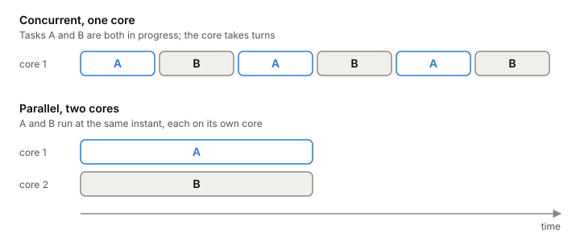

# Concurrency vs parallelism

Concurrency is about how you structure a program: as several pieces
that make progress independently, like one handler per client.
Parallelism is about how it runs: several computations happening at the
same instant, on several cores. The short version is that concurrency
is dealing with lots of things at once, and parallelism is doing lots
of things at once. A backend is concurrent almost by definition; whether
it's also parallel depends on the hardware and on how the work is split.

## One core can be concurrent

Take two tasks, A and B, on a machine with one core. The core runs a
bit of A, switches to B, then back to A. Both are in progress at the
same time, but at any instant only one is running. That's concurrency
without parallelism. The switching is what the kernel does between
[[thread|threads]] (a [[context-switch]]), or what a runtime does
between lighter tasks.

Give the same program two cores and A and B can run at the same
instant. Now it's also parallel.

*Concurrent on one core versus parallel on two.*

Two classic examples make the difference clear. The drivers for a
mouse, a keyboard, a display and a disk are concurrent: each handles
its own device's events whenever they come. A vector dot product is
parallel: one calculation, split across cores to finish sooner. A
server on an [[event-loop]] with one thread, answering thousands of
clients, is concurrent and not parallel.

## Structure first, execution second

The useful way to see it: concurrency is a property of your design, and
parallelism is something the design may or may not get when it runs.

A concurrent design breaks the job into pieces that can proceed
independently, plus some way for them to coordinate. That design isn't
automatically parallel. Run it with only one piece active at a time
and it's still correct, just not faster. What the structure does give
you is a way to become parallel: once the pieces are independent, the
runtime can put them on different cores. Go works this way. Goroutines
([[green-threads]]) are spread over OS threads as needed, and when one goroutine blocks,
the thread under it blocks but the other goroutines keep going.

The reverse doesn't hold. Adding cores to a design that isn't split
into independent pieces doesn't help. When Go was new, people ran a
concurrent prime sieve on four processors and found it got slower.

Concurrency also brings the problem that parallelism alone doesn't
need: once pieces share state, the order in which they run can change
the result. That happens even on one core, because a switch can land
between any two instructions. That's a [[race-condition]].

## Where it gets tricky

**Not everyone draws the line in the same place.** The framing above,
structure versus execution, is the one Go's designers use. A different
view, from programming-language research, says concurrency is about
nondeterminism: events arrive in an order you don't control (a click, a
packet) and the program must respond. Parallelism, in that view, is
about making a deterministic computation faster; the answer is fixed,
only the time changes. Sorting both halves of an array at once is
parallel without being concurrent in that sense, because the result
never depends on timing. Both views agree the two ideas differ; they
disagree on what the difference is.

**Parallel speedup has a floor.** Any computation has a longest chain of
steps that each depend on the one before. No number of cores gets you
below that. With a lot of work and few cores, the core count limits
you; with many cores, the chain does. How much more cores can help is
[[amdahls-law]].

**People use the words loosely.** "Parallel requests" often means
concurrent ones, maybe on one core. When someone reports a speedup from
"more concurrency", check whether more cores were involved.

## What this means when you build

- Design for concurrency first: independent pieces with clear ways to
  hand work between them. Parallelism can come later, and it only comes
  if the pieces really are independent.
- A server with one thread can serve many clients at once. Whether you
  need several cores depends on whether the work is waiting or
  computing ([[cpu-bound-vs-io-bound]]).
- Measure before assuming more cores will make something faster.
- Every piece of shared state in a concurrent design needs a rule, even
  on one core.

## Further reading

- [Concurrency is not Parallelism (slides)](https://go.dev/talks/2012/waza.slide), Rob Pike, 2012. The structure-versus-execution framing, with gophers and Go examples.
- [Parallelism Is Not Concurrency](https://existentialtype.wordpress.com/2011/03/17/parallelism-is-not-concurrency/), Robert Harper, 2011. The other framing: nondeterminism versus deterministic speedup, with work and depth.
- [Concurrency: An Introduction (Operating Systems: Three Easy Pieces, ch. 26)](https://pages.cs.wisc.edu/~remzi/OSTEP/threads-intro.pdf), Remzi and Andrea Arpaci-Dusseau, 2023. Why threads exist (parallelism and not blocking on I/O), and how a switch mid-update loses data.
