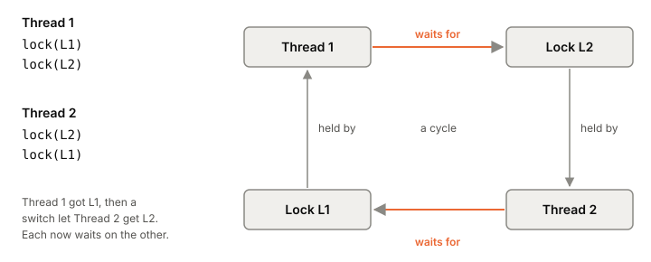

# Deadlock

A deadlock is when two or more [[thread|threads]] each hold a lock and wait for a
lock another one holds. None of them can move, and nothing will ever
change that. The program doesn't crash; it just stops making progress,
often only under a timing that almost never happens in testing.

## Two locks, taken in opposite orders

The smallest deadlock needs two [[mutex|mutexes]] and two threads that
take them in different orders:

*Two threads, two locks, one cycle. Adapted from Remzi and Andrea Arpaci-Dusseau, "Common Concurrency Problems" (Operating Systems: Three Easy Pieces, ch. 32), figure 32.7.*

Most runs are fine: thread 1 takes both locks and finishes before
thread 2 starts. The deadlock needs a switch at one exact moment, after
thread 1 has L1 and before it has L2. Then thread 2 takes L2 and asks
for L1. Each waits for the other.

Draw who holds what and who waits for what, and a deadlock is always a
cycle in that graph.

## Four conditions, all required

A deadlock needs all four of these at once (they go back to a 1971
paper by Coffman, Elphick and Shoshani):

1. **Mutual exclusion.** A lock can have only one holder.
2. **Hold and wait.** A thread keeps the locks it has while it waits
   for more.
3. **No preemption.** Nobody can take a lock away from its holder.
4. **Circular wait.** There's a cycle of threads, each waiting on the
   next.

Break any one and deadlock can't happen. Each way of dealing with it
attacks one condition.

## Ways out

**Always take locks in the same order.** This breaks circular wait and
is the one used most in practice. If every thread takes L1 before L2,
no cycle can form. Large systems use a partial order: the Linux kernel's
memory mapping code (as of Linux 5.2) lists its lock orders in a comment
at the top of the file. When a function gets two locks from its caller and can't know
their order, it can sort them by address and always take the lower one
first.

**Take all the locks at once.** Grab a global lock, take everything you
need, release the global lock. This breaks hold-and-wait, but you have
to know every lock in advance, and it cuts concurrency.

**Back off.** Take the first lock, then *try* the second (`trylock`);
if it's busy, release the first and start over. That breaks no
preemption, in a way: you preempt yourself. It adds a new failure,
**livelock**: two threads can keep backing off from each other forever,
busy but getting nowhere. A random delay before retrying makes that
unlikely.

**Don't lock at all.** Structures built on atomic compare-and-swap
avoid mutual exclusion ([[lock-free-structures]]), though they can
livelock too.

**Detect and recover.** Let deadlocks happen, find the cycle, and break
it by killing one participant. Many databases do this;
that's [[deadlock-detection]]. For an ordinary program, recovery
usually means a restart.

## Where it gets tricky

**Encapsulation hides the locks.** A thread-safe collection whose
`v1.AddAll(v2)` locks both collections, in the order v1 then v2, will
deadlock against another thread calling `v2.AddAll(v1)`. Neither caller
wrote a lock. Calling code you don't control while holding a lock is
how orders get mixed up.

**You don't have to hit a deadlock to find one.** Linux's lockdep
records every order in which lock classes are taken, "L1 held while
taking L2", over the life of the kernel. The first time it sees an
order that would close a cycle, of any length, it reports it, even if
the deadlock never happened. Each order only has to occur once, at any
time, in any task.

**One lock is enough.** Taking the same non-recursive lock twice
deadlocks a thread against itself. Read locks have a subtle version: if
a writer is waiting, a second read lock in the same thread can block
behind that writer, which is waiting for the first read lock.

**Go's built-in detector catches very little.** The Go runtime reports
a deadlock only when no goroutine at all can make progress. A server
always has something running, so a few stuck goroutines go unnoticed.
In a study of real Go bugs, the built-in detector found 2 of the
reproduced blocking bugs; the rest went unreported.

**Channels deadlock too.** A goroutine that sends on a channel nobody
will ever receive from is stuck just as surely. In that same study,
about 58% of the blocking bugs came from message passing, not locks
([[message-passing]]).

## What this means when you build

- Avoid holding two locks at once. When you must, fix an order,
  write it down next to the locks, and follow it everywhere.
- Don't call callbacks or other packages' code while holding a lock.
- If you use `trylock` and retry, add a random delay.
- A stuck service with idle CPUs and requests piling up is worth
  checking for a deadlock: dump every thread's or goroutine's stack and
  look for a cycle.

## Further reading

- [Common Concurrency Problems (Operating Systems: Three Easy Pieces, ch. 32)](https://pages.cs.wisc.edu/~remzi/OSTEP/threads-bugs.pdf), Remzi and Andrea Arpaci-Dusseau, version 1.20. The four conditions and every way of breaking them.
- [Runtime locking correctness validator (lockdep)](https://docs.kernel.org/locking/lockdep-design.html), Linux kernel docs. How the kernel finds lock-order inversions before they deadlock.
- [Understanding Real-World Concurrency Bugs in Go](https://songlh.github.io/paper/go-study.pdf), Tengfei Tu, Xiaoyu Liu, Linhai Song, Yiying Zhang, 2019. Blocking bugs in real Go systems, and what Go's built-in detector misses.
