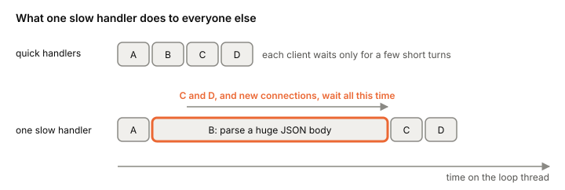

# Event loops

An event loop is one [[thread]] running a simple cycle: wait until some
connection has something to do, run the short piece of code that
handles it, and go back to waiting. With non-blocking sockets and epoll
underneath, one such thread can serve thousands of clients. It's how
nginx, Node.js and Redis work, and it comes with one rule you can't
break: never block the loop.

## The loop, step by step

Take a small key-value server on one thread. At startup it creates a
listening socket, makes it non-blocking, and registers it with epoll.
Then it runs this forever:

```
loop:
    timeout = time until the next timer is due
    ready = epoll_wait(timeout)
    for each socket in ready:
        if it's the listening socket:
            accept the new connection, make it non-blocking, register it
        else:
            read what has arrived, move that connection's state forward,
            write whatever reply can be written now
    run the timers that are due
```

That's all an event loop is. The thread sleeps in exactly one place,
`epoll_wait` ([[io-multiplexing]]), and only when there's nothing to do.
Every socket is [[non-blocking-io|non-blocking]], so no read or write
inside a handler can put it to sleep somewhere else.


*One turn of an event loop. Adapted from libuv, "Design overview" (libuv documentation, v1.x).*

Real loops add detail but keep this shape. libuv, the loop under
Node.js, runs each turn as: update its idea of "now", run due timers,
run I/O callbacks deferred from last time, run idle and prepare hooks,
compute how long it may block (the time to the nearest timer, or zero
if work is pending), block for I/O and run the callbacks for whatever
became ready, run check hooks, run close callbacks, and run timers
again. It uses epoll on Linux, kqueue on the BSDs and macOS, event ports
on SunOS and IOCP on Windows. A libuv loop belongs to
one thread and isn't thread-safe; to use more threads you run more
loops.

## The state lives in the connection, not on a stack

With [[thread-per-connection]], where a client is in its request lives
on its thread's stack: which line of code is running, which bytes have
been read. An event loop has no thread per client to hold that. A
handler runs until it would have to wait, saves what it knows, and
returns to the loop.

So each connection gets an explicit state object: the bytes received
so far, which part of the protocol comes next, the reply waiting to be
sent. In nginx each connection is driven by a state machine (there's
one for HTTP, one for raw TCP streams, one for each mail protocol it
speaks). The server keeps its own continuation state for each task
instead of relying on a thread's context. The cost is code
that's harder to write and read: logic that would be a few lines in a
thread gets split across callbacks, with the state carried by hand, a
burden known as "stack ripping". Making that code
look straight again is what [[async-await]] is for.

## Why it scales

Look at what each connection costs. In nginx, a new connection
adds a [[file-descriptor|file descriptor]] and a small amount of memory to the worker
process, and very little else: no thread of its own, no stack.

The thread also doesn't get switched out while there's work. An nginx
worker context-switches only when it has nothing to do.
In a thread-per-connection server, every time data arrives for a
different client the kernel switches threads ([[context-switch]]).

And under overload it degrades gently. In the SEDA paper's tests, an
event-driven server's throughput stayed flat as load went past its
capacity, with each request's latency growing linearly, where the
threaded version of the same server collapsed. Extra work waits in the
loop's queue instead of adding threads that fight each other.

[[redis-internals|Redis]] is the textbook case. Its client sockets are non-blocking and
multiplexed, and for fairness it does one `read` per client each time
that client's socket is readable, so one chatty client can't hog a
turn.

## The one rule: don't block the loop

Everything runs on one thread, so a handler that takes 200 ms delays
every other client by 200 ms, and new connections too. There's no
scheduler to step in: in a thread-per-client server the kernel
preempts a thread that runs too long, but in a loop, fairness is your
code's job.



*One slow handler stalls every connection on the loop.*

What blocks a loop in practice:

- **[[cpu-bound-vs-io-bound|CPU-heavy]] work in a handler.** Watch for regular expressions that
  can take exponential time on crafted input, and for `JSON.parse` and `JSON.stringify` on big payloads,
  which are linear but slow for large inputs. A client that can send
  such input can block your server on purpose, so it's a
  denial-of-service risk as well as a performance one. The fixes: bound
  input sizes, split long work into chunks that yield back to the loop,
  or move it off the loop.
- **Blocking calls.** Disk file reads have no useful readiness, and
  DNS lookups through the system resolver block. libuv runs these on a
  [[thread-pool]] and delivers the result back to the loop as an event.
  Node.js sends file system calls, DNS lookups, and CPU-heavy crypto and
  compression there too.
- **Things you didn't write as blocking.** Even with non-blocking I/O
  everywhere, the loop's thread can stall on a [[page-faults|page fault]] or a
  [[garbage-collection]] pause.

Long-running handlers freezing the program were already the first
problem on the list in Ousterhout's 1995 case for events.

## One loop per core

A loop is one thread, so it uses one core. To use a whole machine you
run several loops.

nginx runs one single-threaded worker process per CPU core, each with
its own loop, all handed the same listening sockets by a master
process. Redis is mostly single-threaded; the usual way to get more
out of it is pipelining and running several instances, and newer versions can move
socket reads, writes and protocol parsing onto optional I/O threads
(off by default, meant for machines with four or more cores).

Spreading connections across several loops is subtler than it looks.
Cloudflare found that with one shared listening socket and epoll, Linux
tends to wake the worker that most recently went back to waiting, which
is usually the busiest one, so it gets most new connections. Giving
each worker its own listening socket with `SO_REUSEPORT` spreads
connections evenly by hash, but then a worker that stalls also stalls
every connection queued for it. In their test the worst request took
about twice as long with separate queues as with the shared one, a hit
to [[tail-latency]].

## Where it gets tricky

**Threads versus events is an old argument.** Ousterhout argued in
1995 that threads are too hard for most programmers, that events are
easier and, on one CPU, faster because there are no locks and no
context switches, and that threads should be kept for when you need
real CPU parallelism. SEDA (2001) measured threaded servers collapsing
under load (the wider story is [[c10k]]). Von Behren, Condit and
Brewer answered in 2003 that the collapse came from poor thread
implementations, not threads as such:
their user-level thread package scaled to 100,000 threads, and they
pointed out that the "free" synchronization of an event loop only holds
on a single CPU. Today both sides are in production. nginx, Node.js and
Redis run explicit loops, while other runtimes give you cheap
thread-style code with a loop hidden underneath ([[green-threads]]).

**A single thread doesn't mean no shared-state bugs.** Handlers don't
run at the same time, so a handler that runs start to finish without
waiting sees consistent data. But a request that spans several turns of
the loop can see state change between them, the same check-then-act
problem as in [[race-condition]].

**A fast reader can drown a slow writer.** If a loop reads requests
faster than the network drains its replies, output buffers pile up in
memory. Redis puts limits on each client's output buffer and closes
connections that exceed them. The general problem is [[backpressure]].

**It's the wrong tool for heavy computation.** A loop is for work that
waits. For work that computes, you want threads on every core.

## What this means when you build

- Keep every handler short. Bound the size of anything a client sends
  before you parse it.
- Put blocking and CPU-heavy work on a pool, and hand the result back
  to the loop.
- Keep per-connection state in an explicit struct, with buffers and a
  cap on how much each connection may queue.
- Run one loop per core, and decide deliberately between a shared
  listening socket and `SO_REUSEPORT`.
- Measure how late the loop runs its timers ("loop lag"); it tells you
  when something is blocking it.

## Further reading

- [Design overview](https://docs.libuv.org/en/v1.x/design.html), libuv documentation, v1.x. The loop under Node.js, every step of an iteration, and why file I/O goes to a thread pool.
- [Don't Block the Event Loop (or the Worker Pool)](https://nodejs.org/en/learn/asynchronous-work/dont-block-the-event-loop), Node.js project. What blocks a loop in practice, and partitioning versus offloading.
- [Inside NGINX: How We Designed for Performance & Scale](https://blog.nginx.org/blog/inside-nginx-how-we-designed-for-performance-scale), Owen Garrett, 2015. One single-threaded worker per core, connections as state machines.
- [Redis client handling](https://redis.io/docs/latest/develop/reference/clients/), Redis docs. Non-blocking multiplexed clients, one read per event, output buffer limits.
- [redis.conf](https://raw.githubusercontent.com/redis/redis/unstable/redis.conf), Redis, unstable branch. The THREADED I/O section: mostly single-threaded, with optional I/O threads.
- [Why does one NGINX worker take all the load?](https://blog.cloudflare.com/the-sad-state-of-linux-socket-balancing/), Marek Majkowski (Cloudflare), 2017. How Linux spreads connections across several loops, and the latency cost of each layout.
- [SEDA: An Architecture for Well-Conditioned, Scalable Internet Services](https://www.sosp.org/2001/papers/welsh.pdf), Matt Welsh, David Culler, Eric Brewer, 2001. Event-driven versus threaded servers under overload, and what still blocks an event thread.
- [Why Threads Are A Bad Idea (for most purposes)](https://web.stanford.edu/~ouster/cgi-bin/papers/threads.pdf), John Ousterhout, 1995. The classic case for events.
- [Why Events Are A Bad Idea (for high-concurrency servers)](https://www.usenix.org/legacy/events/hotos03/tech/full_papers/vonbehren/vonbehren.pdf), Rob von Behren, Jeremy Condit, Eric Brewer, 2003. The classic reply, including the case against stack ripping.
