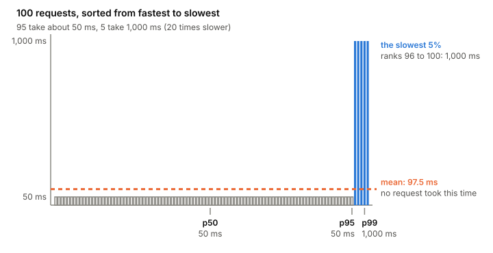

# Latency percentiles

A latency percentile answers "how slow were the slowest requests?".
The p99 is the time that 99% of requests beat and 1% didn't. The
average can't tell you that, and the requests it hides are the ones
people complain about. The phase 4 lab compares servers by their
p99, so it's worth being exact about what that means.

## An example where the average lies

Take 100 requests to a service. 95 of them take about 50 ms. The other
5 hit something slow and take 1,000 ms, 20 times longer. That shape
isn't made up: Google's SRE book shows a real service where the typical
request takes about 50 ms and 5% are 20 times slower.

*Sorted latencies for 100 requests. The shape follows the example in Chris Jones, John Wilkes, Niall Murphy and Cody Smith, "Service Level Objectives" (Google SRE book, 2016).*

The mean is (95 × 50 + 5 × 1,000) ÷ 100 = 97.5 ms. No request took
97.5 ms. It's twice what a typical user saw, and a twentieth of what
the unlucky ones saw. It describes nobody.

Now sort the 100 times and read off ranks:

- **p50, the median:** the 50th value, 50 ms. What a typical request
  gets.
- **p95:** the 95th value, still 50 ms.
- **p99:** the 99th value, 1,000 ms. Here the slow 5% finally shows.
- **p100, the max:** 1,000 ms.

That's the whole definition. The φ-quantile of N values is the one at
rank φ × N; the 0.99-quantile is the p99. A low percentile tells you
the typical case, a high one (p99, p99.9) a plausible worst case.

## Why the tail matters

**People notice variance.** In user studies, people prefer a slightly
slower system to one whose response times jump around. Some SRE teams
watch only high percentiles, on the logic that if p99.9 is fine, the
typical case is too.

**The tail gets worse under load.** [[queueing-theory|Queueing]] at high load makes the
long tail hurt more. In the SRE book's chart of one service over a
day, the average would show no change while the top percentile line
moves a lot.

**Latency isn't a bell curve.** Nothing finishes in less than 0 ms,
and a timeout cuts off the top, so the distribution is lopsided. The
mean and the median can be far apart. Don't assume a normal
distribution without checking.

A typical target sounds like: 99% of Get calls, measured over one
minute across all servers, finish in under 100 ms. That's a percentile,
a window and a scope, all three needed. More on targets in
[[sli-slo-sla]].

## Where it gets tricky

**You can't average percentiles.** If server A's p95 is 50 ms and
server B's is 400 ms, the p95 of both together is not 225 ms. It
depends on how many requests each served and what their whole
distributions look like. To get a combined percentile you need the
raw data, or [[histograms]] (bucket counts) that can be added up and
turned into a percentile afterwards. Prometheus summaries, which
compute percentiles inside each process, can't be combined at all.

**Every percentile you see is an estimate.** Unless you keep every
single value, a percentile comes out of buckets or a sketch. With
coarse buckets the error is large: in Prometheus's own example,
requests all near 220 ms land in a 200 to 300 ms bucket, and the p95
comes out as 295 ms.

**The window matters.** "p99 over one minute" and "p99 over a day" are
different numbers, and a burst that lasts seconds can vanish in a long
window, just as averaging request rates hides bursts.

**How you measure matters.** The way a load generator sends requests
can hide slow periods from the percentiles. That's
[[coordinated-omission]].

**p99 isn't rare at scale.** One request in a hundred is a lot of
requests on a busy service, and a request that fans out to many
servers waits for the slowest of them. That's [[tail-latency]].

## What this means when you build

- Report p50 and p99 (and p99.9 if you have enough requests), not the
  mean. Say the window and the number of requests.
- Keep raw latencies or a histogram, so you can compute any percentile
  and combine results later.
- Compare percentiles at the same load. A p99 without the request rate
  next to it says little.
- Look at the tail first when something gets slower under load.

## Further reading

- [Service Level Objectives](https://sre.google/sre-book/service-level-objectives/), Chris Jones, John Wilkes, Niall Murphy and Cody Smith, Google SRE book, 2016. Why latency is a distribution, and why percentiles beat the mean.
- [Histograms and summaries](https://prometheus.io/docs/practices/histograms/), Prometheus docs. The definition of a quantile, why they can't be averaged, and how bucket width sets the error.
