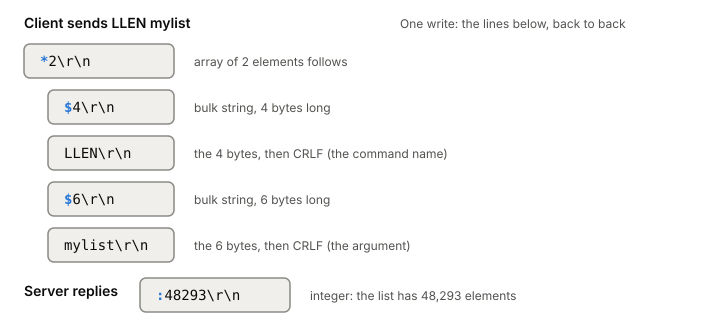

# RESP, the Redis protocol

RESP (Redis serialization protocol) is what a Redis client and server
send each other over a TCP connection. Every value starts with one byte
that says its type, lines end in CRLF (`\r\n`), and anything that can
hold arbitrary bytes carries its length up front. It's easy enough to
write a parser in an afternoon, which is why the phase 4 lab server
speaks a small piece of it.

## One command, byte by byte

Say a client wants the length of the list at the key `mylist`. It sends
the command `LLEN mylist` as an array of two bulk strings:

*One request and its reply. Adapted from Redis, "Redis serialization protocol specification".*

On the wire it's one run of bytes with no line breaks of its own:
`*2\r\n$4\r\nLLEN\r\n$6\r\nmylist\r\n`. The server answers
`:48293\r\n`, an integer.

Read it the way a parser does:

1. `*` means an array. The digits up to CRLF say how many elements
   follow: 2.
2. Each element is itself a RESP value. `$` means a bulk string, and
   `4` is its length in bytes. The parser reads exactly 4 bytes
   (`LLEN`), then skips the CRLF after them.
3. Same again for `mylist`.

Clients always send commands this way: an array of bulk strings, the
command name first. The server's reply can be any type, depending on
the command.

## The types

RESP2, the version every connection starts in, has five types, each
named by its first byte:

| First byte | Type | Example |
|---|---|---|
| `+` | simple string | `+OK\r\n` |
| `-` | error | `-ERR unknown command 'asdf'\r\n` |
| `:` | integer (signed 64-bit) | `:1000\r\n` |
| `$` | bulk string | `$5\r\nhello\r\n` |
| `*` | array | `*2\r\n...` then two values |

A simple string can't contain CR or LF, so it can be read up to the
first CRLF. A bulk string can hold any bytes, including `\r\n`, because
the reader never looks inside it: it reads the length, then that many
bytes. That's what makes RESP binary-safe. Redis caps a bulk string at
512 MB by default (`proto-max-bulk-len`).

RESP2 has no null type. It fakes one with a length of -1: `$-1\r\n` is
a null bulk string (what `GET` returns for a missing key), and `*-1\r\n`
a null array.

RESP3 adds maps, sets, booleans, doubles, big numbers, a real null
(`_\r\n`) and push messages the server can send at any time. It's
mostly a superset of RESP2. Redis 6.0 added it as opt-in: a client
sends `HELLO 3`, and a server that only knows RESP2 answers with an
unknown-command error, so the client can fall back.

## Readable, but fast to parse

You can read most of RESP by eye, and Redis even accepts "inline"
commands like `PING` typed into telnet, spotting them because they
don't start with `*`. The length prefix is what keeps it fast. A JSON
parser has to look at every byte of a string to find its end and undo
escapes. A RESP parser reads the digits of a length, one operation per
character, then copies that many bytes without looking at them.

It also solves framing. [[tcp|TCP]] is a byte stream with no message
boundaries, so one `read` can return half a command or three at once.
RESP says where each value ends, so the server reads until it has a
whole command and keeps the leftover bytes for the next one.

## Pipelining

A client doesn't have to wait for a reply before sending the next
command. It can write many commands in one go and read all the replies
afterwards, in order. That's pipelining, and Redis has always supported
it.

It saves round trips. With a 250 ms round trip, a client that waits for
each reply gets at most four commands a second, however fast the server
is. It also saves [[system-call|system calls]] on the server: many
commands arrive in one `read` and many replies leave in one `write`.
Redis's own benchmark shows throughput rising with pipeline length up
to about 10 times the unpipelined rate, and a Ruby client doing 10,000
PINGs over loopback went from about 1.19 s to 0.25 s.

There's a cost. The server has to keep the replies in memory until the
client reads them. Send big jobs in batches instead, for
example 10,000 commands, and read the replies before sending more.

## Where it gets tricky

**One read isn't one command.** A server that assumes it is works in
a quick test and breaks with pipelining or a slow network.

**Two nulls in RESP2.** `$-1` and `*-1` both mean "nothing", and a
client should return nil for them, not an empty string. RESP3's single
null type cleans this up.

**Pipelining can't do read-then-write.** If a later command needs an
earlier reply, the client has to wait for it. Server-side scripts are
the tool for that case.

**Replies pile up if the client doesn't read.** That's a
[[backpressure]] problem, covered there.

## What this means when you build

- Parse from a buffer, not from single reads. Keep partial commands
  around until the rest arrives.
- Trust the length prefix and read exactly that many bytes, then check
  for the CRLF.
- Test with pipelined input: many commands in one write, and one
  command split over many writes.
- Put a limit on how much you'll buffer for one client, in both
  directions.

Compare [[http-1-1]], also CRLF-delimited text over TCP with
pipelining; in RESP every value states its own type and length.
[[redis-internals]] shows what Redis does with a command once it's
parsed.

## Further reading

- [Redis serialization protocol specification](https://redis.io/docs/latest/develop/reference/protocol-spec/), Redis. Every RESP2 and RESP3 type, the HELLO handshake, inline commands and how to parse it fast.
- [Redis pipelining](https://redis.io/docs/latest/develop/using-commands/pipelining/), Redis. Why pipelining saves round trips and system calls, and the memory it costs the server.
