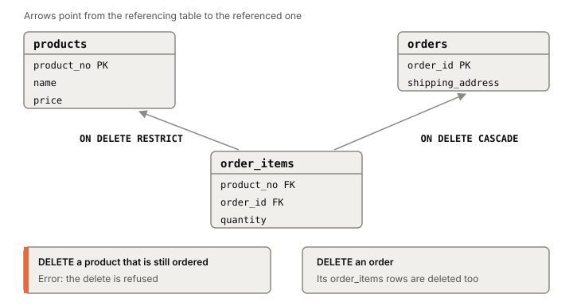

# Constraints

A constraint is a rule you declare in the schema, and the database
checks it on every write. If an insert or update would break it, the
statement fails with an error, whichever service or script sent it. Data types alone can't say "a price is positive" or
"every order line points at a real order"; constraints can.

## Six kinds of rule, on one small shop

Picture a shop with `products`, `orders`, and `order_items` (how many
of which product in which order).

**NOT NULL.** The column must have a value. Most columns should be
`NOT NULL`.

**CHECK.** A Boolean expression every row must satisfy:
`CHECK (price > 0)`, or across two columns of the same row,
`CHECK (discounted_price < price)`. Named
(`CONSTRAINT positive_price CHECK (...)`), its errors say which rule
broke.

**UNIQUE.** No two rows share the value, or the combination of values
for a multi-column constraint. Postgres enforces it with a unique B-tree
index it creates for you.

**PRIMARY KEY.** Unique and not null, one per table
([[primary-keys]]).

**FOREIGN KEY.** `order_items.product_no REFERENCES products` means
every non-null `product_no` in `order_items` must exist in `products`.
No order line can point at a missing product. The referenced columns
must be a primary key or have a unique constraint.

**EXCLUDE.** A generalization of unique: for any two rows, at least one
of the listed comparisons must come out false (or NULL). With a range column and the
overlap operator `&&`, `EXCLUDE USING gist (room WITH =, during WITH &&)`
says no two bookings of one room may overlap. PostgreSQL 18 (2025)
added a shortcut: `UNIQUE (room, during WITHOUT OVERLAPS)`.

Relational theory ([[relational-model]]) says every table has a key;
constraints make the database hold you to it.

## What happens when a referenced row is deleted

A foreign key has a second half: what to do when the row it points at
goes away or changes. You choose per foreign key.

*One order line, two different delete rules. Adapted from the PostgreSQL documentation, section 5.5.5 (version 18).*

- **NO ACTION** (the default). The delete is allowed to go ahead, but
  the foreign key must still hold when it's checked, so it usually
  fails with an error.
- **RESTRICT.** Like NO ACTION, except the check can never be put off
  until later in the transaction.
- **CASCADE.** Delete the referencing rows too.
- **SET NULL / SET DEFAULT.** Clear the referencing column, or reset it
  to its default.

If the child is part of the parent and can't exist without it (order
lines in an order), CASCADE fits. If they're independent things (a
product and the orders that bought it), use RESTRICT or NO ACTION, and
let the application delete both explicitly if it must. `ON UPDATE`
offers the same choices for a changed key.

## When the check runs

By default each constraint is checked right after every statement.
Unique, primary key, exclusion and foreign key constraints can be
declared `DEFERRABLE`, and then a [[transaction]] can run
`SET CONSTRAINTS ... DEFERRED` to have them checked once, at commit.
In between, other statements can put things right: delete a referenced
row, then insert its replacement or remove the rows that pointed at it,
and only the end state is checked. NOT NULL and CHECK can't be
deferred. Deferrable constraints can't be the arbiter for
`INSERT ... ON CONFLICT`.

## Where it gets tricky

**NULL slips past most rules.** A CHECK passes when its expression is
NULL, so `CHECK (price > 0)` accepts a NULL price; add `NOT NULL` too.
A UNIQUE constraint treats two NULLs as different by default, so many
rows can have NULL in a "unique" column; `NULLS NOT DISTINCT` changes
that, and other databases pick different defaults. A foreign key with
any NULL column isn't checked at all unless it says `MATCH FULL`.

**Foreign keys don't index the child side.** Postgres indexes the
referenced columns (they're unique), not the referencing ones. Every
product delete then scans `order_items` for rows still pointing at it,
so index `order_items.product_no` ([[indexes]]).

**CHECK only sees one row.** A CHECK that reads other rows or
tables may seem to work, but Postgres assumes checks are immutable and
runs them only on insert and update, so the rule can go false later and
break a dump and restore. Rules across rows belong in UNIQUE, EXCLUDE or foreign keys, or, for a one-time check at insert,
in a [[triggers|trigger]].

**Adding a constraint to a big table blocks writes.** `ALTER TABLE ...
ADD CONSTRAINT` scans every existing row, and other updates wait until
it commits. For foreign key, CHECK and NOT NULL constraints you can
split it: add it `NOT VALID` (quick; new writes are checked from then
on), then run `VALIDATE CONSTRAINT`, which checks old rows under a
lighter lock that lets writes continue. This matters for
[[schema-migrations]]; the lock levels are in [[ddl-locks]].

**Declared but not checked.** PostgreSQL 18 (2025) added `NOT
ENFORCED` for CHECK and foreign key constraints. The database won't
check them, yet the planner may still assume they hold. Useful as
documentation when checking is too expensive, dangerous if the data
drifts.

## What this means when you build

- Put invariants in the schema: `NOT NULL` by default, CHECK for value
  rules, UNIQUE for "one per", foreign keys for "must exist". Still
  validate input at the edge ([[validation-at-boundary]]); constraints
  are the backstop for every writer.
- Index foreign key columns on the child table.
- CASCADE only for true parts-of relationships.
- On a live table, add constraints `NOT VALID` and validate afterwards.

## Further reading

- [PostgreSQL documentation, 5.5 Constraints](https://www.postgresql.org/docs/current/ddl-constraints.html), PostgreSQL Global Development Group, version 18. Every constraint type, NULL handling, and the foreign key actions.
- [PostgreSQL documentation, CREATE TABLE](https://www.postgresql.org/docs/current/sql-createtable.html), PostgreSQL Global Development Group, version 18. DEFERRABLE and NOT ENFORCED.
- [PostgreSQL documentation, ALTER TABLE](https://www.postgresql.org/docs/current/sql-altertable.html), PostgreSQL Global Development Group, version 18. NOT VALID and VALIDATE CONSTRAINT, and what they lock.
- [PostgreSQL 18 release notes](https://www.postgresql.org/docs/release/18.0/), PostgreSQL Global Development Group, 2025. When NOT ENFORCED and NOT VALID not-null constraints arrived.
