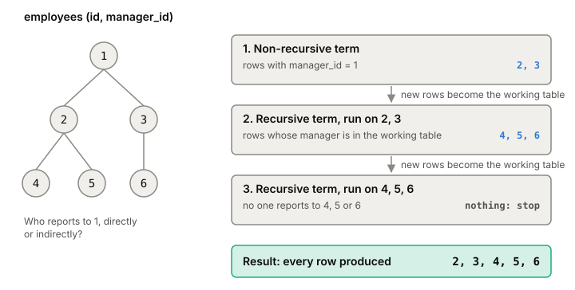

# CTEs: naming parts of a query with WITH

A common table expression (CTE) is a subquery you give a name at the
top of a statement with `WITH`, then use like a table in the rest of
it. It exists only for that one statement. Plain CTEs make long
[[sql]] readable; recursive ones walk trees and graphs, which plain SQL
can't do at all.

## Naming the steps

Say you want per-product sales, but only in the regions that bring in
more than a tenth of all sales. Without `WITH` that's two levels of
nested subqueries. With it, each step gets a name:

```sql
WITH regional_sales AS (
  SELECT region, SUM(amount) AS total_sales
  FROM orders GROUP BY region
), top_regions AS (
  SELECT region FROM regional_sales
  WHERE total_sales > (SELECT SUM(total_sales) / 10 FROM regional_sales)
)
SELECT region, product, SUM(quantity) AS units, SUM(amount) AS sales
FROM orders
WHERE region IN (SELECT region FROM top_regions)
GROUP BY region, product;
```

Each step reads top to bottom, one name at a time.

## Recursive CTEs walk a tree

Take an `employees` table where each row has a `manager_id`. "Everyone
who reports to employee 1, directly or not" needs one level of joins
per level of the org chart, and you don't know how deep it goes.
`WITH RECURSIVE` handles any depth:

```sql
WITH RECURSIVE reports(id) AS (
  SELECT id FROM employees WHERE manager_id = 1   -- non-recursive term
  UNION ALL
  SELECT e.id FROM employees e
  JOIN reports r ON e.manager_id = r.id           -- recursive term
)
SELECT id FROM reports;
```

A recursive CTE always has that shape: a non-recursive term, then
`UNION` or `UNION ALL`, then a recursive term that refers to the CTE
itself. Despite the name, Postgres runs it as a loop:

1. Run the non-recursive term. Its rows go into the result and into a
   *working table*.
2. While the working table isn't empty, run the recursive term with the
   CTE name standing for the working table only. Its new rows go into
   the result and become the next working table.



*A recursive CTE is a loop over a working table. Adapted from the PostgreSQL documentation, section 7.8.2 (version 18).*

Each pass only looks at the rows the previous pass found, so it ends
once a level has no children.
With `UNION` instead of `UNION ALL`, duplicates of earlier rows are
dropped at each step.

## Computed once, or folded into the query

A CTE can be run in two ways. Postgres can **materialize** it: compute
it once, keep the rows, and read them wherever the name is used. Or it
can **fold** it into the main query, as if you'd written a plain
subquery, so the [[query-planner]] can optimize both together, for
example by pushing a `WHERE` filter down into it and using an index.

Before PostgreSQL 12 (2019), CTEs were always materialized, and
evaluated before the rest of the query. A filter outside a CTE couldn't
reach inside it, so

```sql
WITH w AS (SELECT * FROM big_table)
SELECT * FROM w WHERE key = 123;
```

scanned all of `big_table` first. Since 12, a CTE is folded by default
when it isn't recursive, has no side effects, and is used exactly once.
The query above now runs like `SELECT * FROM big_table WHERE key = 123`
and can use an index on `key`.

You can override the choice. `AS MATERIALIZED` forces separate
computation, which helps when the CTE is expensive and used in several
places, or calls a costly function you want run once per row.
`AS NOT MATERIALIZED` forces folding, which helps when a CTE used twice
would otherwise be copied into a temporary result that can't use any
[[indexes]].

## Where it gets tricky

**Loops that never end.** If the data has a cycle (A manages B, B
manages A), the recursive term keeps finding rows forever. `UNION`
only helps when whole rows repeat. The usual fix is to track the path
so far and stop when an id shows up twice; Postgres has a `CYCLE`
clause that writes that for you. An outer `LIMIT` happens to stop a runaway
recursion in Postgres, but don't rely on it in production.

**Order is not guaranteed.** The loop happens to produce rows level by
level, but that's an implementation detail. If you need depth-first or
breadth-first order, use the `SEARCH` clause or sort explicitly.

**Writes inside WITH.** A CTE can be an `INSERT`, `UPDATE`, `DELETE` or
`MERGE`. `WITH moved AS (DELETE FROM jobs WHERE done RETURNING *)
INSERT INTO jobs_archive SELECT * FROM moved;` moves rows in one
statement. Two surprises: data-modifying CTEs always run to completion,
even if nothing reads their output; and every part of the statement
sees the same snapshot ([[mvcc]]), so a `SELECT` from the table in the
main query doesn't see the CTE's changes. `RETURNING` is the only way to
pass changed rows along. Don't touch the same row from two parts of
one statement; which change wins is unpredictable.

**The version changes the plan.** The same CTE query can run very
differently on PostgreSQL 11 and on 12 or later, because 11
materializes every CTE. Performance tips about CTEs from the 11 era
don't carry over; on current versions, say what you mean with
`MATERIALIZED` or `NOT MATERIALIZED`.

## What this means when you build

- Use plain CTEs to give each step of a long query a name.
- Use `WITH RECURSIVE` for hierarchies instead of one query per level
  from the application.
- Guard recursive queries against cycles if the data can have them.
- If a CTE query is slow, read its plan ([[explain]]) to see whether
  the CTE was folded or computed separately, and set it explicitly.

## Further reading

- [PostgreSQL documentation, 7.8 WITH Queries (Common Table Expressions)](https://www.postgresql.org/docs/current/queries-with.html), PostgreSQL Global Development Group, version 18. Recursive evaluation, SEARCH and CYCLE, materialization rules, and data-modifying CTEs, with examples.
- [PostgreSQL 12 release notes](https://www.postgresql.org/docs/release/12.0/), PostgreSQL Global Development Group, 2019. When CTEs stopped being always materialized.
