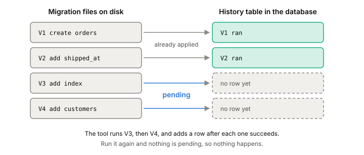

# Schema migrations

A schema migration is one small, numbered change to your database's
structure, kept as a file next to your code. A tool runs the files in
order and remembers which ones it has already run. That way every
database you have (your laptop, CI, staging, production) goes through
the same steps and ends up with the same tables, [[constraints]] and
indexes.

## The problem it solves

Say you have an `orders` table, and you need a `shipped_at` column. You
could open a console on production and type the `ALTER TABLE`. It
works, once. Then the questions start:

- Did anyone run the same change on staging? On the test database?
- Your teammate's laptop has a database from last month. What's missing
  from it?
- A new service needs a fresh copy of the database. What's the full list
  of steps to build one?

Without a record, the honest answer is "we don't know". Migrations fix
that by turning every change into a file that runs the same way
everywhere.

## Files, versions and a history table

Each migration is a file with a version in its name. Flyway uses
version numbers; Rails puts a UTC timestamp at the front of the file
name. Either way,
the version sets one order that everyone agrees on.

Inside the database, the tool keeps a small table of its own, with one
row per migration that has run: `flyway_schema_history` for Flyway,
`schema_migrations` for Rails. The first time the tool runs on an empty
database, it creates that table.

*The tool compares the files on disk with the history table, and runs only the pending ones, in version order.*

Running the tool is a comparison:

1. Read the list of migration files from disk.
2. Read the history table.
3. Every file with no row in the table is **pending**. Run the pending
   ones in version order. (Flyway, by default, skips a missing file
   whose version is lower than the newest one already applied.)
4. After each one succeeds, add its row to the table.

Run it twice and the second run does nothing, because nothing is
pending. Run it on a database that's three versions behind and it runs
exactly those three. That's what makes the result the same everywhere.

Migrations aren't only for structure. Adding a column, backfilling it
and creating an index can all be migrations. Anything that has to
happen once, in order, on every copy of the database belongs in one.

## Where it gets tricky

**Never edit a migration that has already run somewhere else.** Rails,
for one, only checks whether a version has run, so an edited file
counts as done. If you fix a bug in migration 7 after production ran it,
production keeps the old version and your laptop gets the new one. The
two databases now differ, and nothing tells you. Write migration 8
instead. Editing is fine only while the file has never left your
machine.

**Transactions around DDL.** Rails wraps each migration in a
[[transaction]] when the database supports transactional DDL, so a
migration that fails halfway leaves nothing behind. On a database that
doesn't, the first half stays applied and you clean up by hand. Some
statements can't run inside a transaction at all, so tools let you turn
the wrapper off for one migration.

**The migrations are not the schema.** The database itself is the
source of truth. Replaying years of migrations to build a new database
is slow, and old ones can fail if they call application code that has
changed since. Rails keeps a snapshot of the current schema
(`db/schema.rb` or `db/structure.sql`) and loads that for fresh
databases; with the snapshot in place, you can even delete old
migration files.

**Some changes can't be undone.** Tools like Rails can reverse many
migrations (the reverse of "create table" is "drop table"). A
migration that destroys data, like dropping a column full of it, has
no reverse, and the tool should say so rather than pretend.

**"Runs the same way" is not "runs safely".** A migration that finishes at once
on your laptop can block every query on a busy production table. What each statement locks is [[ddl-locks]], and how to change
a schema while the app keeps serving traffic is
[[zero-downtime-migrations]].

## What this means when you build

- Every schema change goes through a migration file in the same
  repository as the code that needs it. No hand-typed changes in
  production.
- Treat a merged migration as frozen. Fix mistakes with a new one.
- Keep a schema snapshot and build fresh databases from it, not by
  replaying history.
- Test migrations against a database the size of production before you
  trust their timing.

## Further reading

- [Active Record Migrations](https://guides.rubyonrails.org/active_record_migrations.html), Rails Guides, Rails 8.1. The history table, transactions around each migration, why not to edit old migrations, and why the schema file beats replaying history.
- [How Flyway works](https://documentation.red-gate.com/fd/how-flyway-works-184127223.html), Redgate, Flyway docs. The shortest explanation of versioned migrations: history table, version order, pending migrations.
