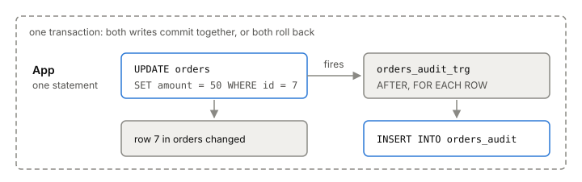

# Triggers

A trigger is a function the database runs by itself whenever a row is
inserted, updated or deleted in a table. You don't call it; the write
does. That makes triggers good for keeping a second table in step with
the first, and it's how the older online schema change tools capture
every write during a copy. The price is that every write to the table
now does more work, and nobody reading your [[sql]] can see it.

## One write, two tables

Say you want a record of every change to `orders`. In Postgres you
write a trigger function, then attach it to the table:

```sql
CREATE TABLE orders_audit (op char(1), order_id bigint, amount integer);

CREATE FUNCTION orders_audit_fn() RETURNS trigger AS $$
BEGIN
  IF TG_OP = 'DELETE' THEN
    INSERT INTO orders_audit VALUES ('D', OLD.id, OLD.amount);
  ELSE
    INSERT INTO orders_audit VALUES (left(TG_OP, 1), NEW.id, NEW.amount);
  END IF;
  RETURN NULL;  -- ignored for AFTER triggers
END;
$$ LANGUAGE plpgsql;

CREATE TRIGGER orders_audit_trg
  AFTER INSERT OR UPDATE OR DELETE ON orders
  FOR EACH ROW EXECUTE FUNCTION orders_audit_fn();
```

A trigger function takes no arguments and returns the type `trigger`.
Its input arrives in special variables: `NEW` is the row after an
insert or update, `OLD` the row before an update or delete, and
`TG_OP` names the operation.

Now `UPDATE orders SET amount = 50 WHERE id = 7` also inserts
`('U', 7, 50)` into `orders_audit`. Both writes happen in the **same
[[transaction]]**. If the audit insert fails, the update is rolled back
too, and if the transaction rolls back, the audit row disappears with
it. The side table can never record a change that didn't happen, or
miss one that did.



*A row trigger turns one write into two, inside the same transaction.*

## When and how often it fires

Two choices shape a trigger:

- **BEFORE or AFTER.** A `BEFORE` row trigger runs just before the row
  is written. It can change the row it's about to write, or return
  `NULL` to skip the row. An `AFTER` row trigger runs at the end of the
  statement and sees the final row, so it's the one for copying changes
  to other tables.
- **Per row or per statement.** `FOR EACH ROW` runs once per changed
  row. `FOR EACH STATEMENT` runs once per statement, even if it changed
  no rows.

## What it adds to each write

A row trigger turns every write into at least two: the row you changed
and whatever the trigger writes. An `UPDATE` touching a million rows
runs the function a million times. There are a few extra costs:

- `AFTER` row triggers are queued until the end of the statement, so
  Postgres has to keep track of every changed row until then. With no
  reason to pick `AFTER`, `BEFORE` is cheaper.
- A statement-level `AFTER` trigger can read all the changed rows at
  once through *transition tables*. For statements that change many
  rows, that can be much faster than one call per row.
- On MySQL, trigger bodies are interpreted on every call, and the
  trigger's writes compete for locks with the app's writes. GitHub saw
  that contention lock up busy tables during trigger-based migrations.

## Change capture with triggers

The audit table above is change capture: every insert, update and
delete lands in a side table, in the same transaction as the write.
Online schema change tools use exactly this. They copy a big table
into a new one in the background, and a trigger makes sure writes that
happen during the copy aren't lost. Some tools have the trigger write
straight into the new table; others write to a change log that a
separate process replays later. [[online-schema-change]] compares them.

The catch for a migration: you can pause the background copy when the
database is busy, but you can't pause the trigger. Dropping it mid-copy
loses changes. That's why gh-ost reads MySQL's replication log instead,
and why this phase's lab compares triggers with
[[logical-replication]].

## Where it gets tricky

**Hidden behavior.** A trigger runs on every write from every client,
including the ones you forgot about: bulk imports, console fixes, other
services. Someone reading the app code sees one `UPDATE` and no hint of
the second write.

**Order and cascades.** Several triggers on the same event fire in
alphabetical order by name. A trigger that writes to a table with its
own triggers fires those too, with no depth limit, so recursion is
possible and preventing it is your job.

## What this means when you build

- Use triggers for things that must happen in the same transaction as
  the write, like an audit row or keeping a copy in step during a
  migration.
- Keep trigger functions small, and prefer `BEFORE` unless you need the
  final row.
- For bulk changes, consider a statement-level trigger with transition
  tables.
- Document every trigger next to the table it's on.

## Further reading

- [Overview of Trigger Behavior](https://www.postgresql.org/docs/current/trigger-definition.html), PostgreSQL 18 docs. BEFORE and AFTER, row and statement triggers, same-transaction behavior, order and cascades.
- [Trigger Functions (PL/pgSQL)](https://www.postgresql.org/docs/current/plpgsql-trigger.html), PostgreSQL 18 docs. NEW, OLD, TG_OP, and the audit trigger example, row-level and with transition tables.
- [gh-ost](https://github.com/github/gh-ost), GitHub, v1.1.11. Its "Why triggerless?" doc is the clearest case against trigger-based change capture during migrations (MySQL).
