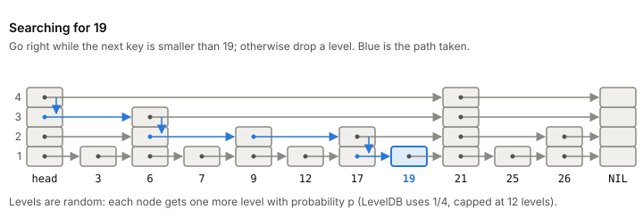

# Skip lists

A skip list is a sorted linked list with extra pointers that let a
search jump over most of the list. It gives you what a balanced tree
gives you (find, insert, delete and in-order scans in roughly
logarithmic time) with much simpler code, because it stays balanced by
flipping coins instead of rotating nodes. It's the default in-memory
structure behind the memtable of LevelDB and RocksDB, so it sits on the
write path of every [[lsm-tree]] built on them.

## From a linked list to a skip list

Keep ten keys in a sorted linked list. Finding 19 means walking node by
node from the start.

Now give every second node an extra pointer that jumps two nodes ahead.
You can walk the upper pointers first and only drop to the lower ones
at the end, so you look at about half as many nodes. Give every fourth
node a pointer four ahead, every eighth a pointer eight ahead, and so
on, and a search looks at about log₂ n nodes while only doubling the
number of pointers.

The trouble is keeping that perfect pattern. Insert one key and every
node after it is in the wrong place for its pointers. The skip list's
trick is to stop insisting on the pattern and keep only its
proportions: half the nodes get a second level, a quarter get a third,
and so on, chosen at random. A node that has k forward pointers is a
level-k node, and its level-i pointer goes to the next node that has at
least i levels.

*Searching a skip list: go right while the next key is smaller, otherwise go down. Adapted from William Pugh, "Skip Lists: A Probabilistic Alternative to Balanced Trees" (1990), figure 1.*

## Search, insert, delete

**Search** starts at the highest level of the head node. At each level,
move right while the next node's key is smaller than the one you want.
When you can't, drop one level. When you can't move right on level 1,
the next node is either your key or proof it isn't there.

**Insert** is a search that remembers, at each level, the last node it
passed. Pick the new node's level by flipping a biased coin: keep
adding a level while a random number comes up under p, up to a cap.
Then splice the new node in after each remembered node, one pointer per
level. Nothing else in the list moves. A node's level is chosen once and
never changes.

**Delete** is the same search, then unlinking the node at each of its
levels.

Two numbers matter when you implement it:

- **p**, the chance of one more level. With p = 1/2 you get the
  every-second-node picture. p = 1/4 makes searches slightly faster;
  1/2 makes their times vary less. Use 1/4 unless that variation
  matters most. LevelDB uses 1/4.
- **The level cap.** With p = 1/2, 16 levels is enough for up to 2¹⁶
  elements. LevelDB caps height at 12.

With p = 1/4, a node has on average 1⅓ pointers. RocksDB's skip-list
memtable averages about 1.33 per entry, as expected.

The balance is only probable. A bad run of coin flips can make one
search slow, but no order of inserts causes it reliably, unlike a plain
binary tree fed sorted keys. For a list of more than 250 elements, the
chance that a search takes more than three times the expected time is
under one in a million.

## Why memtables use them

A memtable has to accept writes fast, answer lookups, and at flush
time hand over every key in sorted order. A skip list does all three,
and concurrent versions are much simpler than for balanced trees.

In LevelDB, writers take an
outside mutex, one at a time. Readers take no lock at all. That works
because of two rules: a node is fully built before it's linked in (the
link is published with a release store, see [[memory-model]]), and no
node is ever deleted while the list exists. The skip list doesn't even
have a delete operation: every node lives until the whole list is
destroyed. RocksDB
goes further and supports concurrent inserts into its skip-list
memtable, turned on by default. Its hash-based memtables can't, and
they can't scan across key prefixes without copying and sorting, which
is why the skip list is the default.

## Where it gets tricky

**Randomness isn't a weakness in practice, but it's a real property.**
The expected costs hold for any input, provided nobody can see the
levels. Someone who knows which nodes are level 1 could delete all the
others and leave you a plain linked list.

**It's an in-memory structure.** Every step follows a pointer to a node
somewhere else in memory. On disk, where one read fetches a whole page,
a [[b-plus-tree]] with many keys per page is the better fit. The skip
list's job in an LSM tree ends at flush, when its sorted contents are
written out as an [[sstable]].

## What this means when you build

- For an ordered in-memory map that needs sorted iteration, a skip list
  is one of the easiest correct choices.
- Use p = 1/4 and a fixed level cap sized to your largest list.
- If you need lock-free readers, copy LevelDB's rules: build the node
  fully, publish it with a release store, never free nodes while
  readers can see them, and free the whole thing at once.
- Seed the random generator; don't let clients choose levels.

## Further reading

- [Skip Lists: A Probabilistic Alternative to Balanced Trees](https://15721.courses.cs.cmu.edu/spring2018/papers/08-oltpindexes1/pugh-skiplists-cacm1990.pdf), William Pugh, 1990. The original paper: the idea, the algorithms, the analysis and the choice of p.
- [leveldb db/skiplist.h](https://github.com/google/leveldb/blob/main/db/skiplist.h), LevelDB authors. A real memtable skip list with lock-free readers.
- [MemTable (RocksDB wiki)](https://github.com/facebook/rocksdb/wiki/MemTable), RocksDB team. Why the skip list is RocksDB's default memtable, and how the alternatives compare.
