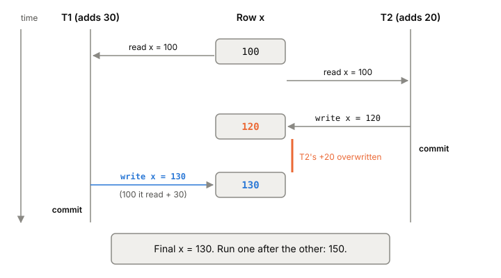

# Lost updates

A lost update happens when two transactions each read a value, compute
a new one from it, and write it back. The second write replaces the
first, and the first change is gone without any error. It's the
read-modify-write [[race-condition]] moved into the database, and
the default isolation levels of both Postgres and MySQL let it through.

## A counter that forgets

A row holds `x = 100`. Two transactions each add to it, the way
application code usually does: read the value, do the arithmetic in the
app, write the result.

1. T1 reads `x`: 100.
2. T2 reads `x`: 100.
3. T2 adds 20, writes `x = 120`, and commits.
4. T1 adds 30, writes `x = 130`, and commits.

The row ends at 130. It should be 150. T2's +20 was lost, and both
transactions reported success.



*Both transactions read 100, so the last write wins and T2's +20 disappears. Adapted from history H4 in Berenson et al., "A Critique of ANSI SQL Isolation Levels" (1995).*

The same thing happens through an [[orm|ORM]]. Two requests load the
same object, each changes a field in memory, each calls `save()`. The second
save writes values computed from what it loaded, and whatever the first
save changed is overwritten.

Written as a [[history-checking|history]], the pattern is: T1 reads
`x`, T2 writes `x`, T1 writes `x`, T1 commits. The key is that T1's write is based on a read
that is out of date by the time the write happens.

## Why the default level allows it

Nothing in the example is a [[dirty-read]]. Every value read was
committed. [[isolation-levels|READ COMMITTED]] is about not seeing
uncommitted data. It doesn't keep track of what T1 read earlier, so it
has no reason to stop T1's write.

The timing doesn't have to be as neat as the list above. If T1's
UPDATE reaches the row while T2 has written it but not yet committed,
Postgres makes T1 wait for T2. Once T2 commits, T1 goes ahead and
applies its own change to the new version of the row. But T1's change is `SET x = 130`,
a number it worked out from the stale 100. Waiting didn't help, because
the mistake was made before the UPDATE started. The Hermitage test suite
shows exactly this on Postgres: the second update blocks, then
overwrites.

A level that forbids [[non-repeatable-read|non-repeatable reads]] rules
lost updates out too: T2 wrote `x` after T1 read it and before T1
finished, which is the same pattern. A locking database enforces it by
holding read locks until commit. Postgres's REPEATABLE READ detects the
conflict instead, which is fix 4 below.

There are four standard fixes. They differ in who does the work: the
database, a lock, your code, or the isolation level.

## Fix 1: let the database do the arithmetic

Instead of reading the value and writing a result, write the change:

```sql
UPDATE counters SET x = x + 30 WHERE id = 1;
```

Now the second updater waits for the first, then re-checks its WHERE
clause against the new version of the row and applies `x + 30` to it.
It adds 30 to 120, and the row ends at 150. The Postgres manual uses a
bank transfer (`balance = balance + 100`) as the example of what READ
COMMITTED handles well: each command touches one known row, so seeing
the latest version of it is exactly what you want.

ORMs can express this too. In Django it's an `F()` expression:
`counter.x = F("x") + 30` makes the database compute the new value from
whatever is stored at save time, not from what Python loaded. Django's
docs call out this race as a reason to use it.

This is the cheapest fix, but it only works when the new value can be
computed in one SQL statement from the row itself. "Add 30" works.
"Call a pricing service with the old value, then write the answer"
doesn't.

## Fix 2: lock the row when you read it

If the logic has to happen in your code, lock the row as you read it:

```sql
BEGIN;
SELECT x FROM counters WHERE id = 1 FOR UPDATE;
-- compute in the app
UPDATE counters SET x = 130 WHERE id = 1;
COMMIT;
```

`FOR UPDATE` puts a row lock on what the SELECT returns. A second
transaction running the same SELECT FOR UPDATE, or trying to UPDATE or
DELETE the row, waits until the first commits. At READ COMMITTED, when
it gets the row, it reads 130, not 100. This is [[explicit-locking]]: it's pessimistic, it
makes other writers queue, and it only protects code paths that take
the lock. A plain SELECT elsewhere still reads without waiting.

## Fix 3: check a version when you write

Instead of locking, remember what you read and make the write
conditional on it still being true. The usual form is a version column:

```sql
UPDATE counters SET x = 130, version = version + 1
WHERE id = 1 AND version = 7;
```

If someone else wrote the row since you read version 7, the WHERE
clause matches nothing and zero rows are updated. Your code sees the
zero, reloads, and either retries or tells the user. This is
[[optimistic-concurrency]], and Rails builds it in: add a `lock_version`
column and Active Record adds the old version to every update's
conditions, and raises `StaleObjectError` when the update touches no
rows.

This fix has one property the others lack. The read and the write
don't have to be in the same transaction. A user opens an edit form,
goes to lunch, and saves an hour later. No database transaction spans
that hour, so no isolation level or row lock can see the conflict. A
version number carried through the form (Rails suggests a hidden field)
can. The same idea over HTTP is [[conditional-requests]].

## Fix 4: let the isolation level catch it

At REPEATABLE READ, Postgres detects the lost update for you. When T1
tries to update a row that T2 changed and committed after T1's
snapshot was taken, T1 gets:

```
ERROR: could not serialize access due to concurrent update
```

T1 has to roll back and run again from the start. On the second run it
reads 120, and writes 150. This is the first-committer-wins rule of
[[snapshot-isolation]]: of two concurrent transactions that write the
same row, only the first to commit keeps its write.

You don't change your SQL, but you do need retry logic around every
transaction that writes, because the error is expected, not a bug. The
retry has to redo the reads and the logic, not only resend the last
statement.

## Where it gets tricky

**MySQL's REPEATABLE READ doesn't catch it.** It's the InnoDB default,
and it sounds like Postgres's level of the same name, but Hermitage's
test shows the second update blocks and then overwrites, just like READ
COMMITTED. The reason is in the MySQL manual: InnoDB's snapshot applies
to plain SELECTs, not to UPDATE and DELETE, which act on the latest
committed rows. So raising the level from READ COMMITTED to REPEATABLE
READ changes nothing here. On MySQL, use fix 1, 2 or 3, or SERIALIZABLE,
where Hermitage saw one of the two transactions fail with a
[[deadlock-detection|deadlock]] error instead.

**Locking reads at REPEATABLE READ can still fail.** In Postgres, a
REPEATABLE READ transaction whose SELECT FOR UPDATE finds a row changed
since its snapshot gets the same serialization error as an UPDATE
would. Using fix 2 inside fix 4 still needs the retry.

**Re-evaluation is not magic.** READ COMMITTED's "wait, then re-check
the WHERE clause on the new version" is right for one row with a simple
condition. With a condition the other transaction changes, it gives odd
results. The Postgres manual's example: one session runs
`UPDATE website SET hits = hits + 1` on two rows holding 9 and 10,
another runs `DELETE FROM website WHERE hits = 10`, and the DELETE
removes nothing, even though a row with 10 exists both before and after.

**Lost updates can be caught; their cousin can't, as easily.** In a
lost update both transactions write the same row, so the database has
a row-level conflict to notice. If two transactions read overlapping
data and then write *different* rows, there's no such conflict, and
snapshot isolation lets it through. That's [[write-skew]].

## What this means when you build

- Look for read-then-write in your code: load, change in memory, save.
  Each one is a lost update waiting for two concurrent requests.
- Prefer `SET x = x + n` (or your ORM's version of it) whenever the
  change can be expressed in SQL. It's correct at READ COMMITTED and
  takes no extra round trip.
- When the logic lives in the app and the transaction is short, use
  `SELECT ... FOR UPDATE`.
- When the read and the write are in different requests, use a version
  column and treat zero updated rows as a conflict.
- If you run Postgres at REPEATABLE READ or SERIALIZABLE, wrap writes in
  a [[retries-with-backoff|retry loop]] that reruns the whole transaction.
- Don't assume MySQL's default level protects you.

## Further reading

- [A Critique of ANSI SQL Isolation Levels](https://www.microsoft.com/en-us/research/wp-content/uploads/2016/02/tr-95-51.pdf), Berenson, Bernstein, Gray, Melton, O'Neil and O'Neil, 1995. Defines lost update (P4), the 100/120/130 history, and first-committer-wins.
- [13.2 Transaction Isolation](https://www.postgresql.org/docs/current/transaction-iso.html), PostgreSQL 18 documentation. How a second updater waits and re-checks at READ COMMITTED, and the serialization error at REPEATABLE READ.
- [13.4 Data Consistency Checks at the Application Level](https://www.postgresql.org/docs/current/applevel-consistency.html), PostgreSQL 18 documentation. When to use SELECT FOR UPDATE and what its lock covers.
- [Hermitage](https://github.com/ept/hermitage), Martin Kleppmann and contributors. The lost update scripts on Postgres and MySQL at each level.
- [17.7.2.3 Consistent Nonlocking Reads](https://dev.mysql.com/doc/refman/8.4/en/innodb-consistent-read.html), MySQL 8.4 Reference Manual. Why InnoDB's UPDATE doesn't read from the transaction's snapshot.
- [Query Expressions](https://docs.djangoproject.com/en/5.2/ref/models/expressions/), Django 5.2 documentation. `F()` and the section on avoiding the race.
- [ActiveRecord::Locking::Optimistic](https://api.rubyonrails.org/classes/ActiveRecord/Locking/Optimistic.html), Rails 8.1.4 API. The `lock_version` column and `StaleObjectError`.
