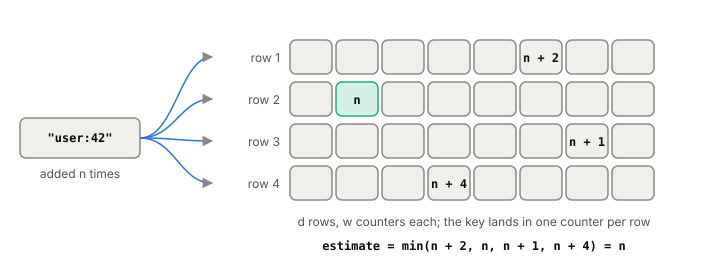

# The count-min sketch

A count-min sketch is a small, fixed-size table of counters that
estimates how many times each key has appeared in a stream, without
storing the keys. Its estimates can be too high but never too low. A
cache uses one to answer "how popular is this key lately?" for millions
of keys in a small, fixed amount of memory, which is what the W-TinyLFU
[[eviction-policies|eviction policy]] runs on.

## Counting without storing the keys

Start from a [[bloom-filter]]: hash a key with several hash functions
and set the bits they point to. A count-min sketch does the same with
counters instead of bits, and gives each hash function its own row.

The table has `d` rows of `w` counters, all starting at zero, and one
hash function per row.

- **To add a key**, hash it once per row and add 1 to the counter it
  lands on in that row.
- **To estimate a key's count**, hash it the same way, read its `d`
  counters and return the smallest.

*One key, one counter per row, and the estimate is the smallest. The name comes from those two steps: count, then take the minimum.*

Why the minimum? Every counter the key touches has been incremented
once for every time the key was added, so each is at least the true
count. Other keys that happen to hash to the same cell only push it
higher. The smallest of the `d` counters is the one polluted least by
collisions, and it can never be below the truth.

## How big it has to be

The error is bounded relative to the total count `N` of everything
added. With width `w = ⌈e/ε⌉` and depth `d = ⌈ln(1/δ)⌉`, the estimate is
at most `ε·N` above the true count, with probability at least `1 − δ`.
Width buys accuracy, depth buys confidence, and the space is just `w·d`
counters, no matter how many distinct keys there are. Each add or query
touches `d` counters.

Caffeine, the Java cache W-TinyLFU was built for, uses a depth of 4
and sizes the table from the cache's maximum number of entries (rounded
up to a power of two), which by its own comment gives a confidence of
93.75% and an error bound of `e / width`.

## The cache version

A cache doesn't need exact counts. It only needs to compare two keys:
is the newcomer more popular than the item about to be evicted? The
TinyLFU paper and Caffeine lean on that to make the sketch tiny and
keep it current:

- **Small counters.** Caffeine's counters are 4 bits and stop at 15. A
  key that popular belongs in the cache anyway; the exact number
  doesn't matter.
- **Halving, so it forgets.** After a set number of additions
  (Caffeine uses 10 times the cache size), every counter is divided by
  two. Old popularity fades, and a key that was hot yesterday has to
  keep earning its place. TinyLFU calls this the reset.
- **A doorkeeper for one-time keys.** The TinyLFU paper also puts a
  plain Bloom filter in front: a key's first appearance only sets bits
  there, and only repeat visitors reach the counters. In skewed
  workloads most keys show up only once in the sample, so this saves a
  lot of counters.
- **One cache line per key.** Caffeine keeps a key's four counters
  inside one 64-byte block, the size of an L1 [[cpu-cache]] line, so an
  add or a query usually costs a single memory access instead of four.

One refinement from the literature is the *conservative update*: on an
add, only increment the counters that are currently the smallest,
because the larger ones are already overestimates. TinyLFU's paper uses
it with its counting Bloom filter. Caffeine's sketch increments all four
counters instead.

## Where it gets tricky

**Rare keys are mostly noise.** The error is a fraction of the whole
stream, not of the key's own count. For a key seen a handful of times
in a big stream, the estimate may be mostly collisions. That's fine for
a cache, which cares about telling popular keys apart, and bad if you
need exact counts for the long tail.

**It only overestimates.** A sketch can't tell you a key is rare with
certainty, only that it's at most so frequent. The guarantee above is
for counts that only go up, which is the cache case; a cache forgets by
halving everything, not by removing single keys.

**Bloom filter or count-min sketch?** A Bloom filter answers "have I
seen this key?" with one bit per cell. A count-min sketch answers "about
how many times?" with a counter per cell. TinyLFU uses both: the Bloom
filter for first-timers, the sketch for everyone else.

## What this means when you build

- Use a count-min sketch when you need approximate counts for a huge
  or unbounded set of keys in fixed memory: cache admission, or
  finding the most frequent items in a stream.
- Size it from the error you can accept against the total count, not
  from the number of keys.
- Add aging (halving) if recent popularity is what matters.
- If you build W-TinyLFU yourself, test the sketch on its own against
  exact counts on a small trace before trusting the cache's hit ratio.

## Further reading

- [An Improved Data Stream Summary: The Count-Min Sketch and its Applications](https://dsf.berkeley.edu/cs286/papers/countmin-latin2004.pdf), Graham Cormode and S. Muthukrishnan, LATIN 2004. The structure, the error bound, and how to size it.
- [TinyLFU: A Highly Efficient Cache Admission Policy](https://arxiv.org/abs/1512.00727), Gil Einziger, Roy Friedman and Ben Manes, 2015. The reset, small counters, the doorkeeper, and why a cache only needs rough counts.
- [FrequencySketch.java](https://github.com/ben-manes/caffeine/blob/master/caffeine/src/main/java/com/github/benmanes/caffeine/cache/FrequencySketch.java), Ben Manes, Caffeine source. A production sketch: 4-bit counters, depth 4, one cache line per key, and the halving.
